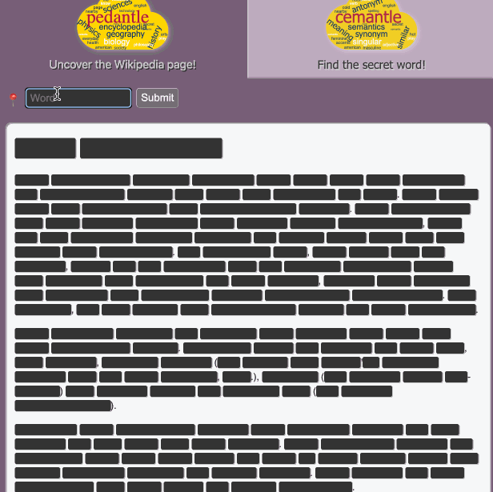
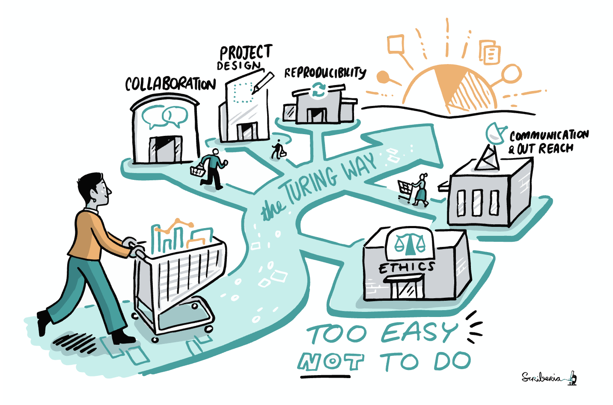

*Another highly-curated, lightly-annotated list of recommendations. Previous autobibliography: [Feb 2025](../autobibliography-1/)*

*For the last week I've been recovering from a medical thing, which has involved very little Doing and a whole lot of Resting™---in my doctor's words, I'm only supposed to be doing "the activities of daily living." Easier said than done! It's pretty weird to feel mentally fine but physically exhausted, which is different than my typical brain-plus-body exhaustion when ill.*

*Anyway, I've done a fair bit of media consumption during this time, and now that I have a bit more energy it feels like a good time for a link dump!*

---

## Play

- **Video game [Alba: A Wildlife Adventure](https://www.albawildlife.com/)**

    You are a young girl visiting your grandparents on their Mediterranean island for the week. You run around taking photos of birds, cleaning up trash, and advocating for environmental restoration.

    It is beautiful and calming to look at and listen to, and easy to play. This was my second time through, and it was just as delightful as the first. If you are a person who doesn't consider themselves a game person, Alba may change your mind.
    

<iframe
    width="560"
    height="315"
    src="https://www.youtube-nocookie.com/embed/a-Eu9WE3grA"
    title="YouTube video player"
    frameborder="0"
    allow="accelerometer; autoplay; clipboard-write; encrypted-media; gyroscope; picture-in-picture; web-share"
    referrerpolicy="strict-origin-when-cross-origin"
    allowfullscreen
></iframe>

- **Online word game [Pedantle](https://pedantle.certitudes.org/)** (and **[Cemantle](https://cemantle.certitudes.org/)**)

    This game is the daily bane of my existence, in a good way. Every day, there's a new Wikipedia page to identify, word by grueling word. The healthy way to play is to stop when you've guessed the Wikipedia page. Or you can keep going to try to guess *all* the words. 🙃 Luckily, there's only one new entry to guess every 24 hours?

    

- **Eleanor Tursman's tabletop game [*Chickadees Know Better Than You*](https://www.goldencobra.org/pdf/2024/ETursman--ChickadeesKnowBetterThanYou.pdf)**

    I have not actually played this yet, but want to---and I haven't been able to stop thinking about it. I mean, it opens like **this**! I dare *you* to be able to stop thinking about it!

    > **You are a Flock of Ungrateful Forest Chickadees**
    >   
    > You are also know-it-alls of the highest caliber. Animals gather from all over to ask you their
    > most burning questions. What wisdom will you bestow upon them?
    >   
    > This is a larp for one flock of chickadees. A flock is usually 3 to 18 birds, most of which are
    > chickadees but might also include a few other small social birds, such as nuthatches,
    > woodpeckers, or warblers. The larp is meant to run for 30 minutes to a few hours at most,
    > depending on how many questions you answer. No additional materials are required to play.
    >   
    > Play consists of making your chickadees, doing a workshop to practice your chickadee moves,
    > playing several scenes where you’ll answer questions, then wrapping with a short debrief. Read
    > these instructions aloud as you work through the larp.
    
    Who wouldn't want to be *Totinos, a Frog therapist*?! If you know me irl and want to play, let's make it happen!

## Small delights

- **[*The Squirrel Census*](https://www.thesquirrelcensus.com/)**

    What is even happening here?! I'm not sure, but I love it.

- **Craig Mod & Dan Rubin's travelogue [*Koya Bound: Eight Days on the Kumano Kodo*](https://walkkumano.com/koyabound/)**

    A beautifully presented travel write-up; even if you don't read it, scan through it on a desktop computer to get the whole beautiful photos-aligned-with-map-journey timeline effect.

## Commentary

- **The Muppets' song [*business business*](https://www.youtube.com/watch?v=xed-rGLgrUo)**:
    
    

    <iframe
        width="560"
        height="315"
        src="https://www.youtube-nocookie.com/embed/xed-rGLgrUo"
        title="YouTube video player"
        frameborder="0"
        allow="accelerometer; autoplay; clipboard-write; encrypted-media; gyroscope; picture-in-picture; web-share"
        referrerpolicy="strict-origin-when-cross-origin"
        allowfullscreen
    ></iframe>
    

    The ~~escalation~~ tempo change at 1:55 feels like a personal attack---it's a *little* too relatable to the current mood.

- **Bruce Schneier's article [*AIs and Robots Should Sound Robotic*](https://www.schneier.com/blog/archives/2025/02/ais-and-robots-should-sound-robotic.html)**

    Yes. 

- **Adam Mastroianni's [*Excuse me but why are you eating so many frogs*](https://www.experimental-history.com/p/excuse-me-but-why-are-you-eating)**

    I will give you the headings for each section, and then you will feel a need to go read the whole thing:

    > **1. YOU ARE NOT A LAZY PIECE OF TRASH** 
    > **2. OKAY BUT WHY DO I FEEL LIKE A LAZY PIECE OF TRASH?** 
    > **3. WHAT HAPPENS WHEN YOU EAT TOO MANY FROGS** 
    > **4. BAD RELATIONSHIPS AND SMALL PONDS** 
    > **5. "COUGH UP THAT FROG,” HE SAID TO THE MIRROR** 

- **Victoria Kirst's [*How to draw a cover: An essay against AI art*](https://vrklovespaper.substack.com/p/how-to-draw-a-cover-an-essay-against)**

    I really appreciate Victoria's take, drawn from experience as both a software engineer and an artist. A few favorite excerpts:

    > I offer, then, a crude heuristic: I believe that the decisions you make in your drawing – conscious and unconscious – are the vehicle by which your soul, or aliveness, or intention, or WHATEVER, is infused in your creation. And I believe you need to make the vast majority of the decisions that compose a piece of art for you to claim it as your own.

    and 

    > If you lie to my face and I believe you, does the lie somehow become "valid" because I'm fooled by it?
    >   
    > I'm saying that even if I *can't tell* that the world around me is a mirage, *I do not want to live in a mirage.*

    I do not want to live in a mirage either.

## Resources

- **Chelsea Troy's article [*A Rubric for Evaluating Team Members’ Contributions to an Inclusive Culture*](https://chelseatroy.com/2018/05/24/why-your-efforts-to-make-your-company-inclusive-arent-working/)**

    Do you interact with people? Do you manage people? Are you managed by people? Are you a person? This article and its rubric are for you.

- **Alex McClean's article [*Ursula Franklin’s tech project checklist*](https://slab.org/2022/02/11/ursula-franklins-tech-project-checklist/)**:

    > While I’m in the beginnings of a new tech-oriented research project, I’m getting a lot from Ursula Franklin’s “Real World of Technology” lectures, which contain the following checklist for projects:
    >  
    > *“… whether it:*  
    > *(1) promotes justice;* 
    > *(2) restores reciprocity;* 
    > *(3) confers divisible or indivisible benefits;* 
    > *(4) favours people over machines;* 
    > *(5) whether its strategy maximizes gain or minimizes disaster;* 
    > *(6) whether conservation is favoured over waste; and* 
    > *(7), whether the reversible is favoured over the irreversible?”* 
    
    ...plus a bunch of other useful quotes from Franklin's lectures. I haven't yet listened to them myself, but they're on my list!

- **Online handbook [*The Turing Way*](https://book.the-turing-way.org/)**

    > Welcome to *The Turing Way* handbook to reproducible, ethical and collaborative data science.
    >  
    > [...]
    >  
    > *The Turing Way* community is dedicated to making collaborative, reusable and transparent research “too easy not to do”. That means investing in the socio-technical skills required to work in a team, to build something more significant than any individual could deliver alone.
    >  
    >  
    > *The Turing Way* is:
    >
    > - a book
    > - a community
    > - a global collaboration

    I haven't read all of it yet, but the bits I have read are great, and it seems like a good primer for anyone working a job that involves data---analysis, model training, etc---and *especially* for those of us who didn't go through engineering schools with "engineering ethics" coursework. If I were assembling a research or engineering team, I think portions of this handbook would be suggested reading.

    

## Songs

Last but not least!

- **Olive Klug's new album [*Lost Dog*](https://oliveklug.com/listen)**:

    We saw them play at Passim recently, and it was the best show I'd been to in a long time. Their band is similarly excellent. Would recommend catching a live show, if you can!
    
    

    <iframe
        width="560"
        height="315"
        src="https://www.youtube-nocookie.com/embed/CVJ2F1Dng6s"
        title="YouTube video player"
        frameborder="0"
        allow="accelerometer; autoplay; clipboard-write; encrypted-media; gyroscope; picture-in-picture; web-share"
        referrerpolicy="strict-origin-when-cross-origin"
        allowfullscreen
    ></iframe>
    

- **Giacomo Smith playing Cole Porter's [Just One Of Those Things](https://www.youtube.com/watch?v=TmQ1UrMbZ5Y)**:

    ...and/or anything else [Giacomo](https://www.instagram.com/giacomomoneymoproblems) plays.

    

    <iframe
        width="560"
        height="315"
        src="https://www.youtube-nocookie.com/embed/TmQ1UrMbZ5Y"
        title="YouTube video player"
        frameborder="0"
        allow="accelerometer; autoplay; clipboard-write; encrypted-media; gyroscope; picture-in-picture; web-share"
        referrerpolicy="strict-origin-when-cross-origin"
        allowfullscreen
    ></iframe>
    

