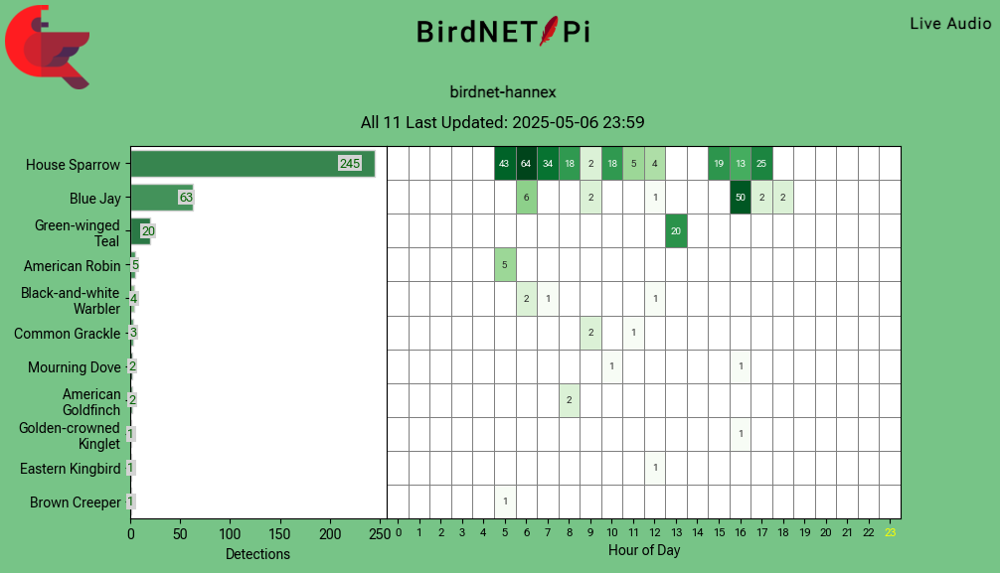
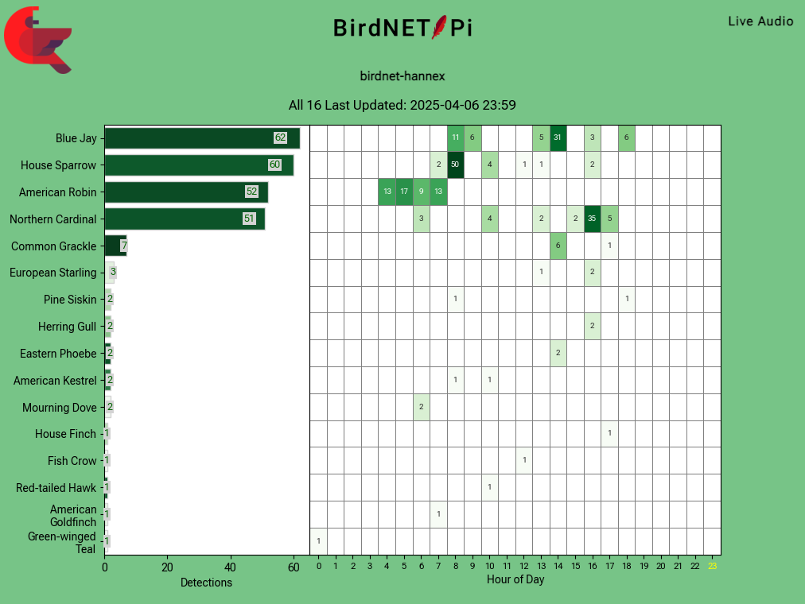

 

Instructions are here: [Set up BirdNET-Pi on a Raspberry Pi Zero 2 W](../birdnet-setup/) 🐦‍⬛

It's autumn here in the greater Boston area, and my bird neighbors have finally calmed down from all the yelling they've been doing since early spring. Yours too? Sounds like the perfect time for any good ~~birb creeper~~ citizen scientist to set up a ~~spy ring for snooping on birbs~~ passive acoustic monitoring station!

It is easier than ever to become the bird voyeur you were born to be, thanks to the [BirdNET model](https://birdnet.cornell.edu/) trained and released by the [Cornell Lab of Ornithology](https://www.birds.cornell.edu/home/) and the [BirdNET-Pi](https://github.com/Nachtzuster/BirdNET-Pi) application built on top of it by an open-source community. I've set up a couple of these now, for both myself and my parents; our BirdNET-Pi's have been both an ongoing source of joy and a connection point with folks around us.

For example, here's what I measured on May 6, from the microphone just outside my window in a semi-urban neighborhood:

We can see that the House Sparrows (*Passer domesticus*) chorp from dawn to dusk, 5am-6pm; that a Blue Jay (*Cyanocitta cristata*) shows up around 4pm and just does not stop hollering for about an hour; and that our American Robin (*Turdus migratorius*) friends make a brief stopover shortly after 5am.

In contrast, a month before---on April 6---there was a much larger American Robin and Blue Jay presence, while the sparrows had not yet come into their own:[^read]

[^read]: Read: set up their nests in the trees nearby.

A month after---on June 6---the sparrows persist but their babies have fledged, so the jay is back to asserting auditory dominance:

Over the last several months I have been fairly consistently ~~chorping~~ talking with folks about this installation, which is how I know that a bunch of other people would love to set up bird monitoring systems of their own, for themselves or others. To that end, I have written up my BirdNET-Pi setup instructions for you, person who wants to set up your own bird listening station as quickly and cheaply as possible! 

To make set-up as straight-forward as possible, I detailed *exactly* what I did to set mine up, in a borderline-too-verbose way. I assume no prerequisite computer knowledge beyond a basic "at least occasionally uses a computer as part of daily life" starting point.

Instructions: [Set up BirdNET-Pi on a Raspberry Pi Zero 2 W](../birdnet-setup/) 🐦‍⬛

I look forward to hearing about the [birb](https://www.audubon.org/magazine/when-bird-birb-extremely-important-guide) friends yelling around *your* homes! The rest of *this* post includes background on the BirdNET project and context around my particular installation---including cost, intentional [lack of] robustness, and privacy concerns.

## Brief background and motivation

I've been aware of the excellent ecoacoustics work coming out of the Cornell Lab of Ornithology for a while, but I only encountered the BirdNET project about a year and a half ago. During the [Recurse Center](https://www.recurse.com)'s 2024 *Never Graduate Week*, [Logan Williams](https://subject.space/) presented [*Bird signs and cycles, February, 2024*](https://subject.space/projects-static/winter-bird-cycles/), a beautiful and compelling interactive visualization he created from recordings captured with his own BirdNET-Pi installation.

[[Logan Williams: *Bird signs and cycles, February, 2024*]](https://subject.space/projects-static/winter-bird-cycles)

I encourage you to click through and explore his gorgeous data analysis.

I set up my first BirdNET-Pi as a gift for my dad.[^day] This necessitated testing the microphone out my own window. I wasn't sure how well it would do, as I live in a decently noisy neighborhood, but it performed brilliantly. When I packed it up to send it off to my dad I acutely missed the new-found relationship with my new sparrow friends.

Later in the year my parents requested a second BirdNET-Pi installation (!) so that they could monitor birds on the other side of their yard. I decided to set one up for my home at the same time. All three are still actively in use!

[^day]: A Father's Day present---belatedly delivered in August.

## Terminology: BirdNET vs BirdNET-Pi

Let's take a pause to clarify some terminology that I found confusing when I got started:

- **[BirdNET](https://birdnet.cornell.edu/)** is the name of a classifier model trained to identify the presence of specific bird calls in short segments of audio. It was trained by the Ornithology Lab.

    The BirdNET model is similar to---but not the same as---the model that powers the also-excellent **[Merlin Bird ID](https://merlin.allaboutbirds.org/)** birdsong identification phone app. Merlin is also built by the Cornell Lab of Ornithology, but as I understand it the models are trained on different data, and don't necessarily use the same ML architecture. Similar overall goal, different model, different name!

    The isolated BirdNET model is made available via [BirdNET-Analyzer](https://github.com/birdnet-team/BirdNET-Analyzer), and licensed under a [Creative Commons Attribution-NonCommercial-ShareAlike 4.0 International License (CC BY-NC-SA 4.0)](https://creativecommons.org/licenses/by-nc-sa/4.0/), which means that you can only use it for non-commercial purposes. It is the underlying engine for a variety of different applications, including the phone app [BirdNET Sound ID App](https://birdnet.cornell.edu/).

- **[BirdNET-Pi](https://github.com/Nachtzuster/BirdNET-Pi)** is the name of a specific application built to run the BirdNET model on a [Raspberry Pi](https://www.raspberrypi.com/) computer. It was initially developed by [Patrick McGuire](https://github.com/mcguirepr89/BirdNET-Pi) and is now maintained by GitHub user ['Nachtzuster'](https://github.com/Nachtzuster/BirdNET-Pi), along with support from the open-source community of programmers. My set-up uses the Nachtzuster fork.[^distinction]

    [^distinction]: This is an important distinction if you're reading the repository's documentation or looking up help elsewhere on the internet! The links tend to bounce between the 'mcguirepr89' and 'Nachtzuster' repos without warning, and it is very easy to spend time in a debugging hole while inadvertently reading docs or code for the opposite fork. Be ye warned!

    In general, if you talk about BirdNET out in the world, you will need to specify that you mean *BirdNET-Pi* or folks may think you're talking about BirdNET phone application.

    While there are other applications built on top of the BirdNET model, including others for Raspberry Pi, BirdNET-Pi is one of the longer-running, well-documented, and currently maintained projects, so it is what I chose to use for my installation.

While we're at it with the definitions:

- A [**Raspberry Pi**](https://en.wikipedia.org/wiki/Raspberry_Pi) is a brand of small and inexpensive computer. It comes in [different models](https://www.raspberrypi.com/news/raspberry-pi-product-series-explained/). I.e., in the same way that Apple has the Mac, Macbook Air, Macbook Pro, etc, there is the basic Raspberry Pi flagship series, the Pi Zero, the Pi Pico, etc.

- The **[Raspberry Pi Zero 2 W](https://www.raspberrypi.com/products/raspberry-pi-zero-2-w/)** is the specific model of Raspberry Pi that I use for this project.

    - The **W** means it has built-in  Wi-Fi capabilities.
    - The **2** means that it is the second version of a Pi Zero (and therefore a similar form-factor/price point to the original, but more powerful).

- An **[Arduino](https://en.wikipedia.org/wiki/Arduino)** is a different flavor of small computer, also regularly used by hobbyists. While this project runs on a Pi, folks often reasonably assume it is running on an Arduino. At the end of the day, both a Raspberry Pi and an Arduino are tiny bundles of computing power that can be programmed to perform tasks.

## Project requirements

My BirdNET-Pi setup is a [houseplant programming 🪴](../houseplant-programming/) project with the following initial requirements:

- Accomplish "microphone out window, listen to birds" as directly as possible, without consideration towards future weatherproofing or battery-powered installations.

- Relatively cheap to make, i.e., should run on the cheapest viable Raspberry Pi model---the Zero (~$15), rather than the flagship series ($35-$80+)---and with a cheap microphone.

- Be as privacy-conscious as possible for an always-on microphone, i.e., make use of configuration choices that mitigate privacy concerns.

- Result in an installation that can trivially be gifted to someone else who has an interest in birds and doesn't necessarily need or want to deal with the setup or debugging themselves.[^shitty]

    More specifically, after the initial set-up by me, the installation will:

    - Connect to a giftee's  Wi-Fi network out of the box, without my presence during installation;

    - Just Work™ whenever plugged into a power source and in range of the configured Wi-Fi network;

    - Be relatively easy to debug remotely, so that a gifted unit is plausibly debuggable without my traveling to the installation site.

[^shitty]: While I knew my dad *could* do debugging himself, it felt like it would be unkind to give the gift of a non-functional computer and the task of trying to make it function... Happy Father's Day indeed! 🥳

On a meta level, I had an additional requirement to document everything well enough that my set-up would be trivially easy to repeat for additional installations.

My installation met all of these requirements, and while its presentation can hardly be called sophisticated, it sure does work---and has continued to work, with minimal intervention, for over a year now.

<figure>
    
    <figcaption style="font-size:smaller">My personal installation. Such elegance! (Yes, I do shut the window with the microphone there. No, it probably isn't great for the microphone wire.)</figcaption>
    </figure>

<figure>

<figcaption style="font-size:smaller">Such grace!</figcaption>
</figure>

***

Note that there is nothing particularly novel about my instructions as compared to the instructions provided by the BirdNET-Pi onboarding documentation---except that they are far more verbose, include the extra system administration tasks necessary for the "make it giftable" requirements, and bake in some small fixes needed to support longer-running installations on a Pi Zero (e.g., log file configuration).

Loads of other people have cool write-ups about their own setups, specific to their own requirements; if your use-case differs from mine I encourage you to seek those out---or create (and write up) your own instructions!

## What does the BirdNET-Pi application...do?

The BirdNET-Pi application has two components: a classification pipeline that constantly analyzes recorded audio for bird sounds, and a small web server that hosts a website that visualizes those detections. The website also lets users configure the application's various settings.

How does the classification pipeline work?

- The microphone is always on, and a continuous series of _x_-duration recordings are captured, where _x_ is 15 seconds by default.

- Each recording is first converted into a spectrogram---a picture of the sounds over time---and that spectrogram is fed into the BirdNET model.

<figure>
    
    <figcaption style="font-size:smaller">Spectrogram of an American Robin  (*Turdus migratorius*) vocalization.</figcaption>
    </figure>

- The BirdNET model outputs the probabilities that the spectrogram contains various sounds produced by a various bird species and by humans (e.g., speech).
- If there are human sounds detected with a probability above a certain customizable threshold, the recording is thrown out for privacy reasons.
- If there are no human sounds detected and there *are* bird sounds detected, the recording is saved, the spectrogram is saved, and an entry with that detection is added to a database on the Pi.
- When new data is added to the database, the day's summary graph is regenerated.

...that's it!

The website then pulls data from that database to display the most recent detections, the recordings and spectrograms of those detections, and the daily summary graphs.

<figure>

<figcaption style="font-size:smaller">The BirdNET-Pi application's website, displayed on the semi-permanent viewing station my parents set up on an old iPad.</figcaption>
</figure>

## Privacy considerations

I am generally a privacy and spyware-conscious person, and my background is in audio signal analysis; I do not have (and do not ever plan to have) any of the always-listening "assistants" running in my spaces. And yet, I willingly built and deployed this always-listening device and installed it in my home! What gives?

Here are the considerations I made, which you should probably consider before installing one around your home:

- **This is an always on microphone! Running in your home! Make sure that *everyone in your home* is on board with that**, and agrees on where to install it (i.e., where the microphone will be located).
    - If you have visitors who will be anywhere near where your microphone is, **make sure that those guests know about it also**.[^disclosure]
- Unless your  Wi-Fi network is configured to allow inbound access, **there is no connection between the outside web and your BirdNET-Pi device** This means that the only people who have access to the recordings made on the device are people who you've given both the password to your Wi-Fi network and the password to the Raspberry Pi. Once able to access both those systems, a user will have access to both the realtime audio being recorded onto the device and the audio stored because it has a detected birdcall in it; no recordings are stored for audio that has no bird detection in it OR that does have a bird detection but additionally has a human sound detection in it.
    - BirdNET-Pi supports the option to publish detections (audio and classifications both, I think?) to the outside web, but enabling that feature would require extra effort on your part; it is not something you might accidentally enable. I have not enabled this feature for myself yet.
- Where possible, I've made application configuration settings that **prioritize disabling services that can be inadvertently creepy**. My installation is in a ~~habitat~~ neighborhood inhabited and frequented by humans, so I disabled the "live listening" function, and I bump up the privacy threshold that excludes audio for having human detections in it, to err on the side of not having any talking end up in the saved audio recordings that contain bird detections.
    - It is possible for vocalizations with human voice in the background to sneak through, despite this threshold setting. You will know that this is happening if you listen back to your recorded bird detections and hear any human voice in the background. If you notice such leakage happening, go into your settings and increase the threshold by a notch, to prevent it. (While the configured value has been sufficient for my installation, which is in a well-populated neighborhood with constant foot traffic and me-talking-on-the-porch noise, but definitely don't assume all recordings are free from human speech without validating that first.)

In sum, If you trust the people who have access to your Wi-Fi network, and disclose the presence of the microphone to anyone who would otherwise have a reasonable expectation of privacy in that space, you're probably good to go.[^network]

[^network]: If you don't trust the people who have access to a  Wi-Fi network, do not configure your BirdNET-Pi to connect to it!! Have it connect to your phone hotspot or something. Or, don't install a BirdNET-Pi there at all.

[^disclosure]: This is something that I wish folks with Alexas/Google Homes/etc in their spaces would also proactively disclose, but here we are.

## Additional BirdNET-Pi benefits

1. Delighting one's corespondents with astute avian analyses:

<figure>
    
</figure>

2. Getting notifications[^notifications] about new visitors:

<figure>
    
</figure>

[^notifications]: I haven't added this notifications piece to my set-up instructions yet, but will add it in a future post.

3. Receiving messages like this from other BirdNET-Pi hosts:

    <figure>
        
    </figure>

    and 

    <figure>
        
    </figure>

    and 

    <figure>
        
    </figure>

...okay, well, that last one is just to give you a dose of reality. We've since diagnosed and fixed that issue, and are back successfully detecting birds at our respective homes. More importantly: a Cooper's hawk!!

## Next steps, output interpretation, and other errant thoughts

You will be unsurprised to learn that I have a lot of follow-up ideas about potential next steps, ways to investigate and tune an installation settings for a specific site, ways to make the installation more robust, interpreting the results, etc. In the interest of getting these instructions published ASAP,[^asap] I'm going to save those thoughts---plus output interpretation---for a future post. Suffice it to say, they exist.

If you use these instructions---or are otherwise inspired to set up a BirdNET-Pi of your own---please let me know! If you know me in real life and want assistance or company while you run through a set up, or want me to just set one up for you, also let me know. I'd love to help!

Once yours is up and running? Be as vocal about the cool things you're learning about your bird neighbors as *my* bluejay neighbor is at 4am of a spring morning. 🙃

***

One final time, the instructions: [Set up BirdNET-Pi on a Raspberry Pi Zero 2 W](../birdnet-setup/) 🐦‍⬛

***I am grateful to the folks at the Cornell Lab of Ornithology and elsewhere who spent time and energy building the various stages of this detection system, taking on tasks such as data collection, data curation, model training, model evaluation, model open-sourcing, application development, application maintenance, and documentation. It takes a village to make a model.***

***Thanks also to mcguirepr89 and Nachtzuster for BirdNET-Pi creation and stewardship; [Logan Williams](https://subject.space/) for introducing me to BirdNET-Pi in the first place; DK for the word "chorp"; [CCE](https://cceckman.com/) both for the friendly encouragement to write this post in the first place and assistance in figuring out that one Wi-Fi Configuration Situation™; and AF for helping it actually get out the door.[^door]***

[^asap]: "ASAP." Hah! I first drafted this in...April? And it is now October. I guess we now know what was possible, and that it is temporally unimpressive!

[^door]: It took me long enough to publish my initial write-up that I have had to fully abandon my original opening sentence, which I am bummed about. The delay also explains why all my examples came from the spring.... 

    For posterity, here is that original opening line, so that you can appreciate what could have been:

    > It's spring here in the greater Boston area, and my bird neighbors are going fucking *nuts*.
