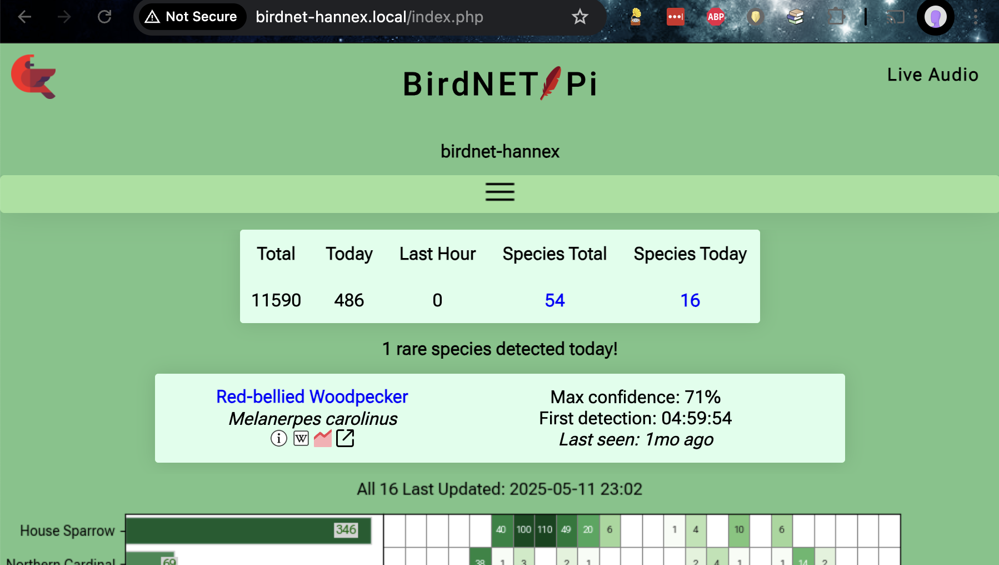

The individual steps were sourced from existing documentation---that I'll cite when used!---but this guide exists because I haven't found a similar single source of truth with this level of minutia. 

This setup guide came from the notes I wrote for myself so that I could replicate the setup, along with tweaks made when I updated that first installation and set up two more (one for myself, another for my parents). My longest running BirdNET installation---the gift for my dad---has nearly 9 months under its belt now, and has run remarkably smoothly, modulo one hickup due to some overzealous logging bringing down the entire system.


<div style="background:#e8ebf5; padding:.4em 1.5em 1.5em 1.5em;">

## Instructions

*My goal here is to make it trivially easy to get a new BirdNET-Pi installation up and running on a Raspberry Pi Zero 2 W.
These instructions are intentionally verbose, written for folks who use computers but don't consider themselves programmers, and/or folks who have never worked with a Raspberry Pi before. If you fit this description but find that the instructions fall short, please let me know!*

Here are the tasks we'll be stepping through:

- 0: Acquire components
- 1: Initial Raspberry Pi Zero 2 W set up
- 2: SSH time---talk to the Pi
- 3: BirdNET-Pi application installation
- 4 (optional): Install Tailscale for remote monitoring
- 5 (optional): Set up additional  Wi-Fi networks
- 6: Configure the BirdNET-Pi application
- 7: Physical installation

While it may look like there's a lot here, it is a straight-forward "a lot", without implicit steps that require leaving this page. Don't be nervous---you've got this!

Also: I ran this setup from my personal computer, which happens to be a Mac. If you're on a Windows machine the screenshots might not exactly match what you see, see but the steps are the same.

### Task 0: Acquire components

Here are the items you'll need, with prices at time of writing:

- **Raspberry Pi Zero 2 W** [ [Adafruit, $15](https://www.adafruit.com/product/5291) | [MicroCenter, $18](https://www.microcenter.com/product/683270/raspberry-pi-raspberry-pi-zero-w-2-with-headers)]
    - With or without headers, it doesn't matter; we won't use them.
- **USB lavalier microphone** [ [Amazon, $19](https://www.amazon.com/gp/product/B08RYC5435) plus [USB 2.0-to-micro adapter, $4](https://www.amazon.com/dp/B01C6032G0)]
    - The microphone will plug into a **micro USB port** on the Pi, so if you get a different mic than this one, double-check the plug or get an adapter for it.
- **Power adapter, 5V 2.5A or 3A, Micro USB** [ [MicroCenter, $12](https://www.microcenter.com/product/510437/micro-connectors-micro-usb-5v-25a-power-adapter-with-on-off-switch-for-raspberry-pi) | [Amazon, $12](https://www.amazon.com/dp/B07CVH21NC) ]
    - Power connects to a **micro USB port on the Pi**, so if you buy a different one than this, make sure it has a micro USB plug (or get an additional USB adapter).
    - You could alternatively use a rechargable power brick instead of a wall wart, although you'd have to remember to charge it (and wouldn't be detect birds during recharging...).
- **SanDisk 64GB Extreme microSDXC (64GB)** [ [MicroCenter, $17 for two](https://www.microcenter.com/product/675331/sandisk-64gb-ultra-microsdxc-class-10-u1-a1-flash-memory-card-with-adapter-(2-pack)) | [Amazon, $12](https://www.amazon.com/gp/product/B07FCMBLV6) ]
    - You could probably get away with less memory, but don't skimp and get an off-brand card; this is the component that actually matters.[^sd]

- Access to **an SD card writer**, in dongle form [ [MicroCenter, $18](https://www.microcenter.com/product/467960/iogear-superspeed-usb-30-sd-microsd-card-reader-writer) ] if not already built in to your computer.
    - The step that requires an SD card writer is relatively brief and first on the list, so you could easily get away with borrowing a friend's, rather than buying your own---especially if you set up a BirdNET-Pi for them while you're at it!

    <br>

***Total cost: ~$60, not including the SD card writer***

[^sd]: Fun fact, SD card choice *really* matters if you're working with infrasound, e.g., if you're detecting bat sounds rather than bird sounds---some brands of SD card generate a hum at the same frequency as bats. The more you know!

### Task 1: Initial Raspberry Pi Zero 2 W set up

In this step, we'll install an operating system (OS) on the Raspberry Pi Zero 2 W, by loading it onto the microSD card.

1. Plug the SD card writer into your computer, and put the microSD card into it.

2. Install the Raspberry Pi Imager application on your computer, by selecting the correct "Download for Windows/macOS" option on this page: [Raspberry Pi Imager](https://www.raspberrypi.com/software/)

3. Open the Raspberry Pi Imager application, and make the following selections:
    - Raspberry Pi Device: **Raspberry Pi Zero 2 W**
    - Operating System: **Raspberry Pi OS (Legacy, 64-bit) LITE**
        - This option may be nested in the "Raspberry Pi OS (other)" folder and require a little bit of searching.
    - Storage: **Generic - SD/MicroSD Media**, which is the microSD card that's currently in the writer

    

    ...**`NEXT`**!

4. You'll be prompted to optionally "Apply OS customization settings?", which you should accept by choosing **`EDIT SETTINGS`**. On this page, set:
    - Hostname: **`birdnet-<pi_identifier>`**, where `<pi_identifier>` is a name that identifies this device, e.g., `birdnet-foo`, `birdnet-backyard`, `birdnet-007`, whatever! The identifier in these screenshots is `hannex`.
        - Make it something unique enough that if you set up multiple birdnets, you'll be able to keep them separate. I typically use the initials of the recipient.
    - Username and password: **`<pi_username>`** / **`<pi_password>`**
        - This will be the username and password for the Raspberry Pi. I use `birbwatcher` as the username for each of mine, so that's what you'll see in my screenshots.
    - Configure wireless LAN: **`<your_current_wifi_network_name>`** / **`<your_current_wifi_network_password>`**
        - Important: this is the  Wi-Fi network name ("SSID") and password for the  Wi-Fi network your computer is *currently using*, and that you'll be using for the rest of the set up steps. If you're setting this device up for someone else, there'll be a separate step to add *their*  Wi-Fi network info later; for now, this should be yours.
    - Make sure the time zone is correct for wherever your birdnet will be *installed*.
    - Under the *`SERVICES`* tab, confirm that `enable SSH` and `use password authentication` are both selected (they likely already are, by default).

    

    ...**`SAVE`**!

5. Select `WRITE` to write the image to the SD card.

6. Eject the microSD card from the reader. TODO-confirm how to do this.

7. Put the microSD card into the SD card slot of the Pi:

TODO-photo

8. Connect the power cable to one of the Pi's micro USB ports, and plug the other end into the wall. Once powered, the Pi will turn on automatically, which you'll know has happened because a green light will start flashing on the Pi. This may take a few moments!

After powering on, the Pi will use the Wi-Fi credentials you just gave it to automatically connect to your wireless network. The rest of the setup will be done wirelessly!

### Task 2: SSH time---talk to the Pi

This step is barely worthy of its own section, but giving it a header should make it easier for you to find again when you inevitably forget how to connect. :D

By choosing the "Lite" operating system in the previous task, we configured the Pi to run "headless"---which means, without a dedicated monitor, keyboard, or mouse. To interact with it without those things, we'll connect to it remotely over the wireless network, via a protocol called [SSH](https://en.wikipedia.org/wiki/Secure_Shell). ***As long as your personal computer is on the same Wi-Fi network you configured the Pi to connect to*** and the Pi is powered, you'll be able to SSH onto it.

1. On your personal computer, open up your terminal application---if you're on a Mac, this is literally called "Terminal"; on Windows it's called "Windows Terminal"---and type

    ```
    ssh <pi_username>@birdnet-<pi_identifier>.local
    ```
    
    E.g., to SSH onto the device in my screenshots above, I do `ssh birbwatcher@birdnet-hannex.local`.

    

2. When prompted to continue connecting, type `yes` and hit "enter". (This will only happen the first time you connect.)
3. When prompted for a password, type the `<pi_password>` from above and hit "enter".

That's it, you're on! Any commands you type in this window will now be run *on your Raspberry Pi*. 😮

Oh, and if you want to exit the SSH connection? Type `exit` (and hit enter).


In your terminal window, how can you tell which machine you're sending commands to? How can you tell if your SSH connection is running or has dropped? 

Look at the start of each line: when you're on the Pi, the "prompt"---the default text at the start of the line in your terminal---will be `<pi_username>@birdnet-<pi_identifier>`. When you're on your personal machine, it will be something else, probably the name of your computer unless you've customized it to look different. In these screenshots, my local prompt is the path to my working directory "~" in a blue arrow, and the prompt on the Pi is the white `birdnet-hannex`. The text styling may look different for yours, but the concept is the same. 

If your SSH connection drops at any time---your internet chokes, you decide it's bedtime and want to finish another day, you accidentally close your terminal window---simply SSH back on again.

### Task 3:  BirdNET-Pi application installation

Okay. You've set up the pi, you've ssh'd onto the pi---it's time to add  the "BirdNET" part of BirdNET-Pi!

In this step, we'll: 
    - Download and run the installer for the BirdNET-Pi application 
    - Change some of the Pi's configuration around storage limits, restart behavior, and logging, so that it allows the BirdNET-Pi application to run more effectively on a smaller machine than it was originally designed around.

Some of the following is going to seem a little silly, but it works. ¯\\\_(ツ)\_/¯ Bear with me! Basically what we're doing in this step is:


For any of the following steps, if you're prompted for a password use `<pi_password>`.

1. In your remote terminal---that is, the one where you SSH'd onto your Pi---type
    ```
    sudo nano /etc/rc.local
    ```
    This will open up a new file in nano, which is a terminal-based text editor. Copy and paste the following into it:
    ```
    #!/bin/sh -e
    iw wlan0 set power_save off
    exit 0
    ```
    Do `ctrl-x` (TODO-Windows) to close the file, and `Y` + "enter" to save these changes. The file will be saved and you'll be dumped back to a command prompt.

    Want to confirm that you write and saved the correct thing? Type
    ```
    cat /etc/rc.local
    ```
    to print the contents of that file to the terminal. If it matches the above text, you're good to go---if it doesn't, do `sudo nano /etc/rc.local` again and edit it so that it matches!

2. Run `sudo chmod u+x /etc/rc.local`. This makes the new file you just made executable (i.e. runnable).

3. Update the swap space limits! Type `sudo nano /etc/dphys-swapfile` to be dumped back in the nano text editor! Then use the arrow keys to scroll down to find and update the lines that contain `CONF_SWAPSIZE` and `CONF_MAXSWAP` and edit them to:
    1. Remove a `#` from the start of the line, if present, and
    2. Update them so that they read
        ```
        CONF_SWAPSIZE=2048
        CONF_MAXSWAP=4096
        ```
    A `#` at the start of the line means that the line is commented out---i.e., none of your changes will be applied, and the default value will continue to be used.

    Do `ctrl+x` and `Y` to save these changes; once more, you'll be returned to the terminal!

4. Type `sudo reboot`. This will cause the pi to---you guessed it---reboot, which will automatically close your ssh connection.

5. Wait for a moment or two for your Pi to reboot, then SSH back onto it:

    ```
    ssh <pi_username>@birdnet-<pi_identifier>.local
    ```

6. Okay, this is the bit that is going to feel silly. Just go with it. In your remote command prompt, run

    ```
    curl -s https://raw.githubusercontent.com/Nachtzuster/BirdNET-Pi/main/newinstaller.sh | bash
    ```
    A bunch of text will print out to the screen, but you don't have to pay attention. Eventually, it WILL eventually fail with a "No space left on device" error.  That's expected! You want it to happen!

7. After you've gotten the error, type (or paste) the following at the prompt:

    ```
    sudo mount -o remount,size=5G /tmp/
    rm -rf BirdNET-Pi/
    curl -s https://raw.githubusercontent.com/Nachtzuster/BirdNET-Pi/main/newinstaller.sh | bash
    ```

    ...when it succeeds this time (eventually! This step is slow, lots of things happen during installation), the pi will reboot.

8. ...SSH back on again! I bet you remember the command this time. You can also probably use the up-arrows in your terminal to see the last command you typed in the terminal's history, which was probably your SSH command.

9. Do:
    ```
    sudo nano /etc/systemd/journald.conf
    ```
    which will dump you into yet another file in the text editor.
    
    - Replace `#SystemMaxUse=` with `SystemMaxUse=200M` and 
    - Save the file ( `ctrl+x` , `Y`!).

10. Do `systemctl restart systemd-journald`, which will require you to enter your `<pi_password>` when prompted.

At this point, the BirdNET-Pi application has been installed!

### Task 4 (Optional): Install Tailscale for remote monitoring

If you're gifting this birdnet to someone else who wants you to act as tech support for their installation, or you want to be able to check on your own installation while you're not connected to your home Wi-Fi network, you can add your pi to a [Tailscale](https://tailscale.com/) network---basically, it acts as a virtual private network for your various devices. 

1. [Sign up](https://login.tailscale.com/admin/welcome) for a Tailscale account, if you don't already have one.

2. In your terminal, while SSH'd onto the pi, install Tailscale by typing/copying:
```
sudo apt-get install apt-transport-https

curl -fsSL https://pkgs.tailscale.com/stable/raspbian/bullseye.noarmor.gpg | sudo tee /usr/share/keyrings/tailscale-archive-keyring.gpg > /dev/null
curl -fsSL https://pkgs.tailscale.com/stable/raspbian/bullseye.tailscale-keyring.list | sudo tee /etc/apt/sources.list.d/tailscale.list

sudo apt-get update
sudo apt-get install tailscale
```

3. To connect your pi to your Tailscale network, type
```
sudo tailscale up
```
This will result in a prompt for what to do next, with a linked URL to click.  Follow that prompt! It will basically just ask you to agree that you want to connect this new device to your Tailscale network. 

    - Note that if you want to connect the device to *someone else's* Tailscale network, you'll need to send *them* the generated URL and have them authorize it with their Tailscale network. 

4. Once you've followed that prompt, your new device should now show up on your [Tailscale console](https://login.tailscale.com/admin/machines).

5. If you won't have easy access to the device in the future, consider setting `... > Disable key expiry` on that pi in the console.

TODO-screenwhot

6. If this is your first time using Tailscale, also install it on whatever device you want to use to access the birdnet---e.g., your personal computer, or your phone. Steps for these different devices are available [here](TODO-link).

6. Now, from the computer you installed tailscale on in step 5, you can ssh onto your pi through tailscale:
```
ssh birbwatcher@birdnet-<NAME> # note the lack of `.local`
```
Huzzah!

When ssh'd onto the pi, you can do `sudo tailscale down` to disconnect from the VPN, or `sudo tailscale up` to reconnect. (`tailscale status` tells you whether you are currently connected or not.)

If you are giving the pi to someone else, and only want it to be available to your Tailscale network when that giftee specifically enables it---and they are willing and able to interact with a terminal themselves!---you can `sudo tailscale down` for now, and then give them instructions to SSH on and do a `sudo tailscale up` when needed.


### Task 5 (Optional): Set up additional  Wi-Fi networks

There may be multiple  Wi-Fi networks to which you want the pi to auto-connect when in range. For example, when I set up a birdnet for someone else, I want it to autojoin my home network---for quality checking before I send it off!---as well as the network of the home I'm sending it to. Perhaps you want to allow your pi to connect to your phone's hotspot, so that you can take it with you on various outdoor adventures?[^adventure]

[^adventure]: Simply replace the wall plug with a portable USB battery pack, and hey presto, off you go!

For each additional network you want to add, paste the following:

1. Type the following:

    ```
    sudo nmcli connection add \
        type wifi \
        wifi.ssid "<NETWORK-NAME>" \
        wifi-sec.key-mgmt wpa-psk \
        wifi-sec.psk "<NETWORK-PASSWORD>"
    ```

    e.g., for a network named `SuperBoringNetwork381` with password `reallysecurepassword`:

    ```
    sudo nmcli connection add \
        type wifi \
        wifi.ssid "SuperBoringNetwork381" \
        wifi-sec.key-mgmt wpa-psk \
        wifi-sec.psk "reallysecurepassword"
    ```

2. Reload the configuration: `sudo nmcli connection reload`

3. ...that's it! You can check to see what you've set up with `nmcli device wifi list`

For now, you can close your terminal window to close your SSH connection if you want---we won't need it anymore. 

### Task 6: Configure the BirdNET-Pi application

The BirdNET-Pi application has two components: a classification pipeline that constantly analyzes recorded audio for bird sounds, and a small web server that hosts a website that visualizes those detections. The website also lets users configure the application's various settings. That's what we'll be doing in this task!

For the following steps, use whatever browser on your computer you prefer: Chrome, Firefox, whatever.

1. In your browser of choice, go to the website [`http://birdnet-<pi_identifier>.local/](http://birdnet-<pi_identifier>.local/). (For my installation, that's [`http://birdnet-hannex.local/](http://birdnet-hannex.local/)). Note that this site will *only work* if you are visiting it from a machine on the same  Wi-Fi network that your pi is currently connected to!

    You should see something like this, only with no detections yet:

    

2. Select the `Tools` tab. When prompted for a username and password, type `birdnet` and leave the password empty. 
    - This is the default username and password of the BirdNET-Pi *application*, which we have not yet set! If you want to change it, you can do that on the settings page; I haven't bothered to change mine because I trust anyone who I've granted access to my  Wi-Fi network not to mess with my BirdNET-Pi settings.

3. In `Tools > Services`: 

    1. **`Disable` the `Live Audio Stream`**. This is optional---you *could* leave it enabled. I disable mine for two reasons:
        1. I don't want the ability to hear the recorded audio stream live, so it is a waste of compute power to leave it on, potentially slowing everything else down; and
        2. It makes it too easy to accidentally  is a potential privacy violation, as the live audio hasn't been analyzed yet so doesn't bypass/throw out any human sounds. 
    2. **`Disable` the `Streamlit Statistics`**. This service the Species Stats tab, which is unusably slow on the Raspberry Pi Zero. Might as well turn it off, since we can't use it!

    For both these services, be sure to select `Disable` instead of `Stop`; the former will persist after reboot, the latter will only halt the service until reboot.

    Note that it may take a few seconds to a minute for these settings to update after being clicked; your pi is working very hard to analyze birds and handle website requests at the same time! Have patience.  

 4. In `Tools > Settings`, update latitude and longitude to that of your planned installation location, then select `Update settings`.

    How do you find that info? In Google Maps, right click on a location to see its latitude and longitude:

    

5. In `Settings > Advanced Settings`, set:

    - **Privacy threshold to 1%**;
    - **Recording Length to 30**
    then select `Update settings`.

TODO-screenshot

### Task 7: Physical installation

Time to stick that microphone out a window!

While you *could* just unplug your Pi, it's safer for the Pi (less chance of something going wrong!) to intentionally power it down first. While SSH'd onto the pi, do TODO

And then plug the pi into whatever outlet is accessible to the pi stuck out the window! Be mindful of whether anything will get wet if it rains (bad!), especially if that thing is the Pi (very very bad! do not do this). As an example, here is what my installation looks like:

<div class="centered-children">
<figure>

<figcaption style="font-size:smaller; max-width:400px">My exceptionally professional looking setup. Note the piece of white tape for sticking the pi to the wall, and the piece of black tape, for covering up the pi's bright green light, which otherwise is annoyingly bright at night.</figcaption>
</figure>
</div>

<div class="centered-children">
<figure>

<figcaption style="font-size:smaller; max-width:400px">A view of the microphone, and also of my exceedingly dirty inner window frame. I was so horrified by this photo that I considered cleaning it out and taking a new photo. As you can see, I did not do that. Is there a better position for this microphone that might capture the birds better? Probably! This is a sufficient first pass, however. Note that I just slide the window shut over top of the wire; the window isn't so snug that it is problematic. We did a similarly half-assed installation out of my parents' window as well, and it was similarly sufficient for bird detection!</figcaption>
</figure>
</div>

Once powered, the analysis service and web server will start right away, and it will autoconnect to the  Wi-Fi network that you configured it for, which means that you will be able to see what it's doing via `foo.local` on another device (phone, laptop) as long as that device is on the same  Wi-Fi network.

Once your BirdNET-Pi is up and running, anyone connected to your home  Wi-Fi network can view the latest birds at `birdnet-foo.local`. Anyone connected to your tailscale network can see the same via `birdnet-foo.TODO`.

Click around to explore what's visible to you; note that the TODO and TODO tabs won't show anything, since we disabled those services (above). Until you've detected a few birds, the app will seem pretty boring and janky, but leave the microphone plugged in for a bit and then recheck it! The page may be a bit slow to load---remember that this site is being served entirely from that little Raspberry Pi Zero you just set up, and in addition to making the website you're trying to view, it is also constantly recording and analyzing sound. It's doing the best it can.

## Daily usage

In browser:

- without tailscale running on your device? from same  Wi-Fi network your birdnet is connectd to: http://birdnet-foo.local

- with tailscale? from device tailscale is running on: http://birdnet-foo.feist-matrix.ts.net/

Optional niceties:

- Put up a sign in your home with a link to the site, to show visitors how to connect to your  Wi-Fi and then view your birds
- If you have an old display of some sort, you can set up a semi-permanent viewing station. My parents mounted an old iPad near the window with the BirdNET installation, and set its default landing page to view birdnet detections.[^display]


<div class="centered-children">
<figure>

<!-- <figcaption style="font-size:smaller; max-width:400px">TODO-CAPTION</figcaption>-->
</figure>
</div>

[^display]: With the visualization installation, the BirdNET went from being a background piece of trivia to an active obsession---when an issue with logging brought down their installation a few months back, they went into bird monitoring withdrawal while I worked to fix it.


### System administration details

Your BirdNET-Pi is now running! Awesome! Congrats! Uh...what if something goes wrong?

- If your power goes out, or your  Wi-Fi router resets, the Pi will automatically reconnect and start back up.
- If your Pi is unable to connect to the  Wi-Fi for whatever reason, BirdNET will continue to run its detection and analysis; you just won't be able to connect to it (i.e., see the website for your installation) until the Pi has connected to the  Wi-Fi again.
- If your internet is out but your  Wi-Fi router is still running, you'll still be able to see your pi's website
- If you are unable to load your pi's website from another device, check the following (in roughly this order):
    1. Is the pi plugged into power? Is the green light on it flashing (to indicate that it is powered)?
    2. Is the pi able to access the wireless network it was configured to run on? i.e., is that network accessible and can you connect to it with another device (i.e., your phone, a laptop, etc)?
    3. (If you aren't running tailscale) Is the device you're trying to view the website from connected to the *same network as the device is*? This is the gotcha question...if they aren't on the same network, the website won't be viewable. (This means if your phone is on the 5g home network and your pi is on the regular network, you won't be able to view the website.)
    4. (If you are running tailscale) Does the device you're trying to view the website from have tailscale enabled? Are you loading the site through its tailscale address (TODO) rather than FOO.local (TODO)?
    5. Can you connect to the pi via ssh? If the pi is powered and connected to the  Wi-Fi,
- If you set the device up for someone else and it turns out you set up their  Wi-Fi password incorrectly, use your phone to create a hotspot with the same credentials of the  Wi-Fi network you were on when you first set up the pi (i.e., your home network, if you set this up for someone else) to get onto the pi.[^hotspot]
- Once the pi begins to run out of storage space, which won't happen for a long time,[^storage] the oldest recordings will be deleted to make space for newer recordings.
    - You can preempt this "loss" by periodically moving older recordings off the device to a different storage location.

[^hotspot]: Ask me how I figured this one out. 🙃
[^storage]: This won't happen for a long time unless you're somewhere where the birds yell _constantly_ and you have a smaller SD card than the one recommended above.

We have now left the happy harbor of this basic installation document  so if you're hitting issues here, search around in some of the resource docs below, or message me or something...

- Data backup:
    - It's probably a good idea to copy your database off the pi periodically. I don't do this, but I should, because if the SD card dies there's no way to recover your data. TODO-instructions
    - Also more minimal instructions sans recordings.

</div>

If you use my instructions---or are otherwise inspired to set up a BirdNET-Pi of your own---please let me know! If anything is unclear or broken, **tell me**. If you know me in real life and want assistance or company while you run through a set up, or want me to just set one up for you, let me know. I'd love to help!

***Thanks to TODO.***

## Resources

Thanks especially the following instructions/tutorials for helping me get going:

- The original [BirdNET-Pi](https://github.com/mcguirepr89/BirdNET-Pi/wiki/Installation-Guide) application
- Nachtzuster's [BirdNET-Pi fork](https://github.com/Nachtzuster/BirdNET-Pi?tab=readme-ov-file), including its [user guide](https://github.com/mcguirepr89/BirdNET-Pi/wiki/RPi0W2-Installation-Guide), 
https://github.com/mcguirepr89/BirdNET-Pi/discussions/847#discussioncomment-9483912, 
https://github.com/Nachtzuster/BirdNET-Pi/discussions/258, and 
https://github.com/mcguirepr89/BirdNET-Pi/wiki/Installation-Guide.

Oh, and a disclaimer: why haven't I converted this whole shebang---well, everything after the hardware setup---into a single script that can Just™ be run directly, or opened a pull request against the original BirdNET-Pi repo to modify the existing setup script to that effect? Time, mostly. It's on my list as a follow-up task; in the meantime, the instructions are useable as-is.[^next]

[^next]: Okay, I'll admit it: I am **super** self-conscious about having spent the time documenting some kinda silly steps (like "run this, wait until it fails, then do X") instead of spending that time making a single clean installation script that doesn't require so much manual mucking about. HOWEVER. As I keep reminding myself, these are the steps I followed, figuring out parts of it was annoying time-consuming, and the goal here is sharing the "how I reproduce my own workflow" steps that *I* follow when setting up a new BirdNet-Pi. The work to update things upstream is important, but it is a secondary, orthogonal task to sharing what I currently have working. So I tell myself. :) Houseplant programming!


## Extra step: Restore from an preexisting backup

There's an [official path to do this](TODO-link), but if you (like me) exported your files from a different fork of the birdnet repo, here's what to do.

From a new terminal pane on your computer (one *not* ssh'd into the pi):
```
scp /PATH/TO/BACKED/UP/birds.db birbwatcher@birdnet-<NAME>.local:/home/birbwatcher/BirdNET-Pi/scripts/birds.db

scp /PATH/TO/BACKED/UP/BirdDB.txt birbwatcher@birdnet-<NAME>.local:/home/birbwatcher/BirdNET-Pi/BirdDB.txt

scp -r /PATH/TO/BACKED/UP/Charts/ birbwatcher@birdnet-<NAME>.local:/home/birbwatcher/BirdSongs/Extracted/

# OPTIONAL: may be a large amount of data, and if you don't care about playing back the recorded song excerpts, you can skip this
scp -r /PATH/TO/BACKED/UP/By_Date/ birbwatcher@birdnet-<NAME>.local:/home/birbwatcher/BirdSongs/Extracted/
```

## Extra step: get texts when birds are detected!!

TODO
