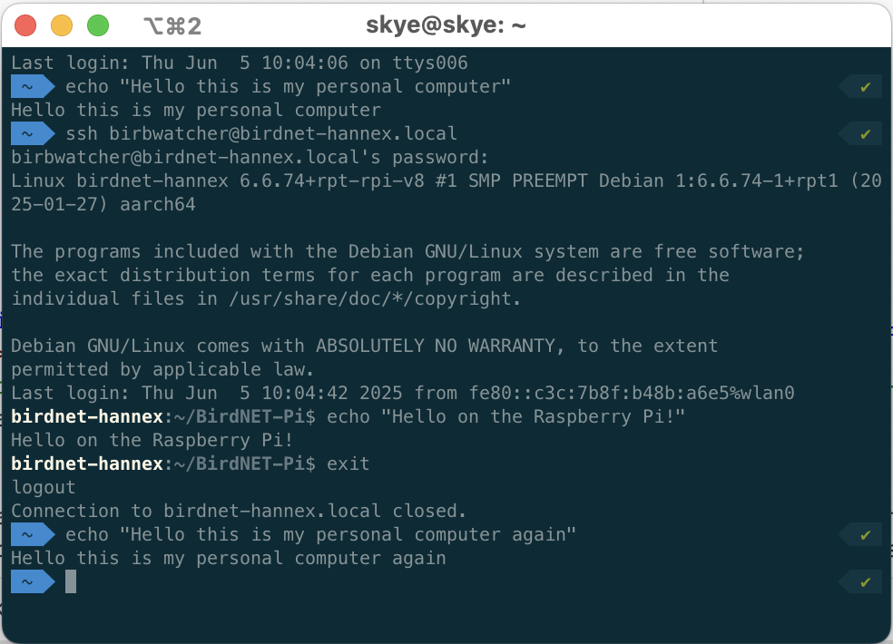
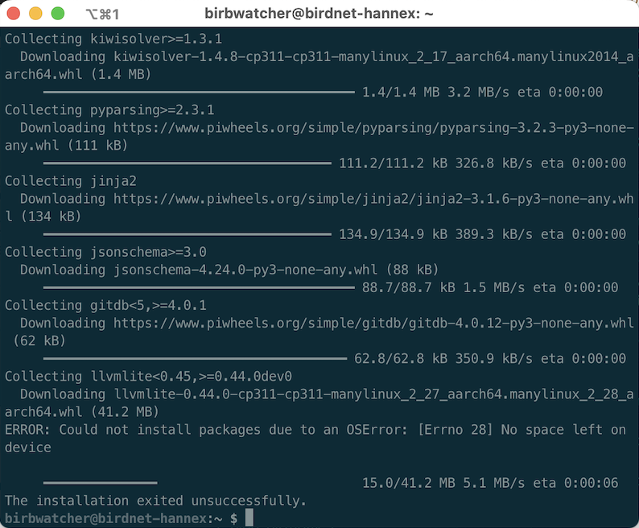
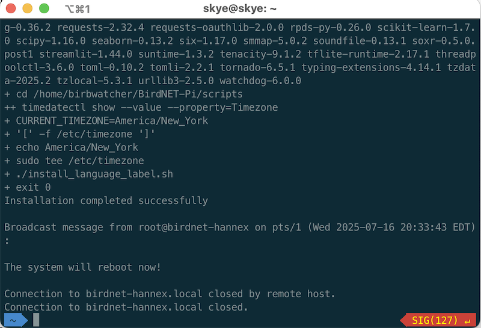
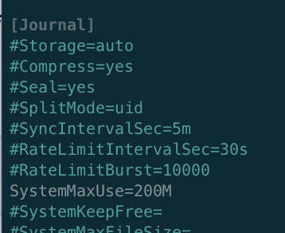
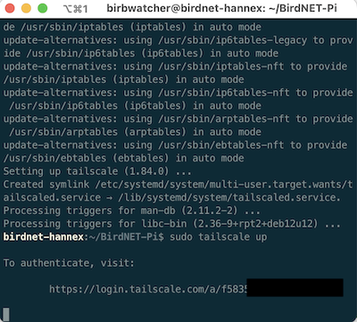
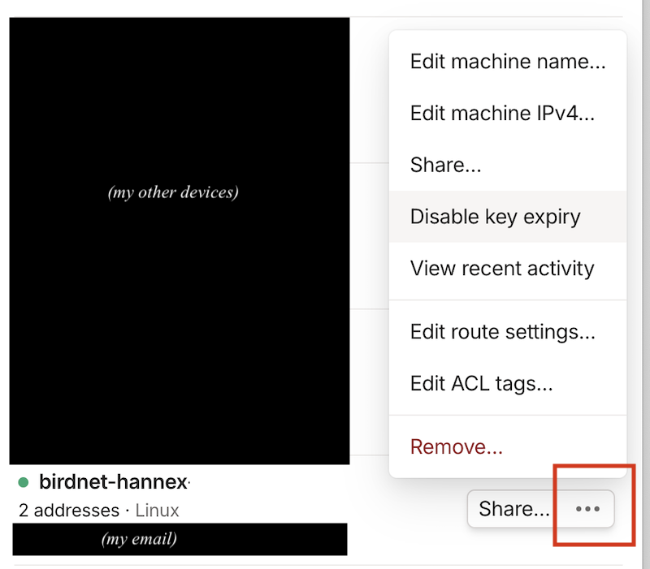

<br>
<div class="alert" style="background:#e8ebf5; padding: .5em;">
<summary class="alert-heading">Before you step through these instructions, first read [Intro to BirdNET-Pi: On surveilling my feathered friends (and how you can too)](../birdnet-intro/) 🐦‍⬛</summary>
</div>

The goal of these instructions is to make it trivially easy to get a new BirdNET-Pi installation up and running on a Raspberry Pi Zero 2 W.
The instructions are intentionally verbose, written for folks who use computers but don't consider themselves programmers, and anyone who has never worked with a Raspberry Pi before. If you fit this description but find that the instructions fall short, please let me know!

## One-time setup

Here are the tasks we'll be stepping through:

- 0: Acquire components
- 1: Initial Raspberry Pi Zero 2 W set up
- 2: SSH time---talk to the Pi
- 3: BirdNET-Pi application installation
- 4: Configure the BirdNET-Pi application
- Optional:
    - 5: Install Tailscale for remote monitoring
    - 6: Support additional Wi-Fi networks
- 7: Physical installation

While it may look like there's a lot here, it is a straight-forward "a lot," without implicit steps that require leaving this page. Don't be nervous---you've got this!

Also: I ran this setup from my personal computer, which happens to be a Mac. If you're on a Windows machine the screenshots might not exactly match what you see, but the steps are the same.

### Task 0: Acquire components

Here are the items you'll need, with prices at time of writing:

- **Raspberry Pi Zero 2 W** [ [Adafruit, $15](https://www.adafruit.com/product/5291) | [MicroCenter, $18](https://www.microcenter.com/product/683270/raspberry-pi-raspberry-pi-zero-w-2-with-headers)]
    - With or without headers, it doesn't matter; we won't use them.
- **USB lavalier microphone** [ [Amazon, $19](https://www.amazon.com/gp/product/B08RYC5435) plus [USB 2.0-to-micro adapter, $4](https://www.amazon.com/dp/B01C6032G0)]
    - The microphone will plug into a **micro USB port** on the Pi; if you get a different mic than this one, double-check the plug or get an adapter for it.
- **Power adapter, 5V 2.5A or 3A, Micro USB** [ [MicroCenter, $12](https://www.microcenter.com/product/510437/micro-connectors-micro-usb-5v-25a-power-adapter-with-on-off-switch-for-raspberry-pi) | [Amazon, $12](https://www.amazon.com/dp/B07CVH21NC) ]
    - The power adapter will connect to a **micro USB port** on the Pi; if you buy a different adapter than this one, double-check the plug or get an adapter for it.
    - You could alternatively use a rechargable power brick instead of a wall wart, although you'd have to remember to charge it (and wouldn't be detect birds during recharging...).
- **SanDisk 64GB Extreme microSDXC (64GB)** [ [MicroCenter, $17 for two](https://www.microcenter.com/product/675331/sandisk-64gb-ultra-microsdxc-class-10-u1-a1-flash-memory-card-with-adapter-(2-pack)) | [Amazon, $12](https://www.amazon.com/gp/product/B07FCMBLV6) ]
    - You could probably get away with less memory, but don't skimp and get an off-brand card; this is the component that actually matters.[^sd]

- Access to **an SD card writer** [ [MicroCenter, $18](https://www.microcenter.com/product/467960/iogear-superspeed-usb-30-sd-microsd-card-reader-writer) ], if there isn't one already built into your computer.
    - The step that requires an SD card writer is relatively brief and first on the list, so you could easily get away with borrowing a friend's, rather than buying your own---especially if you set up a BirdNET-Pi for them while you're at it!

***Total cost: ~$60, not including the SD card writer***

[^sd]: Fun fact, SD card choice *really* matters if you're working with infrasound, e.g., if you're detecting bat sounds rather than bird sounds---some brands of SD card generate a hum at the same frequency as bats. The more you know!

### Task 1: Initial Raspberry Pi Zero 2 W set up

In this task, we'll install an operating system (OS) on the Raspberry Pi Zero 2 W, by loading it onto the microSD card.

1. Plug the SD card writer into your computer, and put the microSD card into it.

    

2. Install the Raspberry Pi Imager application on your computer, by selecting the correct "Download for Windows/macOS" option on this page: [Raspberry Pi Imager](https://www.raspberrypi.com/software/)

3. Open the Raspberry Pi Imager application, and make the following selections:
    - Raspberry Pi Device: **Raspberry Pi Zero 2 W**
    - Operating System: **Raspberry Pi OS (Legacy, 64-bit) LITE**
        - This option may be nested under the "Raspberry Pi OS (other)" folder and require a little bit of searching; also, it may be called "Raspberry Pi OS LITE (Legacy, 64-bit)". 
    - Storage: **Generic - SD/MicroSD Media**, which is the microSD card that's currently in the writer

    

    ...**`NEXT`**!

4. You'll be prompted to optionally "Apply OS customization settings?" Select **`EDIT SETTINGS`**

    

    and then on the following page, set:
    - Hostname: **`birdnet-<pi_identifier>`**, 
        - This will be the name of the Raspberry Pi, e.g., `birdnet-foo`, `birdnet-backyard`, `birdnet-007`, whatever! The identifier I chose in these screenshots is `hannex`, such that my full hostname is `birdnet-hannex`. 
        - Make it something unique enough that if you set up multiple birdnets, you'll be able to keep them separate. I typically use the initials of the recipient.
        - *Note that the angle brackets ("<", ">") here and elsewhere in this tutorial should not be included in your chosen `<pi_identifier>`; they are simply convention used to indicate the user-specific parts of variables.*

    - Username and password: **`<pi_username>`** / **`<pi_password>`**
        - This will be the username and password for the Raspberry Pi. I use `birbwatcher` as the username for all of mine, so that's what you'll see in my screenshots. Make sure to write these values down somewhere, as you'll need them whenever you want to log into your Pi!

    - Configure wireless LAN: **`<your_current_wifi_network_name>`** / **`<your_current_wifi_network_password>`**
        - Important: this must be the  Wi-Fi network name ("SSID") and password for the  Wi-Fi network your computer is *currently using*, and that you'll be using for the rest of the Pi setup. If you're setting this device up for someone else, there'll be a separate step to additionally add *their*  Wi-Fi network info later; for now, this should be yours.
    - Make sure the time zone is correct for wherever your BirdNET-Pi will be installed.

    

    - Under the *`SERVICES`* tab, confirm that `enable SSH` and `use password authentication` are both selected---they likely already are, by default.

    

    ...**`SAVE`**!

5. You'll be reprompted to "Apply OS customization settings?" This time select `YES`. You might get a scary looking message asking you to confirm that any existing data on the card will be overwritten; select `YES` to continue. If prompted for a password, use the password for the computer you're running the configuration from---not any of the passwords we've now set for the Pi. 

    The Raspberry Pi Imager will now proceed to write the operating system and configuration settings to your microSD card! It may take a few minutes, but the progress bar will tell you when its done, and the microSD card will be automatically disconnected from your computer ("ejected") once the writing is complete. At that point it will be safe to remove the card from the writer.

6. Remove the microSD card from the writer and put it into the microSD card slot in the Raspberry Pi 2 Zero W.

8. Connect the power cable to one of the Pi's micro USB ports, and plug its other end into the wall. Once powered, the Pi will turn on automatically; you'll know the Pi is on because a green light will start flashing on the Pi. This may take a few moments.


Congratulations, you've now installed the operating system on your Pi! When the Pi boots up, it will automatically use the Wi-Fi credentials you provided to connect to your wireless network. We can---and will!---do the rest of the setup wirelessly.

### Task 2: SSH time---talk to the Pi

In this task, we'll "SSH onto the Pi", i.e., send commands to it from another computer. It is barely worthy of its own section in this tutorial, but giving it one should make it easier to find again when your future self inevitably forgets the single command. :D

Why do we do this? In the previous task we chose the "Lite" operating system for our Pi, which means we configured the Pi to run in "headless" mode---i.e., without a dedicated monitor, keyboard, or mouse. To interact with the Pi in the absence of those peripherals, we connect to it remotely over a wireless network, using a communication protocol called the [Secure Shell Protocol (SSH)](https://en.wikipedia.org/wiki/Secure_Shell). 

Once your Pi is powered on, **as long as your personal computer is on the same Wi-Fi network you configured the Pi to connect to** you'll be able to SSH onto it from your personal computer. (I've put that bit in bold because it is mission critical!)

> *When a step says "run", that means to type or copy the given text into the terminal and then hit the `Enter` or `Return` key.*

1. SSH onto the device: on your personal computer, open up a terminal application. If you're on a Mac, this is literally called **Terminal**; on Windows it's called **Windows Terminal**. Run

    ```
    ssh <pi_username>@birdnet-<pi_identifier>.local
    ```
    To SSH onto the device I configured in the earlier screenshots, I do `ssh birbwatcher@birdnet-hannex.local`:

    

3. If prompted to continue connecting, type `yes` and hit `enter`.

2. When prompted for a password, type the `<pi_password>` from above (without the angle brackets!!) and hit `enter`.

...that's it, you're on! Any commands you type into this terminal window will now be running *on your Raspberry Pi*. 😮 If you want to close the SSH connection? Simply type `exit` and hit `enter`, or close the terminal's application window by clicking on the X in the corner of the window. 

If your SSH connection drops at any time---your internet chokes, you decide it's bedtime and want to finish another day, you accidentally close your terminal window, you intentionally close your terminal window---simply SSH back on again.

<details><summary>***Click for more details on understanding to which machine you're sending terminal commands***</summary>

*In the terminal window, how can you tell which machine you're sending commands to? How can you tell if your SSH connection is running or has dropped?*

- Look at the start of each line: when you're on the Pi, the "prompt"---the default text at the start of a line in your terminal---will be `<pi_username>@birdnet-<pi_identifier>`. When you're on your personal machine, it will be something else---probably the name of your computer unless you've customized it to look different. 

    

    In this screenshot, my local prompt is the path to my working directory ("~") in a blue arrow, while the prompt on the Pi is the white `birdnet-hannex:~/BirdNET-Pi$`. The text styling will likely be different in your terminal, but the concept is the same. 

    You can try out typing the same series of prompts as I did in this screenshot---anything on the blue or white lines---and you should see similar if not identical responses on your machines. 

</details>

### Task 3:  BirdNET-Pi application installation

Okay. You've set up the Pi, you've ssh'd onto the Pi---it's time to add  the "BirdNET" part of BirdNET-Pi!

In this task, we'll download and run the installer for the BirdNET-Pi application and then change some of the Pi's configuration for storage limits, restart behavior, and logging. Some of the following is going to seem a little silly, but it works. ¯\\\_(ツ)\_/¯ Bear with me! 

> *If you're prompted for a password at any point in this task, use the `<pi_password>` you set previously.*

1. In your remote terminal---that is, a terminal window in which you've SSH'd onto your Pi---run
    
    ```
    sudo nano /etc/rc.local
    ```
    This will create a new file at path `/etc/rc.local` and open it in a program called **nano**, which is a text editor that runs in the terminal. 
    
    Using your arrow keys and keyboard as with a regular text editor, 
    Edit the file so its contents are exactly as follows:
    
    ```
    #!/bin/sh -e
    iw wlan0 set power_save off
    exit 0
    ```
    To do this you can either type these contents in manually, or copy and paste the contents using `ctrl+c`/`ctrl+v` commands, as with any other text editor.

    To exit this file, press `ctrl` and `x` at the same time; then `y` to save the modifications, then `enter` to select the path you originally opened as the save path. You will then be returned back to your command prompt.

    - Want to confirm that you wrote and saved the correct content to this file? Run

        ```
        cat /etc/rc.local
        ```
        to display the file contents in the terminal. If the displayed content matches the text above, you're good to go---if it doesn't, simply do `sudo nano /etc/rc.local` to reopen the file in your editor and try again!

2. To make the file you just created executable, i.e., to enable the computer to run it, run

    ```
    sudo chmod u+x /etc/rc.local
    ```
    in the terminal. 

3. To update the Pi's swap space limits, run 

    ```
    sudo nano /etc/dphys-swapfile
    ```
    to open the file `/etc/dphys-swapfile` in nano. 

    1. Use the down arrow to scroll through the file to the line that says `CONF_SWAPSIZE=512` and edit it to be `CONF_SWAPSIZE=2048`
    
    2. Scroll down to the line that reads `#CONF_MAXSWAP=2048` and edit it to be `CONF_MAXSWAP=4096` (Note the lack of `#` at the beginning of the line!!).
    
    Your resultant file should look like this:

    
    
    > *A `#` at the start of the line means that the line is commented out---which means that the changes on that line will be ignored. We do not want them to be ignored, hence deleting the relevant `#`!*

    To save the changes, press `ctrl` and `x` together, then `y`, followed by `enter`; once again you'll be returned to the terminal.

4. In the terminal, run `sudo reboot`. This will cause the Pi to---you guessed it---reboot, which will automatically close your SSH connection.

5. Wait for a moment or two for the Pi to reboot, then SSH back onto it:

    ```
    ssh <pi_username>@birdnet-<pi_identifier>.local
    ```

    (Look familiar? :) )

6. Okay, this is the bit that is going to feel silly. Just go with it. In your remote terminal, start the BirdNET-Pi installation script by running

    ```
    curl -s https://raw.githubusercontent.com/Nachtzuster/BirdNET-Pi/main/newinstaller.sh | bash
    ```
    A bunch of text will print out to the scree, as various files and dependencies are copied onto the Pi. You don't have to pay attention to that text---you just have to wait and wait, until the installation fails. That's write: eventually, **the installation script you just ran will fail(!)** with a "No space left on device" error.  That's expected! You want it to happen![^expected]

    
    
    [^expected]: The installer was designed for the non-"Pi Zero" Raspberry Pi computer, which has more space. 

7. Okay, let's fix the out-of-space error. Run the following:

    ```
    sudo mount -o remount,size=5G /tmp/
    ```

8. Now re-run the installation step, first deleting the failed installation directory:

    ```
    rm -rf BirdNET-Pi/
    curl -s https://raw.githubusercontent.com/Nachtzuster/BirdNET-Pi/main/newinstaller.sh | bash
    ```

    This step is slow, as lots of things happen during installation. Be patient!

    This time the installation script should succeed. You'll know it has succeeded because the Pi will reboot, which will close your SSH connection.

    


9. SSH back on to your Pi again! I bet you remember the command this time. 

    > *You can also probably use the up-arrows in your terminal to page back through the previous terminal command history, which at this point definitely contains your SSH command! You can hit `enter` on any item in the command history to rerun it.*

10. Now edit the amount of storage space the system logs are allowed to use: run

    ```
    sudo nano /etc/systemd/journald.conf
    ```
    which will dump you into yet another file in your text editor!
    
    Use the arrow keys to scroll down to the line that says `#SystemMaxUse=` and change it to `SystemMaxUse=200M`

    

    and then save the file: `ctrl+x` , `Y`, `enter`. You're now a pro at this in-terminal text editor stuff!

11. Restart the logging with those new settings by running

    ```
    sudo systemctl restart systemd-journald
    ```

Congrats! You've now installed the BirdNET-Pi application! 🐦‍⬛ The finicky part is over.

### Task 4: Configure the BirdNET-Pi application

The BirdNET-Pi application consists of two components: a classification pipeline that constantly analyzes recorded audio for bird sounds, and a small web server that hosts a website that visualizes those detections. The website also lets users (you!) configure the application's various settings. That's what we'll be doing in this task.

For the following steps, use whatever browser on your computer you prefer---Chrome, Firefox, whatever. Note that the BirdNET-Pi website will be slow to load and respond, which is to be expected: remember that it is being run *on your Raspberry Pi*! Have patience, and don't click around excessively in frustration if things are moving more slowly than you'd like---that'll just make things worse.

1. In your browser of choice, go to the website 

    ```
    http://birdnet-<pi_identifier>.local/
    ```
    For my installation, that's `http://birdnet-hannex.local/`.

    > *This URL will only succeed (i.e. the page will load) if you are visiting it from a machine on the same Wi-Fi network that your Pi is currently connected to!*

    You should see something like this:

    

    In the future, once you've detected some birds, this same page will look more like this: 

    

2. Select the `Tools` tab. (You may need to make your browser window wider or click the button with the horizontal black lines to make the toolbar visible.) When prompted for a username and password, use `birdnet` as the username and leave the password empty. 

    - These are the default credentials of the BirdNET-Pi *application*, as defined in the installation script we just ran, rather than any of the credentials we configured previously for the Pi itself. If you want to change this default, you can do that on the Settings page. (I haven't bothered to change mine yet, because I trust the folks who have access to my Wi-Fi network to not mess with my BirdNET-Pi settings.)

    

3. In `Tools > Services`: 


    1. Click **`Disable`** in **`Live Audio Stream`**. 
    
        This step optional---you *could* leave it enabled. I disable mine for two reasons:
        - I don't want the ability to hear the recorded audio stream live, so it is a waste of compute power to leave it on and possibly slow everything else down; and
        - This "feature" makes it too easy to accidentally wander into a privacy violation. 
    
    2. Click **`Disable`** in **`Streamlit Statistics`**. 
    
        This service the Species Stats tab, which is unusably slow on the Raspberry Pi Zero. Might as well turn it off, since we can't use it!

    For both these services, be sure to select `Disable` instead of `Stop`; the former will persist after reboot, the latter will only halt the service until reboot. It might take a 

    Note that it may take a few seconds to a minute for each setting to update after being clicked; that's to be expected! Your Pi is working very hard to analyze birds and handle website requests at the same time! Have patience. If you're taken to a different screen with a black terminal on it, just go back to `Tools > Services` to confirm that those services are now disabled. It should look like this once complete:

    

 4. In `Tools > Settings`, update latitude and longitude to that of your planned installation location, then select `Update settings`.

    You can use [this site](https://www.latlong.net/) or in Google Maps, right click on a location to see its latitude and longitude:

    

5. In `Tools > Settings > Advanced Settings`---found at the bottom of the basic `Tools > Settings` page---set:

    - **`Privacy threshold` to `1%`**;
    - **`Recording Length` to `30`**
    
    then select `Update settings`. It might take awhile for the advanced settings page to open; again, have patience.

    

### Task 5 (Optional): Install Tailscale for remote monitoring

If you're gifting this BirdNET-Pi to someone else who wants you to act as tech support for their installation, or you want to be able to check on your own installation while you're not connected to your home Wi-Fi network, you can add your Pi to a [Tailscale](https://tailscale.com/) network---basically, it acts as a virtual private network for your various devices. 

<details><summary>***Click to see instructions***</summary>

1. [Sign up](https://login.tailscale.com/admin/welcome) for a Tailscale account, if you don't already have one.

2. In your terminal, SSH onto the Pi and install Tailscale by running

    ```
    sudo apt-get install apt-transport-https

    curl -fsSL https://pkgs.tailscale.com/stable/raspbian/bullseye.noarmor.gpg | sudo tee /usr/share/keyrings/tailscale-archive-keyring.gpg > /dev/null
    curl -fsSL https://pkgs.tailscale.com/stable/raspbian/bullseye.tailscale-keyring.list | sudo tee /etc/apt/sources.list.d/tailscale.list

    sudo apt-get update
    sudo apt-get install tailscale
    ```
    
    (If prompted, type `Y` and enter to confirm installation.)

3. To connect your Pi to your Tailscale network, run

    ```
    sudo tailscale up
    ```
    This will result in a prompt with a URL link to click. Follow that `command`-click that link or paste it into your browser! It will ask you to agree to connect this new device to your Tailscale network. 

    > Note that if you want to connect the device to *someone else's* Tailscale network, you'll need to send *them* the generated URL and have them authorize it with their own Tailscale account. 

    

4. Your Pi should now show up on your [Tailscale console](https://login.tailscale.com/admin/machines).

5. If you won't have easy access to the device in the future, consider setting `... > Disable key expiry` on that Pi in the Tailscale web console.

   

6. Optional: If this is your first time using Tailscale, you'll need to additionally install it on whatever device you plan to use to access the BirdNET-Pi---e.g., I have it installed on both my personal computer and my phone. Steps for these different devices are available [in their documentation](https://tailscale.com/kb/1347/installation).

7. Now, from any device on your Tailscale network, you can SSH onto your Pi through that network, and no longer need to be on the same wireless network! Try this by opening a new Terminal window and running

    ```
    ssh <pi_username>@birdnet-<pi_identifier>
    ```

    Note the lack of `.local` at the end of the host name!  E.g. over Tailscale I now do `ssh birbwatcher@birdnet-hannex` instead of `ssh birbwatcher@birdnet-hannex.local`.

8. Similarly, you can view the Pi's website via your Tailscale network, so that you no longer have to be on the same wireless network as the Pi! You'll still need to do this from a machine that is part of your Tailscale network---this url won't work from a machine that isn't, i.e., you can't just give the URL to a friend and expect it to work.

    Find the Pi's URL in your Tailscale console. E.g., for my device, the console shows its address as 

   

   so I access mine at `http://birdnet-hannex.feist-matrix.ts.net/`. If you go to that address, you will not be able to see anything---because you are not part of my Tailscale network. 

That's it!

While SSH'd onto the Pi, you can do `sudo tailscale down` to disconnect it from the VPN, or `sudo tailscale up` to reconnect. (`tailscale status` will tell you whether you are currently connected or not.)

If you are giving the Pi to someone else, and only want it to be available on your Tailscale network when they specifically enables it---and they are willing and able to interact with a terminal themselves!---you can `sudo tailscale down` for now, and then give them instructions to SSH on and do a `sudo tailscale up` when needed.

</details>

### Task 6 (Optional): Support additional Wi-Fi networks

TODO-HERE

There may be multiple  Wi-Fi networks to which you want the Pi to auto-connect when in range. For example, when I set up a BirdNET-Pi for someone else, I want it to recognize my home network---during setup, and for quality checking before I send it off!---as well as the network of the home I'm sending it to. Perhaps you additionally want to allow your Pi to connect to your phone's hotspot, so that you can take it with you on various outdoor adventures?[^adventure] [^hotspot]

[^adventure]: Simply replace the wall plug with a portable USB battery pack, and hey presto, off you go!
[^hotspot]: Note that if your phone's name (and therefore your hotspot name) is anything other than alphanumeric, these instructions may not work. Ask me and my phone named `🐙🐙🐙` how I figured this one out, and how long I struggled before giving up. 😅

<details><summary>***Click to see instructions***</summary>

For each additional network you want to add, paste the following:

1. Type the following:

    ```
    sudo nmcli connection add \
        type wifi \
        wifi.ssid "<NETWORK-NAME>" \
        wifi-sec.key-mgmt wpa-psk \
        wifi-sec.psk "<NETWORK-PASSWORD>"
    ```

    e.g., for a network named `SuperBoringNetwork381` with password `reallysecurepassword`:

    ```
    sudo nmcli connection add \
        type wifi \
        wifi.ssid "SuperBoringNetwork381" \
        wifi-sec.key-mgmt wpa-psk \
        wifi-sec.psk "reallysecurepassword"
    ```

2. Reload the configuration: `sudo nmcli connection reload`

3. ...that's it! You can check to see what networks are now set up with 

    ```
    nmcli device wifi list
    ```

</details>

### Task 7: Physical installation

Time to stick that microphone out a window!

While you *could* just unplug your Pi, it's safer for the Pi (less chance of something going wrong!) to intentionally power it down first. While SSH'd onto the Pi, do `sudo shutdown`.[^say]

[^say]: Do as I say, not as I do---I generally just unplug it. YMMV!

Now go find a window and stick your microphone out it! I've included some photos of my own setup as inspiration. Once the microphone can access the great outoors (presumably, somewhere where you've heard at least one bird recently!), plug it into the remaining micro-USB port on the Pi. Plug the pi into whatever outlet is accessible, and wait! 

In your choice of microphone location, be mindful of whether anything will get wet if it rains (bad!), especially if that thing is the Pi (very very bad! do not do this). As an example, here is what my installation looks like:

<div class="centered-children">
<figure>

<figcaption style="font-size:smaller">My exceptionally professional looking setup. Note the piece of white tape for sticking the Pi to the wall, and the piece of black tape, for covering up the Pi's bright green light, which otherwise is annoyingly bright at night.</figcaption>
</figure>
</div>

<div class="centered-children">
<figure>

<figcaption style="font-size:smaller">A view of the microphone, and also of my exceedingly dirty inner window frame. I was so horrified by this photo that I considered cleaning it out and taking a new photo. As you can see, I did not do that. Also, I just slide the window shut over top of the wire; the window isn't so snug that it is a problem. We did a similarly half-assed installation out of my parents' window, which was also sufficient for bird detection!</figcaption>
</figure>
</div>

Once powered, the analysis service and web server will start right away, and it will autoconnect to the  Wi-Fi network that you configured it for, which means that you will be able to see what it's doing via `foo.local` on another device (phone, laptop) as long as that device is on the same  Wi-Fi network.

Once your BirdNET-Pi is up and running, anyone connected to your home  Wi-Fi network can view the latest birds at `birdnet-foo.local`. Anyone connected to your tailscale network can see the same via `birdnet-foo.TODO`.

Click around to explore what's visible to you; note that the TODO and TODO tabs won't show anything, since we disabled those services (above). Until you've detected a few birds, the app will seem pretty boring and janky, but leave the microphone plugged in for a bit and then recheck it! The page may be a bit slow to load---remember that this site is being served entirely from that little Raspberry Pi Zero you just set up, and in addition to making the website you're trying to view, it is also constantly recording and analyzing sound. It's doing the best it can.

## Daily usage

To view the website being broadcast by your Pi, http://birdnet-foo.local. To access this site, you'll need to be on the same Wi-Fi network that your Pi is connected to.

If you did the optional Tailscale installation, you can additionally view your site at http://birdnet-foo.<TODO>.ts.net/.

Optional niceties:

- Put up a sign in your home with a link to the site, to show visitors how to connect to your  Wi-Fi and then view your birds
- If you have an old display of some sort, you can set up a semi-permanent viewing station. My parents mounted an old iPad near the window with the BirdNET installation, and set its default landing page to view your BirdNET-Pi detections.[^display]

<div class="centered-children">
<figure>

<figcaption style="font-size:smaller">The BirdNet-Pi application's website, displayed on the semi-permanent viewing station my parents set up on an old iPad.</figcaption>
</figure>
</div>

[^display]: With the visualization installation, the BirdNET went from being a background afterthought of being an active obsession---when an issue with logging brought down their installation a few months back, they went into bird monitoring withdrawal while I worked to fix it.

### System administration details

Your BirdNET-Pi is now running! Awesome! Congrats! Uh...what if something goes wrong?

- If your power goes out, or your  Wi-Fi router resets, the Pi will automatically reconnect and start back up.
- If your Pi is unable to connect to the  Wi-Fi for whatever reason, BirdNET will continue to run its detection and analysis; you just won't be able to connect to it (i.e., see the website for your installation) until the Pi has connected to the  Wi-Fi again.
- If your internet is out but your  Wi-Fi router is still running, you'll still be able to see your Pi's website
- If you are unable to load your Pi's website from another device, check the following (in roughly this order):
    1. Is the Pi plugged into power? Is the green light on it flashing (to indicate that it is powered)?
    2. Is the Pi able to access the wireless network it was configured to run on? i.e., is that network accessible and can you connect to it with another device (i.e., your phone, a laptop, etc)?
    3. (If you aren't running tailscale) Is the device you're trying to view the website from connected to the *same network as the device is*? This is the gotcha question...if they aren't on the same network, the website won't be viewable. (This means if your phone is on the 5g home network and your Pi is on the regular network, you won't be able to view the website.)
    4. (If you are running tailscale) Does the device you're trying to view the website from have tailscale enabled? Are you loading the site through its tailscale address (TODO) rather than FOO.local (TODO)?
    5. Can you connect to the Pi via ssh? If the Pi is powered and connected to the  Wi-Fi,
- If you set the device up for someone else and it turns out you set up their  Wi-Fi password incorrectly, use your phone to create a hotspot with the same credentials of the  Wi-Fi network you were on when you first set up the Pi (i.e., your home network, if you set this up for someone else) to get onto the Pi.[^hotspot]
- Once the Pi begins to run out of storage space, which won't happen for a long time,[^storage] the oldest recordings will be deleted to make space for newer recordings.
    - You can preempt this "loss" by periodically moving older recordings off the device to a different storage location.

[^hotspot]: Ask me how I figured this one out. 🙃
[^storage]: This won't happen for a long time unless you're somewhere where the birds yell _constantly_ and you have a smaller SD card than the one recommended above.

We have now left the happy harbor of this basic installation document  so if you're hitting issues here, search around in some of the resource docs below, or message me or something...

- Data backup:
    - It's probably a good idea to copy your database off the Pi periodically. I don't do this, but I should, because if the SD card dies there's no way to recover your data. TODO-instructions
    - Also more minimal instructions sans recordings.

## Finally

If you use these instructions---or are otherwise inspired to set up a BirdNET-Pi of your own---please let me know! If anything is unclear or broken, **please tell me**. If you know me in real life and want assistance or company while you run through a set up, or just want me to just set one up for you, let me know. I'd love to help!

***Thanks to AF for assistance in editing for clarity and comprehension!***
