<br>
<div class="alert" style="background:#e8ebf5; padding: .5em;">
<summary class="alert-heading">All posts in the BirdNET-Pi series:

1. [Intro to BirdNET-Pi: Eavesdropping on my feathered friends (and how you can, too!)](../birdnet-intro/)
2. [Set up a BirdNET-Pi on a Raspberry Pi Zero 2 W](../birdnet-setup)
3. [Text of the wild: Receive notifications from your BirdNET-Pi via ntfy](../birdnet-text-notifications)

🐦‍⬛</summary>
</div>

Now that you've set up your BirdNET-Pi, perhaps you want to get texts whenever a new bird ~~enters the ring~~ yells in your yard?

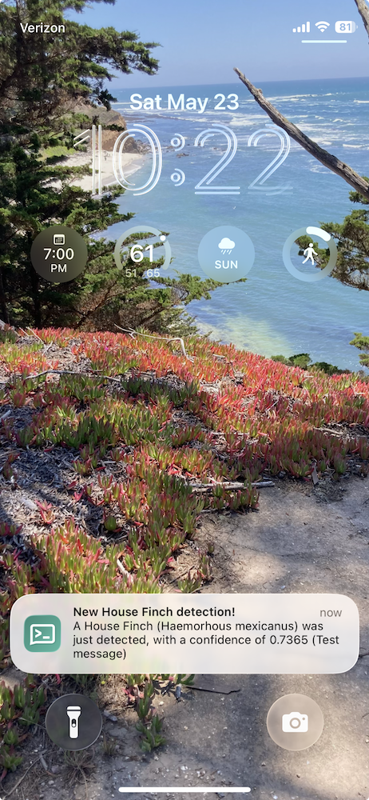

The BirdNET-Pi folks have made this trivially straightforward to set up, thanks to an [apprise](https://github.com/caronc/apprise) integration. Apprise is a piece of code that acts as a switchboard among a huge number of [notification services](https://github.com/caronc/apprise#supported-notifications), so that notifications can be sent to the service(s) of one's choice---with over a hundred such services to choose from.

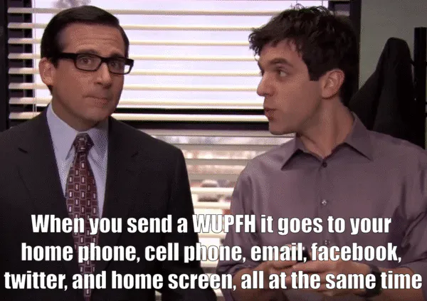

From these notification services I decided to use [ntfy](https://ntfy.sh/) (pronounced "notify", apparently!), which is a [publish-subscribe (pub/sub)](https://en.wikipedia.org/wiki/Publish%E2%80%93subscribe_pattern) service. That means that publishers (in our case, the BirdNET-PI) publish messages to a ntfy topic (e.g., `ntfy.sh/my-fun-topic`), and then anyone who subscribes to that topic (you! your cat! your neighbors, if you tell them about it!) can read those messages.  

I chose ntfy for a number of reasons:

- source (open)
- price (free, for the basic public service)
- sign-up (none, for the basic public service)
- access (not linked to a proprietary device or application; subscribable from my phone; not linked to a single account, so that my spouse can also receive bird notifications)
- recommendations (from some [Recurse Center](https://www.recurse.com/) peers whose choices in software tend to align with my own), and
- difficulty to configure (none)

If you have different notification needs, you may want to use a different service, but your set up on the BirdNET-Pi-side will look roughly the same.

For example, you can do this right now, no sign-up needed:

1. Go to [https://ntfy.sh/app](https://ntfy.sh/app) in your browser

2. Hit "+Subscribe to topic" and add topic "big-old-string-of-text-that-is-likely-somewhat-unique"

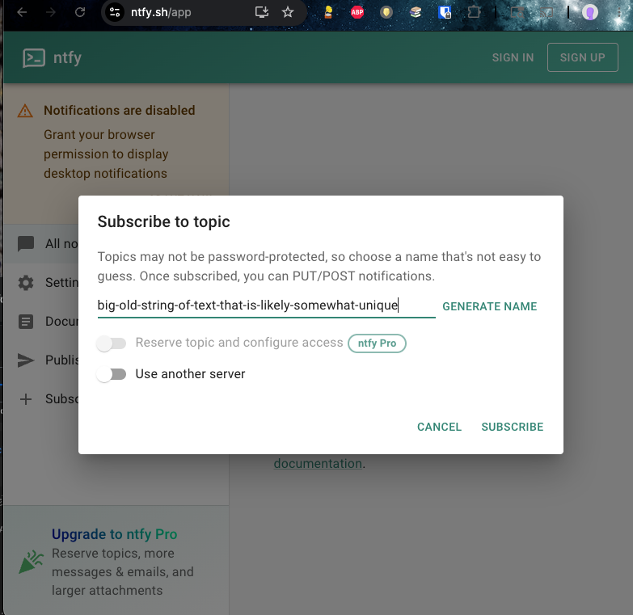

3. In your terminal, post a message to that thread, e.g., copy in

    ```
    curl -d "Hello party people " ntfy.sh/big-old-string-of-text-that-is-likely-somewhat-unique
    ```
    and then hit enter.

    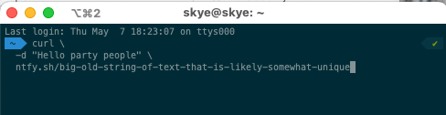

4. See that message show up in the browser!

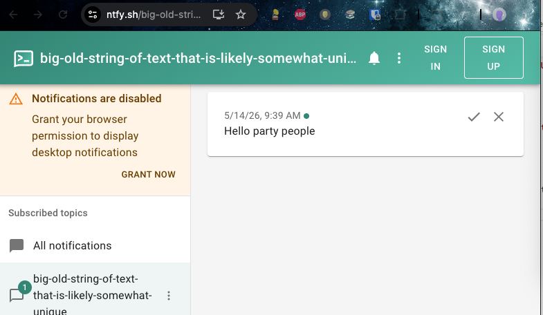

5. Realize that anyone else who subscribed or subscribes to this topic will _also_ see these messages, and gain an understanding of the privacy situation around these messages---namely, none. 😅

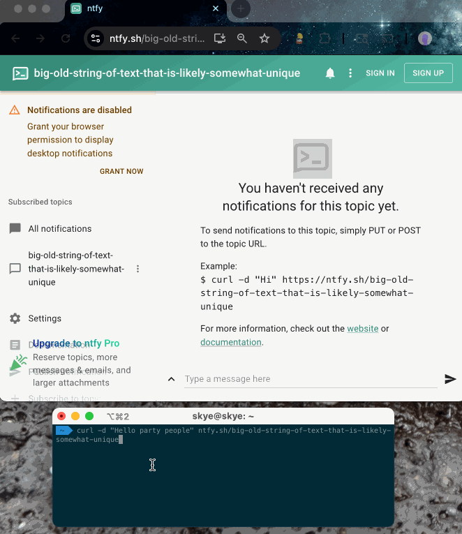

While ntfy is an incredibly powerful service for folks with some basic non-private notification needs---like ours, for these birds!---it is important to know that _the free version of ntfy has no privacy._ Any message you post to it can be viewed by anyone. It is not likely that these messages will specifically be linked to you, unless you share the URL, but you absolutely should not post anything to it that you are not comfortable being fully public.

The messages we'll be posting from BirdNET-Pi will only include specific bird names, not locations or addresses or personal contact info. While someone could theoretically use that information to be creepy, I've decided that I don't think someone would be able to learn more from my public bird notification topic than they'd already be able to find out elsewhere.[^privacy] Well, if there was one particularly rare bird that was migrating through a particularly narrow region, and you noticed it show up on my topic at a certain time, you might be able to triangulate where I live---but not any more precisely than with other data that is already public, for better or worse.[^worse]

Alternatively, it is possible to pay for a private version of ntfy, or host it yourself. I've never done that, but it seems reasonable!

[^privacy]: [For example...](https://sinceyouarrived.world/taken)

[^worse]: Worse. DEFINITELY worse.

## Set-up ntfy on your BirdNET-Pi

To use ntfy with BirdNET-Pi, we'll be choosing a unique-ish topic name, telling BirdNET-Pi to post to that ntfy topic (via its website settings page), and then subscribing to that topic through the ntfy phone application (although you could instead subscribe via the default web application or some other service).

This process is straightforward---let's step through it! Oh, and I'm assuming that you're starting with a fully set-up installation of BirdNET-Pi. If you aren't, go back and follow my [set-up instructions](../birdnet-setup/) first!

1. Choose a unique-enough ntfy topic, by generating a universally unique identifier (UUID).
    - You can generate one [here](https://www.uuidgenerator.net/version4) or select one [from this list of all uuids](https://everyuuid.com/).[^uuid]  It should look something like "1cb879d7-2c2e-40a4-8c3b-c5343babd810". 

    - The goal here is choosing a topic name that no one else is likely to be posting to, so that you don't get _their_ notifications in addition to your own. Also the more obscure it is, the less likely it is that anyone who randomly stumbles across it will know to associate it with you, specifically. 
    
    Nothing is stopping you from making something more human-readable, but keep the obscurity concern in mind if you do. I intentionally do not use `hannahilea-birdnet-notifications`, but because I've set up a few different installations now, and want to know what they are from the different subscription topics, I do throw an identifier for myself at the end of the topic name---e.g., `1cb879d7-2c2e-40a4-8c3b-c5343babd810-hr1`.

[^uuid]: Although I know Nolen [built this list of all uuids on a lark](https://eieio.games/blog/writing-down-every-uuid/), it is useful here! Thanks, [Nolen](https://eieio.games/)! Relatedly, it was delightful to search the open web for "which uuid version to use" and be given Nicole's [TIL: 8 versions of UUID and when to use them](https://www.ntietz.com/blog/til-uses-for-the-different-uuid-versions/) as the top hit. I love it when the answer to my asked-to-the-greater-world questions end up coming from friends.

2. On your BirdNET-PI's basic settings page (`Tools > Settings`), find the `Notifications` section.

    - If you're prompted to log in, remember that the default credentials (unless you changed them!) are username "birdnet" and empty password.

    - Forget how to get to your BirdNET-Pi's website? While on the same local WiFi network as it, it will look something like `http://birdnet-<pi_identifier>.local/`; if you [set up Tailscale](https://hannahilea.com/blog/birdnet-setup/#task-5-optional-install-tailscale-for-remote-monitoring) then you won't need to be on the same local network to view it, and your URL will look something like  `http://birdnet-<pi_identifier>.ts.net` (you can find that specific link in your Tailscale [console](https://login.tailscale.com/admin/machines)).

    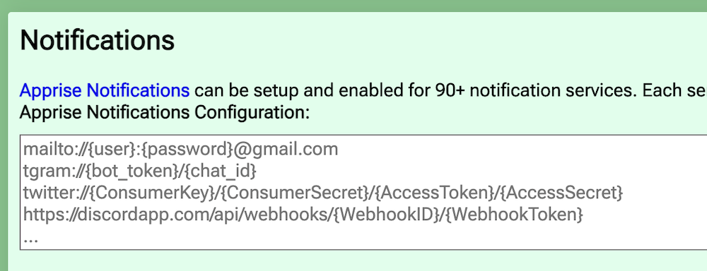

3. Add your ntfy topic as the notification service by setting that first "Notifications" field to `ntfy://<topic-uuid>`.

    - Using our example uuid, that looks like `ntfy://1cb879d7-2c2e-40a4-8c3b-c5343babd810`

    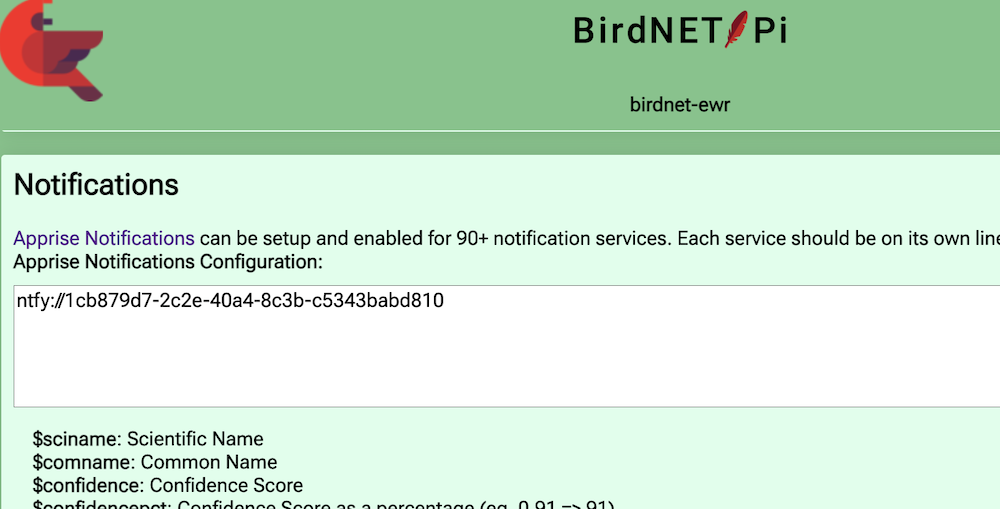

    - If you decide to pay for a private ntfy account---or use a different notification service outright---this is the part of these setup steps that will change; this configuration line will instead need to be something like `ntfys://{token}@{hostname}/{topics}`. There is good [apprise documentation for that](https://appriseit.com/services/ntfy/#syntax), should you need it.

4. Set the subject and message based on what you want to hear from your birds. I have mine set to basically the default message, with an updated subject:

    - Notification Title: `New $comname detection!`

    - Notification Body: `A $comname ($sciname) was just detected, with a confidence of $confidence ($reason)`

    You can update the message to use any of the templated variables described on that screen; play around with combinations and sending yourself test messages to see what feels right to you.[^judge] Remember not to include anything private in those messages, though---i.e., skip including `$latitude` or `$longitude`. (`$listenurl` will be the url of your BirdNET-Pi, but unless you've put your installation on a public network, no one except you and anyone you've added to your tailscale network will be able to access it anyway, so you can use it if you want)

    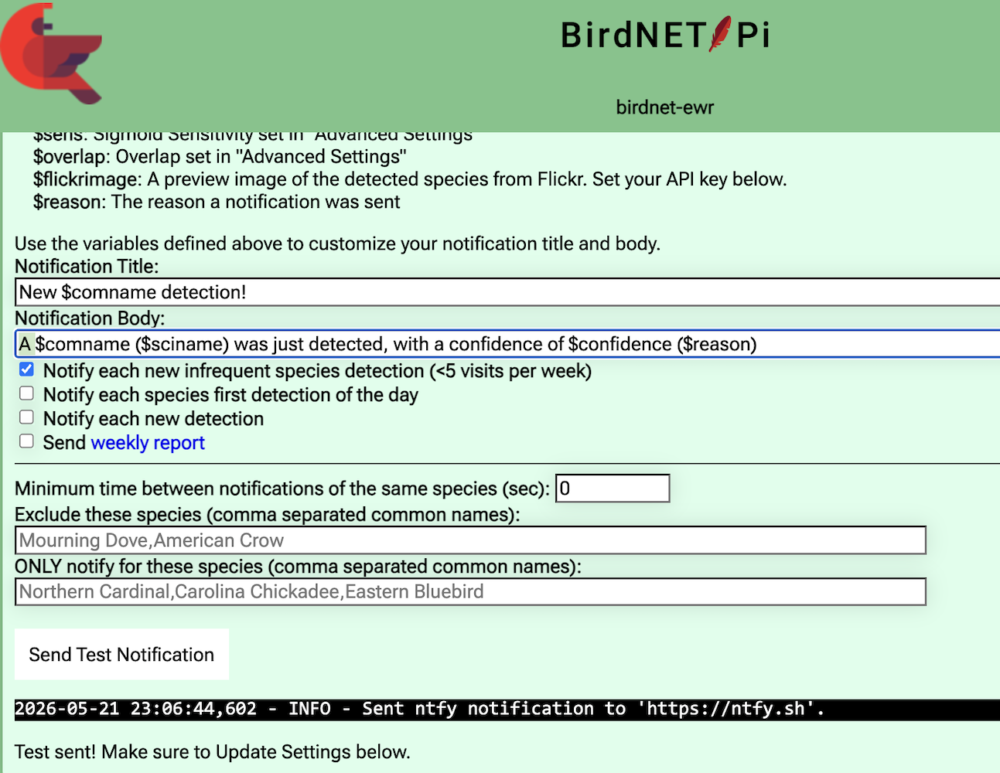

[^judge]: Examples, should you wish:
    - For desired message "I'm a American Goldfinch! I'm a American Goldfinch! I'm a American Goldfinch!" set the Notification Body to `I'm a $comname! I'm a $comname! I'm a $comname!`
    - For desired message "A wild Spinus tristus appears!", set the Notification Body to `A wild $sciname appears!`
    - For desired message format "76% confident in new American Goldfinch detection " set the Notifcation Body to `$confidencepct% confident in new $comname detection`

    Have fun with it. :) 


5. Choose what you want to be notified about! These are my settings:[^old]

    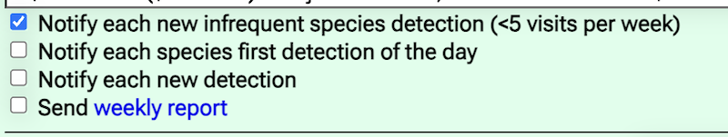

[^old]: When I first set this up I requested notifications for everything, but that got old quickly. I've got a lot of birds. They have a lot to say. Turns out I don't need to know about all of it.

6. Test that you've configured the BirdNET-Pi correctly: go to the ntfy [web app](https://ntfy.sh/app), and subscribe to your topic `<uuid>`:

    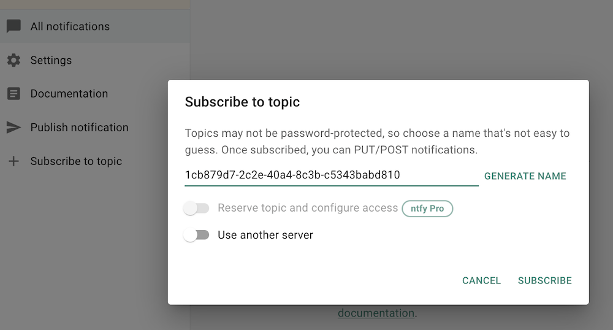.

    Now, back in the BirdNET-Pi settings page, hit "Send Test Notification". After a few moments, confirmation of completion will show up below the test button *and* you should see the test message show up on the ntfy page:

    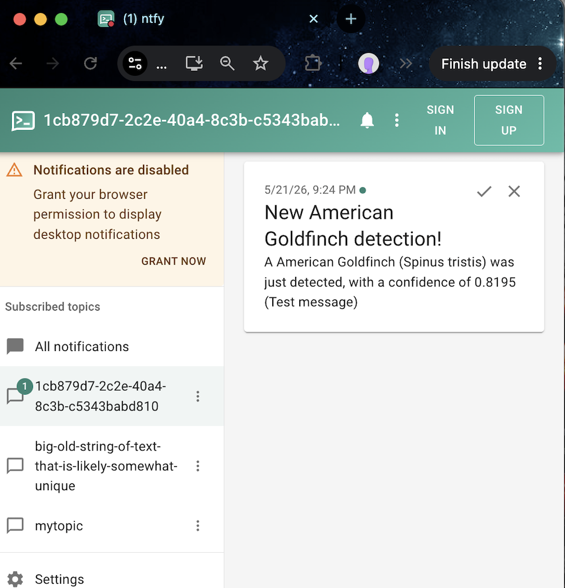.

    Huzzah! (If you don't see a test message show up, double-check that you've used the same uuid topic on both your BirdNET-Pi and the ntfy app.) 
    
6. Repeat this "send test message" process as much as you like, while you tune the notification messages to your liking, but then don't forget to **_SCROLL TO THE BOTTOM OF THE SETTINGS PAGE AND CLICK UPDATE!_** 

    Otherwise your settings will not save and your birds will not trigger notifications, and you will be sad.

Cool, we're done with this part! Don't leave the settings page yet, though, we'll want access to that Send Test Notification button 

## Set-up ntfy on your phone

1. Install ntfy on your phone: [iPhone](https://apps.apple.com/us/app/ntfy/id1625396347) / [Android](https://play.google.com/store/apps/details?id=io.heckel.ntfy) 

    - I use the iPhone app and can't personally vouch for the Android one, but as they're by the same developer I assume they're functionally equivalent.

2. Open the ntfy phone app and subscribe to your new topic:

    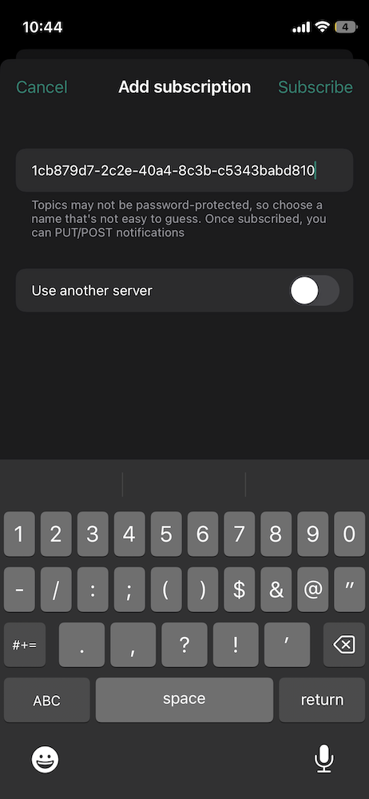

3. With the app still open, send another test message from the BirdNET-Pi settings page ("Send Test Notification" button). If you've typed in your UUID topic correctly, you should see it show up here in the app!

    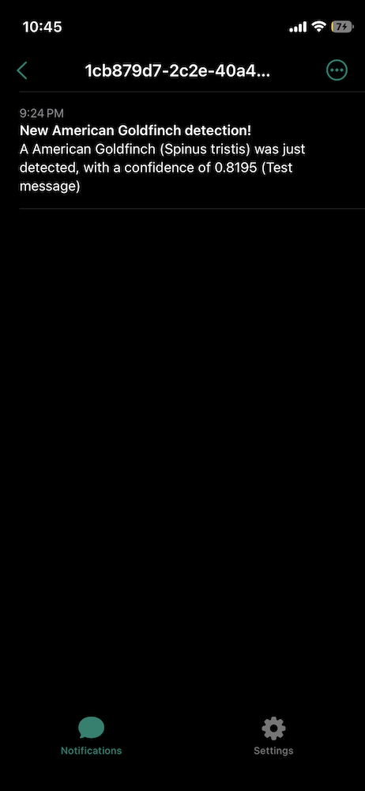

10. When you sent the test notification, you should also have received a push notification for it---i.e., a little pop-up notification at the top of your screen. If you didn't get the pop-up, go into your phone's notification settings and update them to allow the types of notifications you want.

    - On an iPhone, you can get there by going into `Settings > Notifications > ntfy`
    - Unlike any of my other apps(!), I allow ntfy messages to send me all types of notifications, and to let them show up directly on my lock screen. That looks like this:

    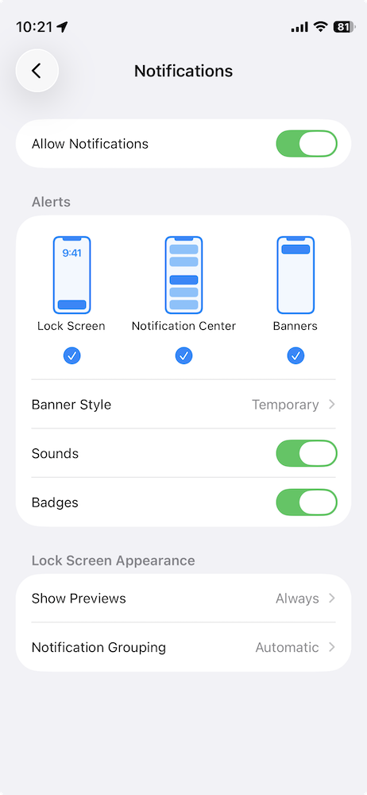

    You may want something a little less zealous! Once you've updated your settings, try sending another test message to test it out.

    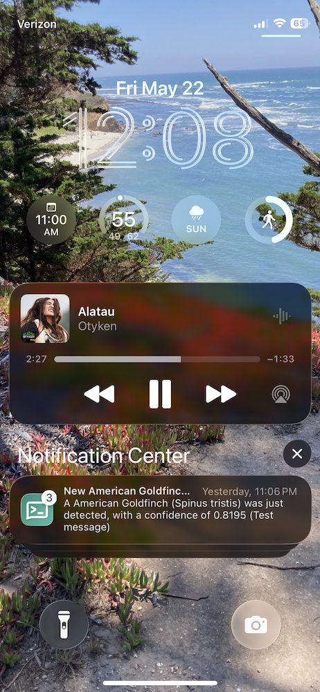

That's all! Go forth and be notified! After a few days you'll likely want to go back to the BirdNET-Pi settings to tune your notification frequency, as you decide you want more or fewer words from your birds.

### Yet another plug for Tailscale

If you're away from home when you receive a notification from your BirdNET-Pi, you may want to immediately go view that new detection. If you aren't on the same WiFi network as your Pi, you won't be able to view it unless you've set up Tailscale. The steps to do this are included as an optional piece of [my original set-up guide](https://hannahilea.com/blog/birdnet-setup/#task-5-optional-install-tailscale-for-remote-monitoring).

If you've installed Tailscale on your Pi, you can also add your phone to your Tailscale network, by installing the Tailscale app [on your phone](https://tailscale.com/docs/install). Then, when you're away from home and you get a ntfy notification about something Exciting™ yelling in your yard, you can simply (1) turn on Tailscale on your phone (if it isn't always running!) and then (2) go to view your BirdNET-Pi's website through that Tailscale URL. I have mine bookmarked on my home screen. 

Or you could rush home to try to see your new bird friend in person. Your call!


***Thanks to SM, for setting up their first BirdNET-Pi and encouraging me to document this next step for them! Happy early birthday!***

<div class="alert" style="background:#e8ebf5; padding: .5em;">
<summary class="alert-heading">All posts in the BirdNET-Pi series:

1. [Intro to BirdNET-Pi: Eavesdropping on my feathered friends (and how you can, too!)](../birdnet-intro/)
2. [Set up a BirdNET-Pi on a Raspberry Pi Zero 2 W](../birdnet-setup)
3. [Text of the wild: Receive notifications from your BirdNET-Pi via ntfy](../birdnet-text-notifications)

🐦‍⬛</summary>
</div>
