This is the Birduino!

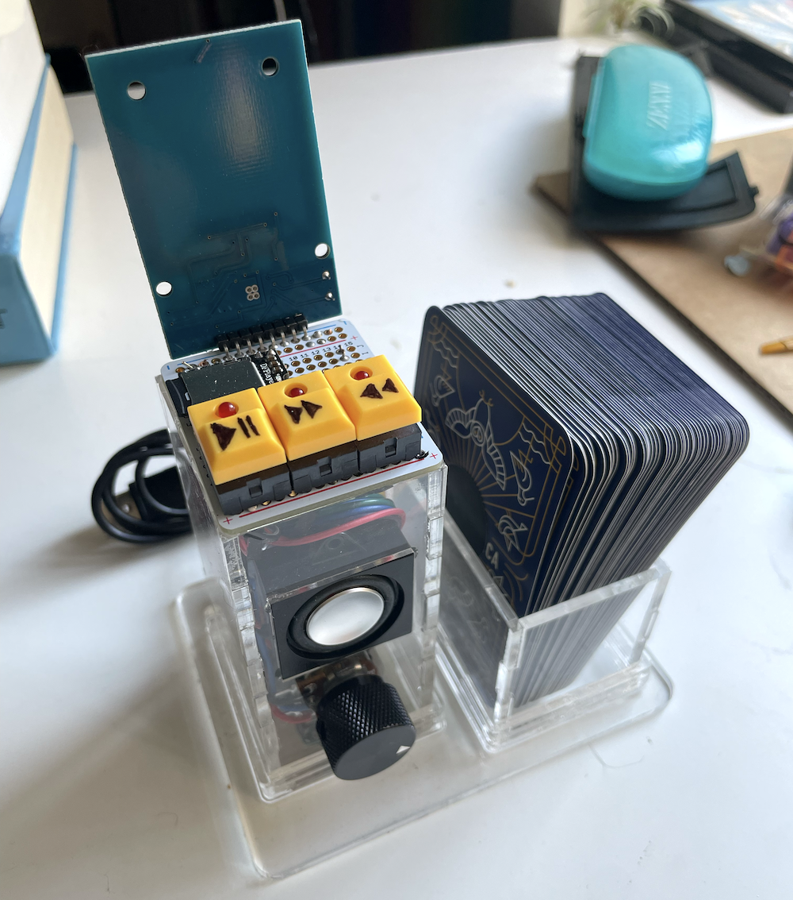

It consists of a deck of bird cards, an audio player, and a card reader. Tapping a card triggers playback of one of the vocalizations associated with that bird. You can trigger a bird-of-choice to learn its calls, or pick a random card and keep it hidden as you try to guess the bird from its call alone.[^shuffle]

[^shuffle]: The recordings are shuffled randomly each time the card triggers playback, so you can't [:just-flag:](../just-flag/) get good at associating the specific background ambience of a given recording with a bird instead of the bird's call itself.

<div class="centered-children">
<iframe
    width="560"
    height="315"
    src="https://www.youtube-nocookie.com/embed/cs_hh3SiV1c?si=Fttae_I8sXknUmV4"
    title="YouTube video player"
    frameborder="0"
    allow="accelerometer; autoplay; clipboard-write; encrypted-media; gyroscope; picture-in-picture; web-share"
    referrerpolicy="strict-origin-when-cross-origin"
    allowfullscreen
></iframe>
</div>

The rest of this post describes how I designed and built the Birduino.

## Background

At the heart of this build is a TonUINO, an open-source audio player first developed by Thorsten Voss and now maintained by [an open-source community of enthusiasts](https://discourse.voss.earth).

Construction of the Birduino involved setting up a [TonUINO](https://www.voss.earth/tonuino/), designing and assembling a clear acrylic housing for it, and setting up a deck of cards with bird photos to map an NFC sticker on each card back to the bird's specific recordings as loaded onto the TonUINO. The TonUINO community's [comprehensive FAQ](https://discourse.voss.earth/t/haeufige-fragen-faq/13282) came in handy for several aspects of this set up, as did Google Translate---as the TonUINO documentation is all in German!

## Hardware: Assembling a TonUINO player

I purchased the core pieces of my TonUINO as a [kit](https://www.amazon.co.uk/dp/B07TVN3M3X?th=1) from [AZ-Delivery](https://cdn.shopify.com/s/files/1/1509/1638/files/AZ240_A_1-7_A_1-8_EN_B07JLBGYQ6_e6736396-264c-43ef-8a33-fc1758c7ecd7.pdf?v=1721124164); it included a microcontroller ([AZ-Nano V3, based on an ATmega328P](https://www.az-delivery.de/en/products/nano-v3-mit-ch340-arduino-kompatibel?srsltid=AfmBOop4FADDSv34pBe6dLynd6G8L1yPbPIsMdjdvb24V6My_burgqOh)), a RC522 RFID reader module, and mp3 module:

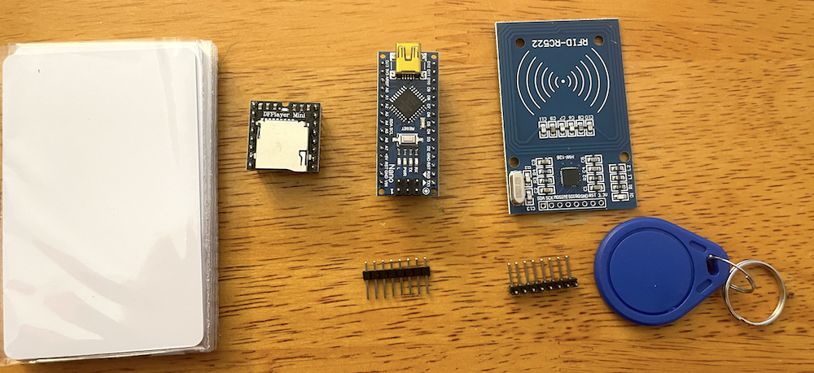

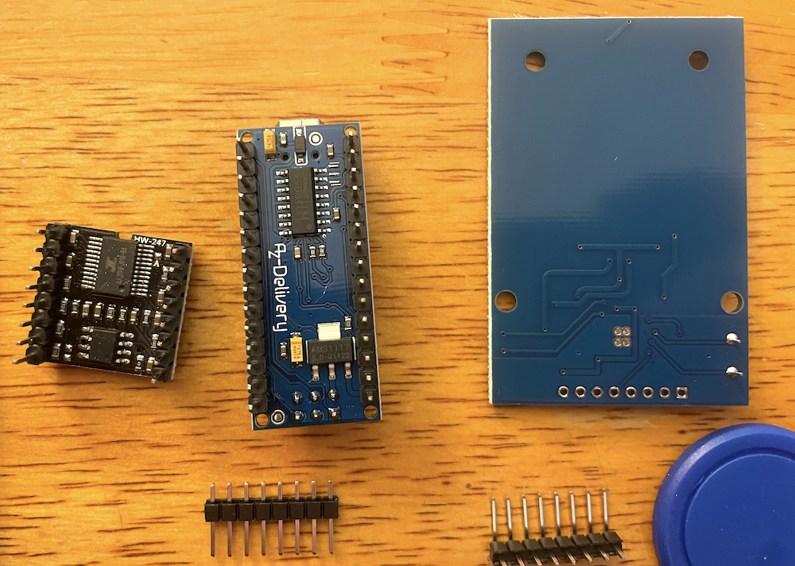

I combined these components with three buttons I already had, a [speaker](https://www.amazon.com/dp/B0BWYBFPW8), and a rotary potentiometer. I used a prototyping board as a base.

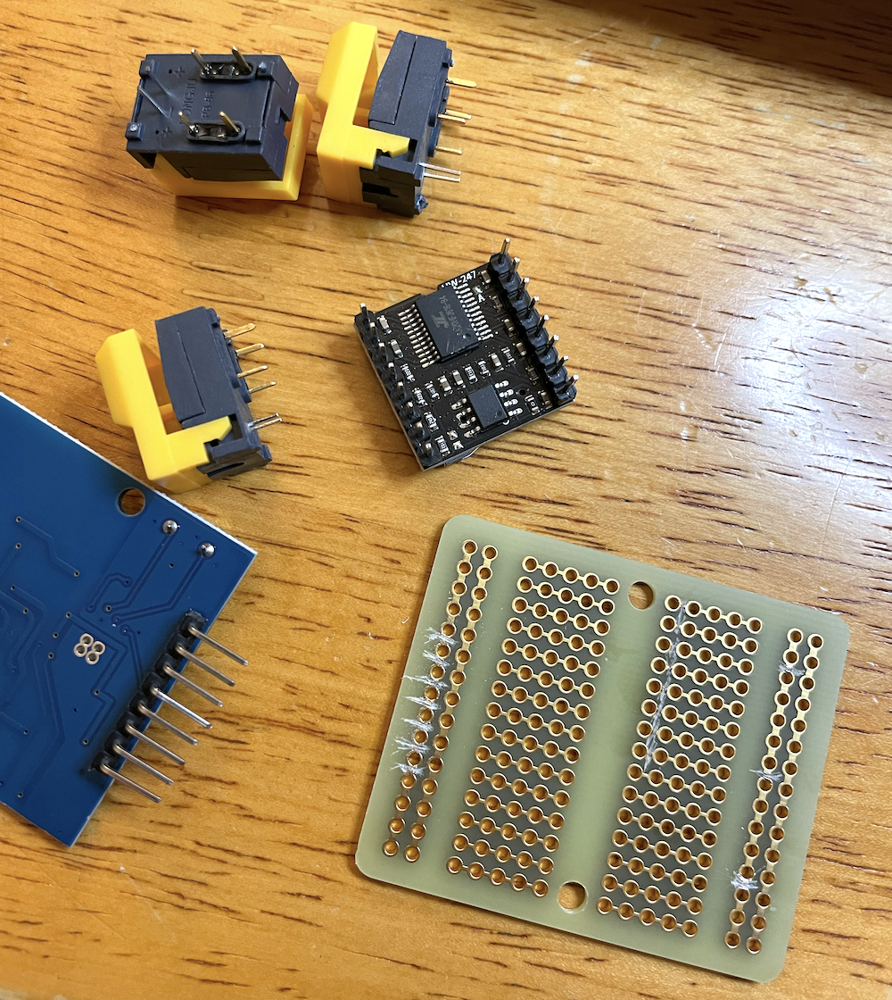

TonUINO provided a schematic; I color-coded it as I soldered each wire.[^color][^solder]

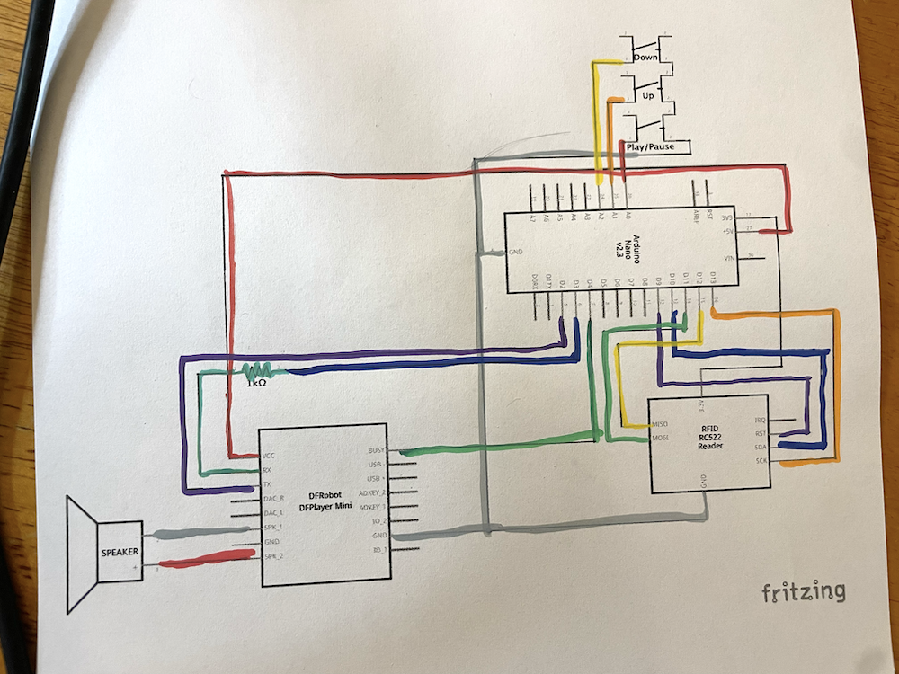

[^solder]: Our newly-assembled soldering station made soldering a delight. Compact *and* easily portable!

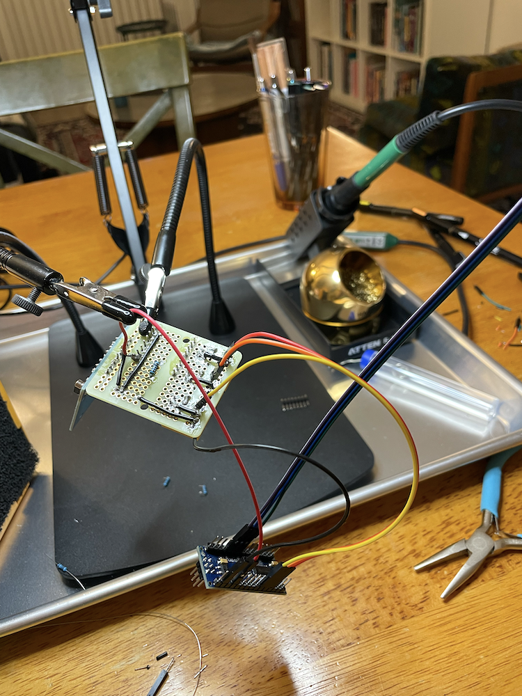

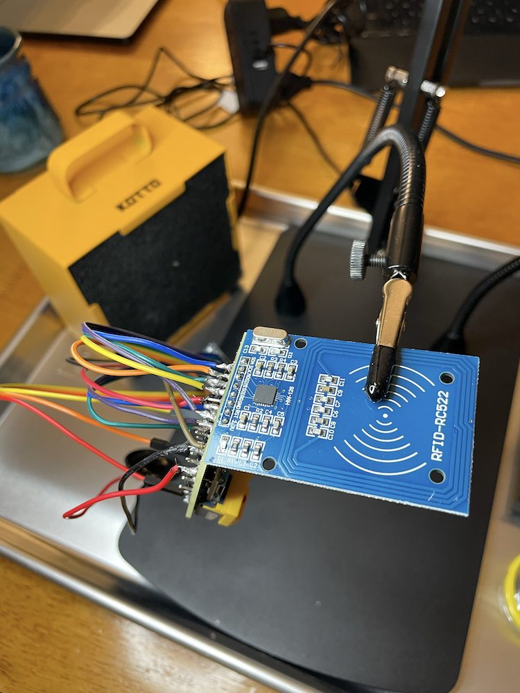

[^color]: This project was above all else an exercise in cable management, so the color-coding was both aesthetic *and* functional!

<details><summary>***Disclaimer that I can't stop myself from including***</summary>

> This project would have been significantly easier with (a) a larger prototyping board and (b) a different choice of wires.</br></br>
>
> The prototyping board was the only one we had at the time, and since I hadn't resigned myself to this being more than a one-evening project, I didn't want to wait to acquire a better board. In hindsight, it would have been worth a few days to order a larger one, not least of which because I wouldn't have had to scratch out traces with a knife, or squeeze my soldering into such a tiny space (and then fix shorts).</br></br>
>
> Similarly, my choice of wires was not ideal. I chose these rainbow wires as they came with connection jacks that slotted nicely into the headers that were pre-soldered onto kit various components. This would have been great had I been working with a breadboard and simply inserting all connector pins into slots, but instead I needed to solder the other end of those wires to the proto board---which required cutting the pins off and soldering the wires directly. Something about these wires did *not* solder well, which resulted in a bunch of messy connections, and more inadvertent bridging that I had to debug and fix.</br></br>
>
> Learn from my mistakes! Get yourself a proto or perf board with suitable properties, and do not use these particular wires if you need to do any wire soldering!

</details>

## Software: Configuring and loading the TonUINO application

The TonUINO application is written in C++; I cloned [the repository](https://github.com/tonuino/TonUINO-TNG) and uncommented various sections to match my hardware configuration. I then used the Arduino IDE to load it onto the microcontroller.

<details><summary>***Configuration specifics***</summary>

- I uncommented the following `#define`s: `TonUINO_Classic`, `THREEBUTTONS`, `DISABLE_SHUTDOWN_VIA_BUTTON`, `POTI`, `SPKONOFF`
-  I had to make one additional software change, to the max input constant used in the volume knob mapping: from `static constexpr int16_t maxLevel = 1023;` to `static constexpr int16_t maxLevel = 700;`. (The project's logging is set up nicely, which enabled me to determine this value empirically.)

</details>

## Audio: The Cornell Guide to Bird Sounds

Loading audio onto a TonUINO is trivially easy: you put it on the microSD card that gets loaded in the mp3 module, following a straight-foward naming and directory structure.

For this project's audio, I wanted multiple high-quality vocalizations for each included bird. To accomplish this,  I purchased [_The Cornell Guide to Bird Sounds: United States and Canada_](https://www.macaulaylibrary.org/product/the-cornell-guide-to-bird-sounds-us-and-canada/):

> The Cornell Guide to Bird Sounds: United States and Canada (v2025) is a compilation of curated audio files covering songs, calls, flight calls, and other sounds for 908 species found in the United States and Canada.</br></br>
>
> [...]</br></br>
>
> The 1.7GB download includes 4,959 MP3 audio files covering 908 regularly occurring, native, vagrant, and introduced species in the United States (including Hawaii) and Canada. The audio in this collection was hand-picked and masterfully edited to ensure premium sound quality while showcasing each species’ range of vocalizations. The collection was made possible by the contributions of more than 515 sound recordists who archived their recordings in the Macaulay Library.</br></br>
>
> Proceeds from the sale of this guide go directly to supporting the Macaulay Library in building free tools to enhance your birding and power research and conservation.

$20 well spent! Not only is the sound quality great, the naming conventions of each track made it trivially easy to map the vocalizations of each species to it's corresponding bird card. Speaking of which...

## Card deck: _Birds of North America_

I needed a set of bird images that I didn't need to curate, design, and print myself. Hence: playing cards with birds on them!

I was picky about the deck I chose; while there are some beautifully illustrated decks out there, I wanted photos. I ended up purchasing [Gerrit Vyn's "Birds of North America](https://www.mountaineers.org/books/books/birds-of-north-america-deck-52-playing-cards) deck.

I then stuck an [NFC tag](https://www.amazon.com/dp/B0919DVLWW?ref_=ppx_hzsearch_conn_dt_b_fed_asin_title_1&th=1) to the back of each card.

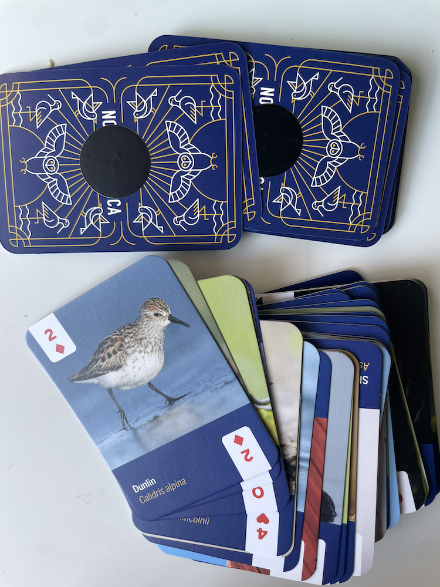


## Mapping bird cards to bird calls

Programming the NFC tags on the bird cards to match them to their corresponding audio was straightforward, thanks to Max Mehl's [TonUINO Cards Manager](https://github.com/mxmehl/tonuino-cards-manager) project. It maps a manifest of audio files to their corresponding TonUINO-card-ready byte strings, which is then written to NFC tags to create the set of TonUINO cards. This meant that I needed to create a manifest that mapped each bird name to its set of audio recording files.

I created the manifest programmatically: after hand-typing out the names of the birds (in the same order as in the sorted card deck), I wrote a small program to iterate through the list and filter the Cornell Guide recordings for any audio files whose name contained that bird.

The function to append the relevant audio to each bird looked like this:
```code
function append_birdsong_files() {
    local I_BIRD="$1"
    local BIRD="$2"

    printf "  $I_BIRD:\n    description: $BIRD\n    source:\n" >> "$OUTFILE"
    cat audio-full-tracklist.txt \
        | grep "$BIRD" \
        | sort \
        | awk '{ print "      - " $0 }' \
        >> "$OUTFILE"
    printf "    mode: party-from-to\n    from_song: 1\n    to_song: "  >> "$OUTFILE"
    cat audio-full-tracklist.txt \
        | grep "$BIRD" \
        | wc -l \
        | tr -d ' ' \
        >> "$OUTFILE"
    printf "\n" >> "$OUTFILE"
}
```

The output manifest looked like this:

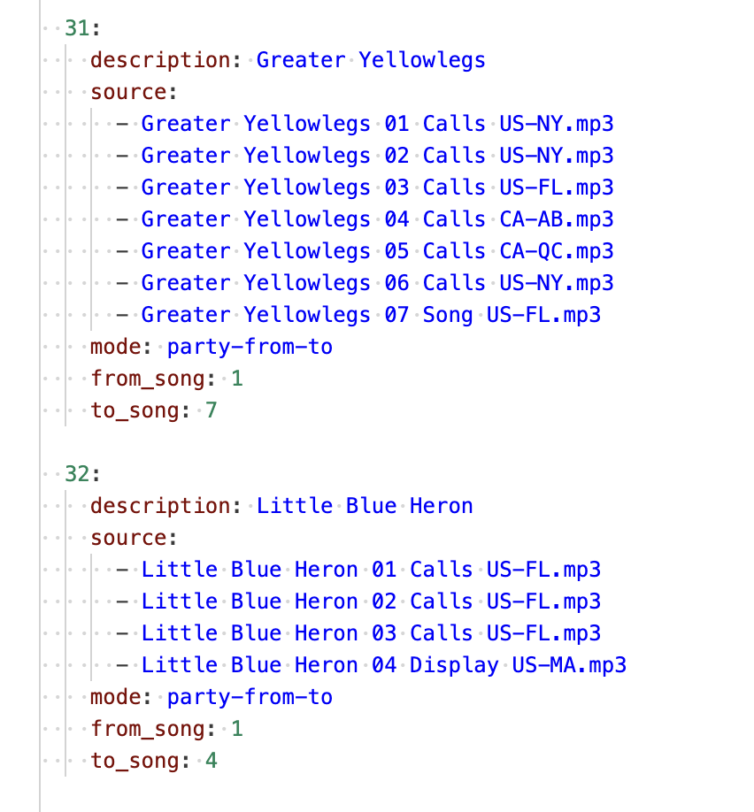

Using the [TonUINO NFC Tools](https://marc136.github.io/tonuino-nfc-tools/) application for Android phones, I then was able to write that list of byte strings to the NFC tags on the bird cards. This NFC-writing process went quickly![^fast]

[^fast]: "This process" is the operative phrase here; before I had AF dig her old Android phone out of storage so that I could use the Android application, I first tried using a bunch of unhelpful RFID-programming apps from the Apple app store. While these programs exist, they are designed to be "user friendly" and aid in writing URLs or text blobs. This was *too* user friendly: I couldn't find one that would support writing a basic binary string, as needed for the TonUINO tags.

    Apple app designers take note: there is a gap in the market for a lightweight, no nonsense RFID writer that supports byte blobs. When you make it, let me know.

My full script and manifest are [here](https://github.com/hannahilea/notebook-playground/tree/main/tonuino-birds), should you want to use it.

## Enclosure: Designing and fabricating clear boxes

I wanted to make the Birduino relatively self-contained---or at least, didn't leave a bunch of wires hanging around. Time to build a box!

Using parametric CAD program [Cuttle.xyz](../cuttle-obsession/), I modified a basic press-fit box to give it cutouts for the knob and speaker, with overall dimensions such that the prototyping board could act as the box's top.

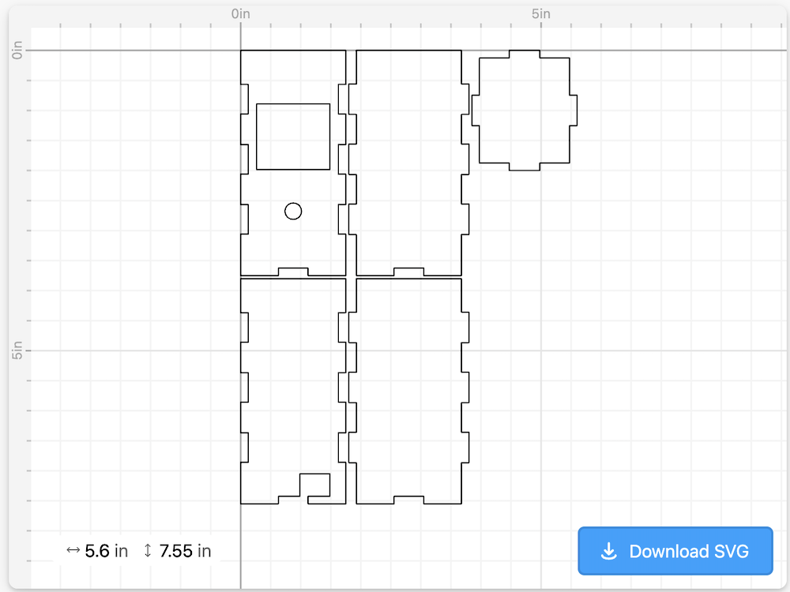
_Cuttle design [here](https://cuttle.xyz/@hannahilea/Birduino-enclosure-xwsytzmwwLnc)._

I designed a second box to hold the cards, and a tray with inserts for both boxes to fit into so that the audio player can optionally be presented along with its cards.

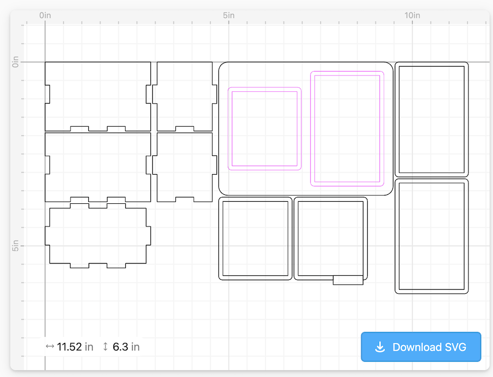
_Cuttle design [here](https://cuttle.xyz/@hannahilea/Birduino-Tray-MhnQCGlMyedq)_

I cut the pieces from 1/8" clear acrylic, using the laser cutter at my public library's maker space.[^clear]

[^clear]: Why clear acrylic? I think electronic objects with visible innards look cool, and I hadn't yet internalized that in this project I'd used an excessive amount of wire relative to the size of the enclosure, such that *my* electronic object with visible innards would look less "cool" and more "crammed together uncomfortably"... 😅

Choosing an adhesive was non-trivial, as I needed to find a glue that didn't make the acrylic cloudy. After testing several different options, we[^af] settled on "Clear Gorilla Glue Gel".[^gorilla]

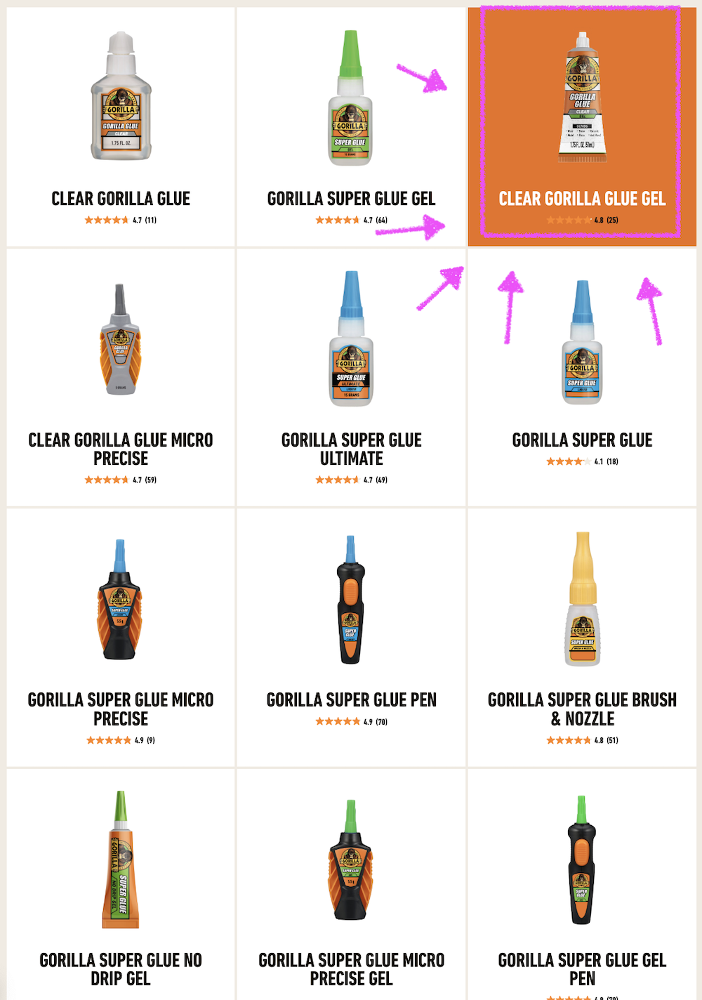

[^af]: "We" because I did not do this step alone: AF was the MVP of the glue process. When she saw I was losing my mind over it, she took over glue research and procurement. One resource that proved useful was Danielle Feliciano Wethington's [_The Acrylic Gluing Guide_](https://daniellefeliciano.com/gluingacrylic/).

[^gorilla]: No thanks to the Gorilla Glue's branding, which includes many different form factors and formulations of glue, all similarly named despite different chemical differences.

    It's enough to make me want to apply for a job in their branding department, revamp their spec sheets and packaging, and then quit. I *want* to use your glue! Take my money! Make it easy for me! Make an FAQ page that A's my F A Qs!

Adhesive selected, I glued the whole shebang together.

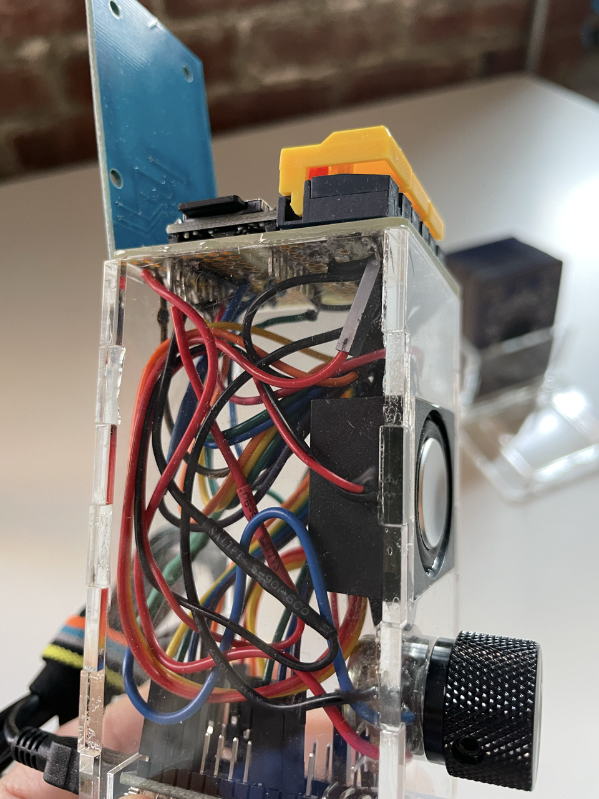

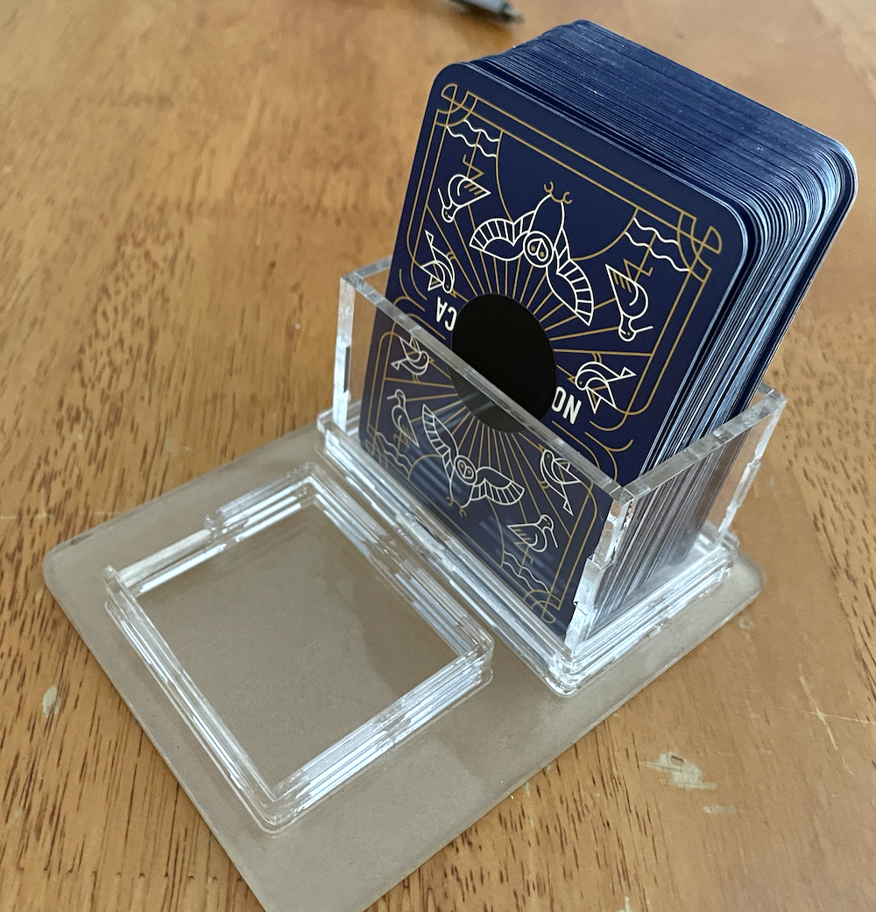

And that's that: the complete Birduino!

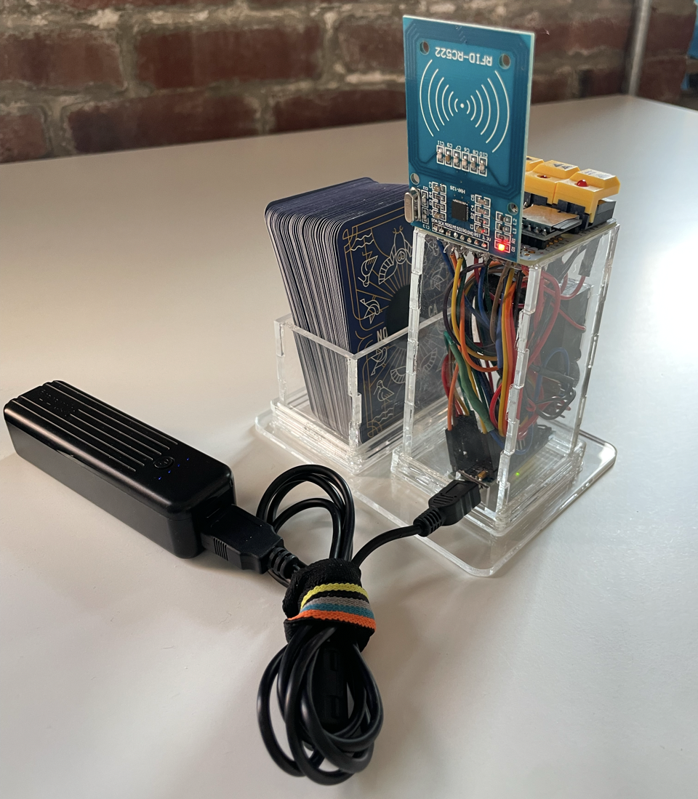


<p style="text-align: center">***</p>

My only regret here is that my Birduino doesn't include enough birds! This initial 54-bird line-up is a good start, but I'd love to include birds from other parts of the world, or even more birds from North America.[^joker] 

For the future: Birduino extension packs!

[^joker]: Yes, 54! Even the Jokers have birds:

    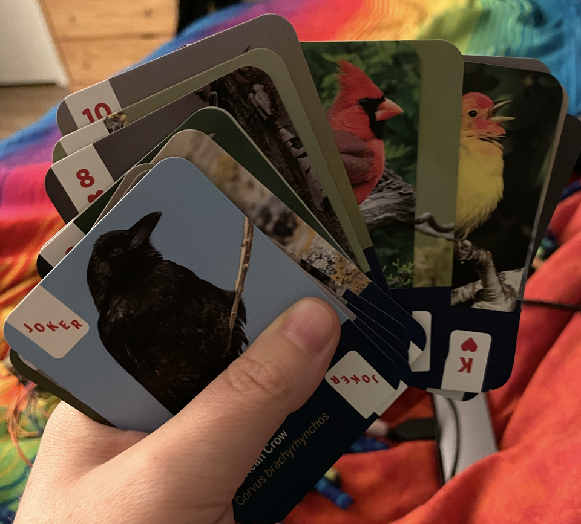

***Thanks to: the TonUINO development community, the sound recordists and other folks who contributed to the _Cornell Guide_ recordings, Gerrit Vyn for the beautiful card deck, and AF for her adhesive assist! Also, to the birds whose vocalizations have been immortalized for projects such as this.***
