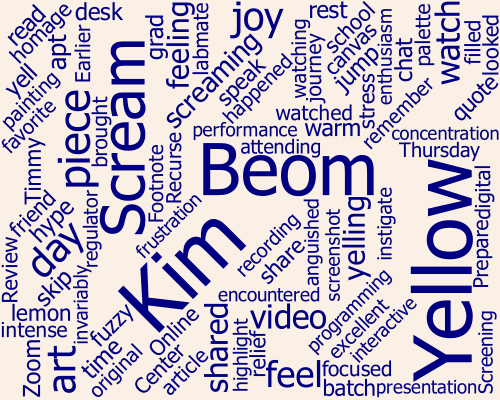

It has been almost exactly a year since I finished my batch at the Recurse Center, and a little over a year since I started ~~doing stuff and bragging about it~~ sharing and writing up my projects publicly on this site. 

I wasn't sure that I'd want to---or manage to---write consistently, much less publish, but I actually kind of have?

## Some plots, in no particular order

My first post, a meta-post on the site itself, was on May 19 last year. Then crickets, for months.

What changed in mid-September---why nothing for months, and then a whole cluster of posts? That was directly attributable to a September 2 hang with [cceckamn](TODO) and [shae](TODO), who asked a bunch of questions about my flipdots project and then strongly encouraged me to write about it. As you can see, having even just that one post up unblocked the dam, so to speak. 

What happened in November? Some family visits, some travel, some being sick. Some working on projects but not writing about them. It's also interesting (to me!) to see my publication rate decelerate towards the end of January as my job hunt and some contracting work---and later, employment---ramped up. I've continued to attend a weekly writing group that's helped keep at least a little continued writing momentum. 

That said, I don't actually believe that "time spent writing" correlates to "number of words published" or "timing of words published"; my writing timing these days is still pretty scattered and unpredictable, which is something I'm actively frustrated by and focusing on. I don't have a great way to show that here, so you'll have to take my word for it.

***

What have I been writing about? Good question. I haven't really figured out my tag game here[^tags], so this wordcloud of tags from all the posts isn't necessarily a *great* view into it, but it is *a* view:

[^tags]: Not the least of which is the fact that you can't currently search the site a per-tag basis. Yet! 

A wordcloud of all the words in all the posts provides a more verbose but not necessarily better (!) view: 

...and per-post wordclouds: 

*Code used to generate all plots is [here](https://github.com/hannahilea/hannahilea.github.io/tree/main/blog/blog-birthday-1/plots/run.jl).*

## Some thoughts, in no particular order

### The good

- Writing is *fun*. I did it a whole lot when I was younger, then took a bit of a break, and have really loved getting back to it---both for myself, and as a means of connection with various parts of my community. 
- Having a dedicated draft-reader and thumbs-up-giver has been awesome. Shoutout to AF, who has done the final read of many a post, and provided the confirmation that at least one other person (her!) finds the thing worth reading. Bonus points for being willing to do this at stupid-o'clock, when I said I'd be done hours before.
- Having a dedicated cheerleading squad to encourage the writing-up of projects has been key. Hat tip especially to Charles and Shae, but also any number of Recursers (and others!) who've chatted about an in-progress project with me and encouraged me to write it up. Shae and Charles were the impetus for my first post on FlipDots, which got such a great reception that it provided the dopamine runway for the next several posts. Shae's mantra is "Do something, brag about it" which is a good mantra, but he also embodies "When your friends do things, brag about them" (and/or, encourage them to brag about themselves) which I've found particularly useful when it comes to writing.
- Having a dedicated and enthusiastic audience. Most of my posts are written with at least one specific person in mind who I think would appreciate the project---a different person based on the post!---and while it has been fun to share with them, it has also been affirming to feedback from folks in the RC Zulip. Sure, I write for me, but I don't *only* write for me.
- My original goal with the structure of the website was to allow me to write posts in markdown, publish them myself, and get out of my own way---and I'll say that has worked out pretty well. I have spent relatively little time changing out the structure or function of the site itself, relative to the time I've spent writing/editing. Through a rough Vibes measurement, I've managed to follow cceckman's investment blogging protocol (IBP) (https://cceckman.com/writing/publish-then-program/) pretty well. 
- Weekly writing group has been lovely. 

### The neutral

- The lower the bar I set for any individual post, the greater the chance I hit publish and move on
- Sometimes I stare down something that I want to 
- Digging out of project backlog hell is...kinda hell. I am not particularly good at it. I would not say that my rate of writing up projects out-paces my rate of doing projects. Oh well!
- I have written a lot more words than I have published, and many of the words that have not seen the light of publishing have gone a bit off the rails in snarkiness. While it feels good to write them, it has also felt good to *not* publish them.

- It was kind of a joke that I ended up writing my own static site host whatever todo, but also, now that I'm leaning into that [houseplant programming 🪴](../houseplant-programming/) life, I don't feel even a little bit weird about it. I went from "hm, probably can't think of this as anything other than hacky until i pull out the publishing bit into its own library" to "i feel proud of how lightweight the infrastructure is that lets me Just Write and Just Publish without having to faff about with html on the reg (or, heaven forfend, someone else's templated static site hosting service!).
- Having this site as a place to post to let me shift my project mindset from a "think up project, do project, abandon project in weird state, feel guilty about not completing project, etc" lousy cycle to a [content-driven development](https://ntietz.com/blog/making-progress-with-content-driven-development) mindset.

### The unending struggle

- I still really struggle with exactly how candid to be here, and about which parts of my life. Focusing on the tech projects helps set a bit of a boundary, but still. I'm not quite as personally open as some of the tech/art writers I most admire, and I'm not sure if/when that will change. At heart I'm still a livejournal kid, with a fully-locked-down journal, and it feels weird to be writing out into the fully-open ether. 
- Ditto tone. I haven't quite figured out a stable one. Or a stable audience, and level of detail for tech write-ups. 
- Ditto references to non-hyper-local stuff. There's a lot of really exquisitely awful stuff that is happening with appalling rapidity, and I don't know how to write about it, so I...mostly haven't. But I admire the folks who do. 
- I also haven't figured out how not to get bogged down in an endless loop of editing and revising. It would be nice to tighten up the "mind dump" to "publish" pipeline.
- 

## In sum

Even if I never publish another post to this site, I feel good about how much I've published this year alone. The experiment was a win, and I'd encourage anyone on the fence to try it for themselves.[^start] 

Last but not least, thank you for reading! 

[^start] Not sure how to start? I recommend [tinylogger](www.tinylogger.com)! I use it to drafting my posts and then move them to a separate site to publish, but it supports publishing directly from there!
