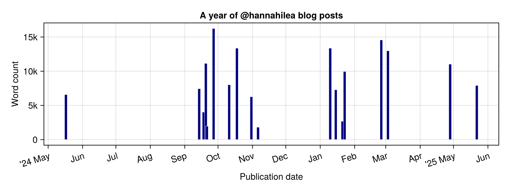
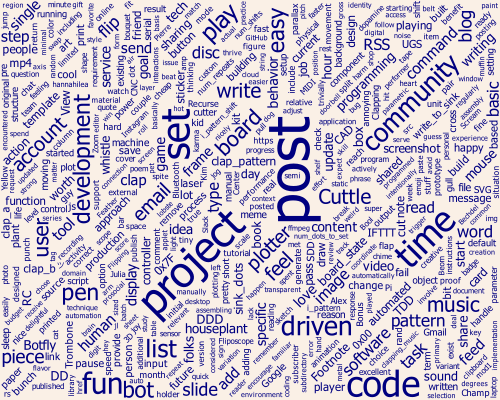
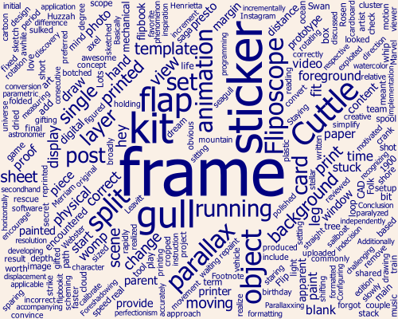

It has been almost exactly a year since I started publicly sharing projects and thoughts on this site. I wasn't sure that I'd want---or manage---to publish consistently, but here we are, a year and 17---now 18!---blog posts later. Let's talk about it!

## Some plots

My first post, a meta-post on [setting up the site itself](../site-structure/), was on May 19 last year. Then crickets, for months. What broke the drought? 

The start of *actually* publishing here on a semi-regular basis is directly attributable to an early September hang with [Charles](https://cceckman.com/) and [Shae](https://www.scannedinavian.com/), who asked a bunch of questions about my flipdots project and then strongly encouraged me to write about it. Because I knew exactly who my audience was---them!---the [write-up itself](../clapping-music-for-flip-disc-displays/) came together quickly. Once published, a bunch of other people responded to it enthusiastically, which was apparently the push I needed to share other things.

Some stats:

- Total word count: ~156k
- Longest post: ~16k words, [Obsessed with Cuttle: Parametric CAD for prototyping, producing, and procrastinating](../cuttle-obsession/) on September 27th.
- Shortest post: ~1.8k words, [*Yellow Scream (2024)*](../yellow-scream-2024/) on November 6th.
- Most footnotes: 10, in [The Botfly Test: Characterizing parasitic automated behavior in online communities](../botfly-test/) on March 3rd.

What have I been writing about? Good question! I haven't really figured out my tag game on this site[^tags], so this word cloud of tags from all posts isn't necessarily a *great* view, but it is *a* view:

[^tags]: Not the least of which is the fact that you can't currently search the site a per-tag basis... 

Ah yes, programming, music, and hardware. Sounds about right! 

A more verbose word cloud---all words from all posts: 

"Post" being the most common word is a little unnecessarily meta, but at least "community" and "fun" are also visible!

Per-post word clouds, for good measure: 

No additional commentary except to say that they make kind of a cool wallpaper.

## Some thoughts

Writing for general publication has been *fun*. I did it a whole lot when I was younger, then took a bit of a break, and have really loved getting back to it---both for myself, and as a means of connection with various parts of my communities.

Parts of my writing process have been less fun; for my own sanity, I need to tighten up the iteration-and-editing stage.

Other observations:

- A major motivation to continue writing about projects publicly? Being part of an enthusiastic community of people who are themselves making things and writing things and hyping up other people who are making and writing things. 
Shout-out to a bunch of folks in the [Recurse (RC)](https://www.recurse.com) community, who've provided motivation simply by being present and engaged; I'm additionally thankful for the kind and responsive crowd that hangs in RC's `#blogging` channel. 
- My original goal in the structure of this site was to allow me to share projects and thoughts with as little infrastructural friction as possible, and a year in, the site structure and publishing mechanisms I set up have met that goal. Through a rough vibes assessment---and a glance at my git history---I've managed to follow Charles's "publish *then* program" [Investment Blogging Protocol (IBP)](https://cceckman.com/writing/publish-then-program/) fairly effectively. I'm a little surprised, to be honest! 

- Semi-regularly attending the weekly "publication accountability" group through RC has been lovely, and has kept me ~~[nerd-sniped](https://xkcd.com/356/)~~ motivated into make incremental progress even on weeks without much other free time for writing. 

- The lower the bar I set for any individual post, the greater the chance I hit publish on it and move on. I have to continually remind myself of this, and then lower that bar.

- Originally, I planned to retroactively write up all projects [shared here on my site](../../projects/). Only, it turns out that digging out of project backlog hell is...kinda hellish. I no longer plan to retroactively make posts for all projects shared here on my site!

- I have written a lot more words than I have published. This is neither good nor bad, but it is something I'm thinking about.

- Having a dedicated draft-reader and thumbs-up-giver has been key---shout-out to AF, who has done a final read on most posts, flagged obvious errors, and provided confirmation that at least one other person (her!) finds the thing worth reading. Bonus points for often doing this last pass at stupid-o'clock, after I'd promised to be done hours earlier.

- The existence of this site has let me shift my project mindset from a regularly negative cycle of "think up project, do project, abandon project in weird state, feel guilty about not completing project, avoid it, etc" and shift to more of a [content-driven development](https://ntietz.com/blog/making-progress-with-content-driven-development) mindset---as in, I can decide I'm done with a project at any point, and "writing about it" is as good an end point as meeting some arbitrary perfectionist bar that I haven't even clarified for myself. 

- I still really struggle with exactly how candid to be here, and about which parts of my life and thoughts about the world to share. Focusing on the tech projects has helped set a bit of a boundary, but it's still hazy. I'm not quite as personally open as some of the tech and art writers I most admire, and I'm not sure if or when that will change. At heart I'm still a livejournal kid, with a fully-locked-down journal, and it feels weird to not know exactly who is reading any of this.
- I haven't quite figured out a consistent tone, or level of appropriate wordiness, or a specific audience and level of detail for any given set of tech steps. I think that's okay, and expect it to be an emergent property, but I do think about it semi-regularly when I write here, and once it has settled I think my writing-to-publishing process will feel smoother and involve less angsting.

- Having a post hit the top of [The Orange Site](https://news.ycombinator.com) felt great. 

    

    While I've since determined that HN is a mixed-blessing of a validator[^mixed], it sure provided some nice dopamine at the time! My favorite response to [that post](../cuttle-obsession/), though, was this:

    > really fun to see! and then about 15min later after i read it, my dad sent it to me, apparently thinking so too having seen it on hn :P

    That is the *real* win in broader readership---having written something that someone thinks is worth sending to their kid, without them knowing me or knowing that said kid knows me. :D

[^mixed]: See also: the [Botfly Test](../botfly-test/)...

- I have *way* more ideas for things I want to write about than I have time to write about those things. Maybe it's time for [another](../future-blog-posts/) post-on-future-posts? 

- My refusal to use statistical word salad machines for any part of my process---writing or otherwise---has only strengthened over the year.[^salad]

- I like making bulleted lists. Turning those lists into paragraphs is hard.

[^salad]: Excepting my own brain, which is majority *Brassica*. Anyway, the phrase "gently debate a word salad machine" has lodged itself in my brain, thanks to [this comment:
    ](https://github.com/dotnet/runtime/pull/115762#issuecomment-2898635945)

Even if I never publish anything else to this site, I feel good about how much I've done this year alone.[^bird] My "write publicly" experiment was a personal win, and I encourage everyone to try it for themselves. (Not sure how to start? I recommend [tinylogger](www.tinylogger.com)![^start])

[^bird]: Okay, that's not QUITE true---I currently have a BirdNET-Pi tutorial that's nearly ready to go, and that I've promised some folks, and I'd be pretty bummed not to have actually shared it. 
[^start]: I use [tinylogger](www.tinylogger.com) to draft new posts; while I then move mine elsewhere to publish, you can publish direct from tinylogger if you like! The creator---[Max Pekarsky](https://maximpekarsky.com/)---is an RC alum, and responds to feature requests unreasonably quickly.

***Thanks to AF, Charles, Shae, and the RC community---and to you, for reading!***

*The code used to generate the plots is [here](https://github.com/hannahilea/hannahilea.github.io/tree/main/blog/blog-birthday-1/plots/run.jl).*
