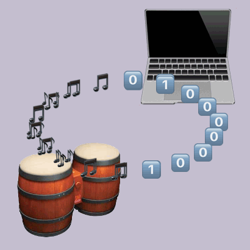
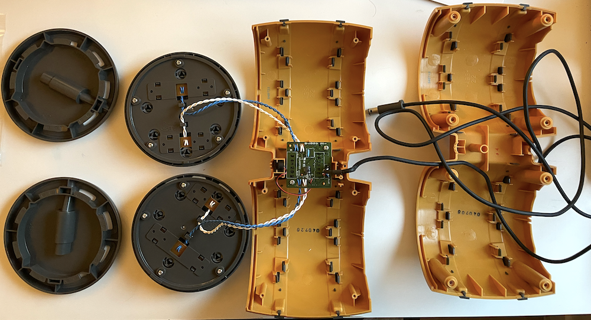
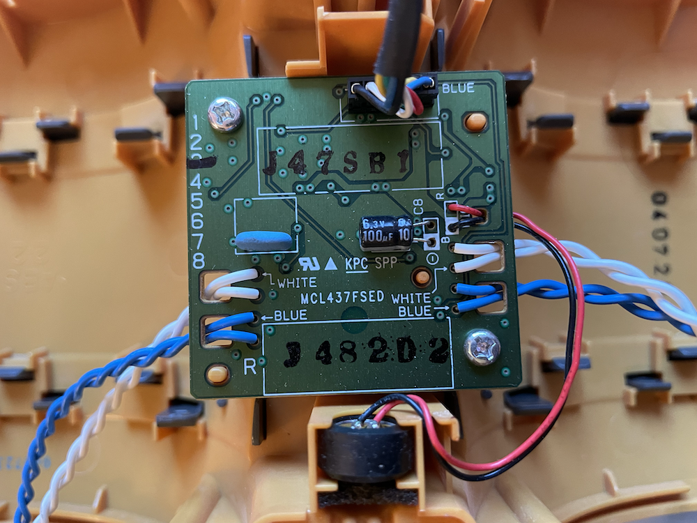
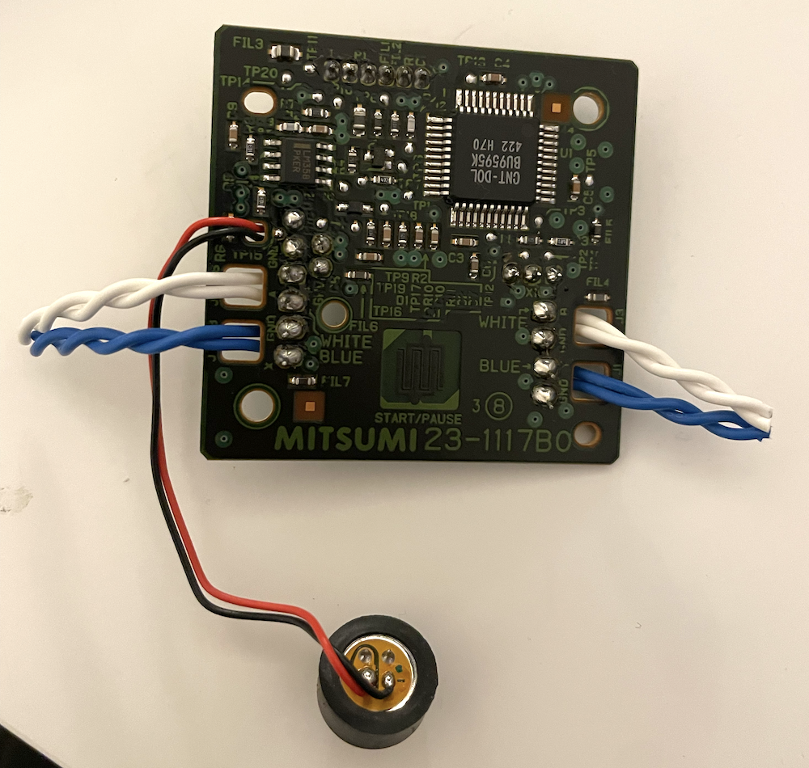
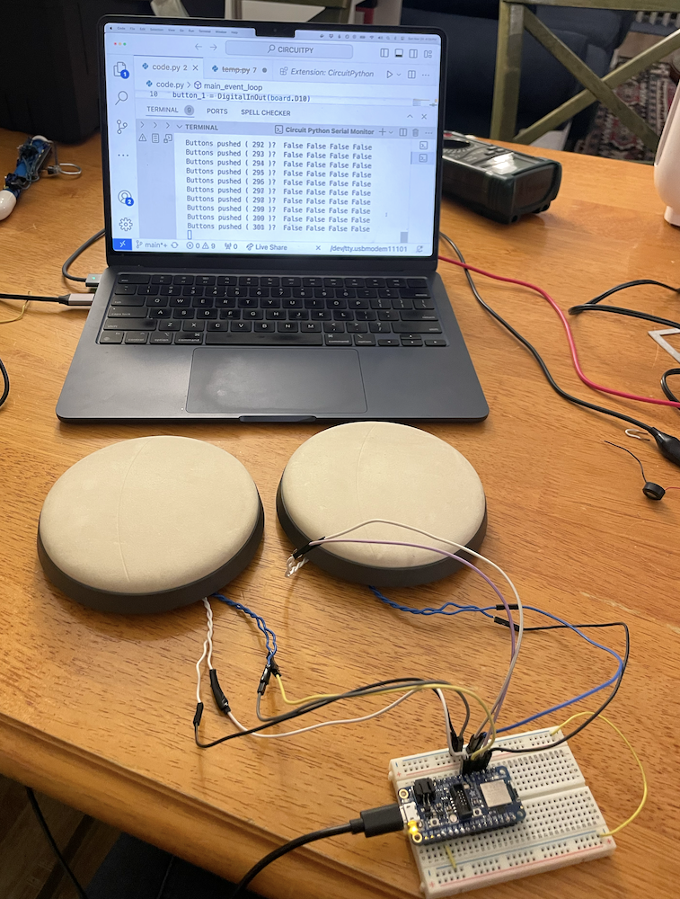
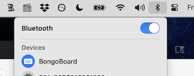
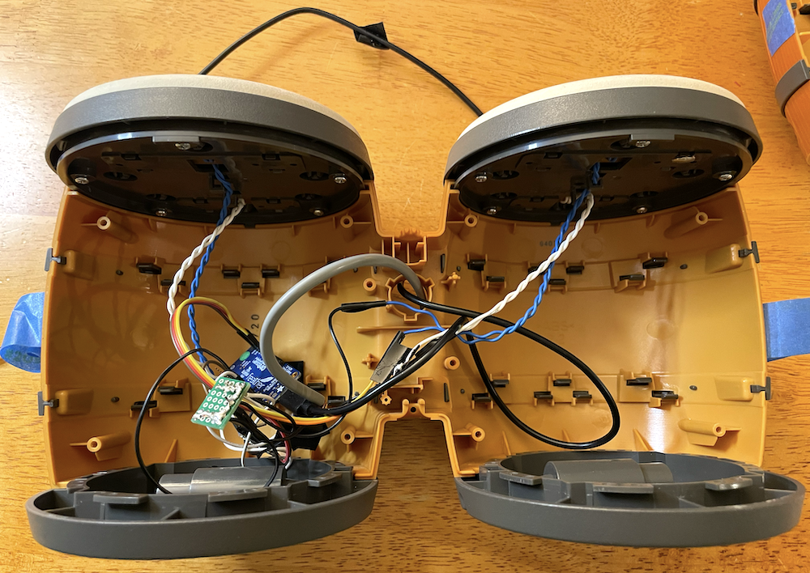
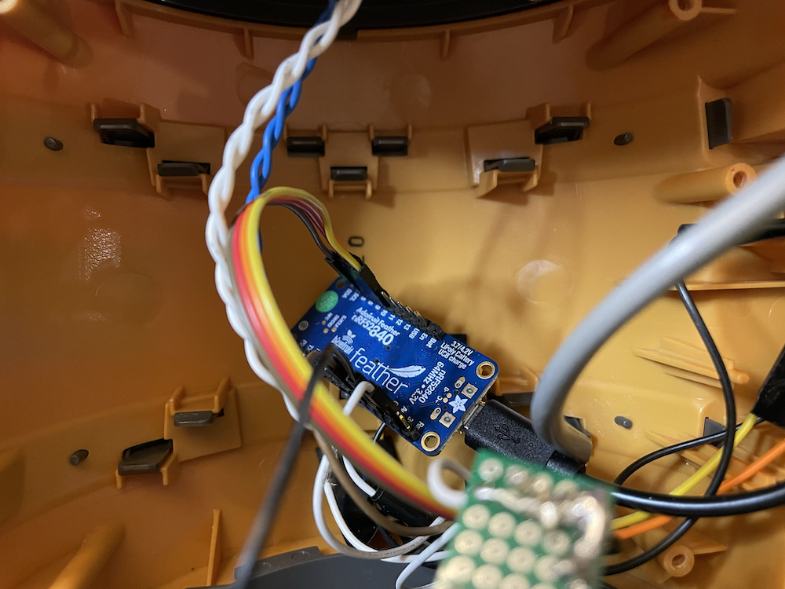

Not all projects are winners! Here is a write-up of [BongoBoard](https://github.com/hannahilea/BongoBoard), a project I've lost interest in completing: while the hardware part is done, the user experience leaves much to be desired. And it's going to stay that way, unless someone else takes it over from me![^now]

[^now]: I will say, in the process of writing the "potential usage" section of this post I got a re-excited, and considered at the very least porting over my [Morse keyboard code](../telegraph-key-singular-board/)... I had to remind myself that the BongoBoard project has been sitting in abeyance for nearly a year for a reason, and that reason is "even though it *would* be cool, there are other things I'd rather be doing with my time." Now that this post is published, I can move the BongoBoard out of my mental "projects in progress" queue and move on. Right? Right.

<iframe
    width="100%"
    height="500"
    src="https://www.youtube-nocookie.com/embed/rOE_ierk-wY"
    title="YouTube video player"
    frameborder="0"
    allow="accelerometer; autoplay; clipboard-write; encrypted-media; gyroscope; picture-in-picture; web-share"
    referrerpolicy="strict-origin-when-cross-origin"
    allowfullscreen
></iframe>

## What is the BongoBoard?

- The BongoBoard is a set of [DK Bongos](https://nintendo.fandom.com/wiki/DK_Bongos), disassembled and reassembled into a wireless Bluetooth keyboard.

    - DK Bongos are a video game controller built by Nintendo for the Donkey Konga rhythm games---games where you drum your way through a jungle.[^dk]

    - The DK Bongos controller has four buttons---two in each drumhead---which are triggered when the drumhead is drummed; it also has a microphone, used to detect claps.

    - In the BongoBoard's current state, each drumhead button corresponds to a directional arrow key. My initial plan was to combine button combinations into more sophisticated keystroke outputs in the software; I ran out of interest before I implemented that.

[^dk]: Or so I have been led to believe, as I have never actually played Donkey Konga myself....

## Why?

- Because the idea tickled my fancy: I find the concept of "drumming" input into a computer hilarious.
- Because I could. Thanks to having recently built a [slidewhistle-based Trombone Champ controller](../slide-whistle-trombone-champ-controller/), I knew that the physical construction was something I could now do relatively easily, and I wanted to practice those skills.
- Why not?!

## Who?

- Me.
- AF, who one midnight told me about a drum-inspired video game controller for a drumming-based video game.
- A stranger on eBay who wouldn't cancel an order made at midnight.
- A friend with the elbow grease and determination to unscrew a bunch of proprietary screws without a proprietary screwdriver, who also offered advice towards attempting to salvage the onboard microphone.
- Some friends who helped brainstorm fun use cases.

## How?

0. Made a logo in [p5.js](https://p5js.org/).[^logo]

[^logo]: Everyone knows that the logo is the most important part of any project.

1. Opened the DK Bongos up.
    

    

2. Cut the button wires off of the PCB.

    

3. Used a breadboard to connect the buttons to an [Adafruit Feather](https://learn.adafruit.com/introducing-the-adafruit-nrf52840-feather) microcontroller.

    

4. Set up the Feather; wrote code to read in the button states and send out keystrokes in response to button presses.

    

<iframe
    width="100%"
    height="500"
    src="https://www.youtube-nocookie.com/embed/f8TN5foNILI"
    title="YouTube video player"
    frameborder="0"
    allow="accelerometer; autoplay; clipboard-write; encrypted-media; gyroscope; picture-in-picture; web-share"
    referrerpolicy="strict-origin-when-cross-origin"
    allowfullscreen
></iframe>

5. Attempted to get data from the original onboard microphone, which is apparently used as a "clap" detector in the original DK Bongos games.

6. Failed at the onboard mic salvage side quest and connected a basic electret mic instead.[^what]

7. Replaced the breadboard with a little prototyping board, soldered a few of the wires, and stuffed it all into the drums.

    

    

    

[^what]: What is an electret microphone? Great question! You won't regret reading this comprehensive Open Music Labs write-up for the answer: [Electret Microphones](http://www.openmusiclabs.com/learning/sensors/electret-microphones/).

## What for?

Basic use-cases that can be done with the current "sends arrow key keystrokes" configuration:

- Drum [2048](https://play2048.co/) (h/t OBR)

<iframe
    width="100%"
    height="500"
    src="https://www.youtube-nocookie.com/embed/yk-6wb80Tso"
    title="YouTube video player"
    frameborder="0"
    allow="accelerometer; autoplay; clipboard-write; encrypted-media; gyroscope; picture-in-picture; web-share"
    referrerpolicy="strict-origin-when-cross-origin"
    allowfullscreen
></iframe>

- Play Tetris? Drum Tetris! *Challenge mode: play along with the theme song. Even more challenging mode: don't play along with the theme song.*

<iframe
    width="100%"
    height="500"
    src="https://www.youtube-nocookie.com/embed/rOE_ierk-wY"
    title="YouTube video player"
    frameborder="0"
    allow="accelerometer; autoplay; clipboard-write; encrypted-media; gyroscope; picture-in-picture; web-share"
    referrerpolicy="strict-origin-when-cross-origin"
    allowfullscreen
></iframe>

Even though these games *can* be played with the current BongoBoard, the drum-to-key mappings don't really feel smooth or fun. A really solid implementation of a Tetris mode, for example, might use double-hand hits or claps to make a block fall fast.

**Ideas for future BongoBoard applications:**

- Type messages? Drum messages! *Use ever-popular Morse code, or use the BongoBoard-specific B4, the latest in [T9-inspired](https://en.wikipedia.org/wiki/T9_(predictive_text)) predictive text drumnology!*

- Play ~~Drummy~~ Flappy Bird!

- Interact with a [pen plotter](../ly-drawbot-setup/)!

- Perform beat poetry duets with a computer: trade drum phrases for bot-spoken phrases that have a complimentary rhythm (Credit: EP).[^coolest]

[^coolest]: I think this one would be especially cool and creative---albeit time-consuming!---to implement. But it would be extremely fun.

## Parting thoughts

- BongoBoard was more fun to imagine than it was to see through to a satisfying-to-use result.
    - In the future, I may try to separate the "what would I do if I was going to do it?" stage from the "...and do I actually want to have done it?" stage more often.
    - On the other hand, it was pretty cool to say to myself "I want to build this thing" and then...be able to build it.

- BongoBoard got me a lot of conversational mileage, which was a plus. One of my favorite parts of building silly things is getting to talk about building silly things with other people, who have lovely silly ideas of their own.

- One thing that I don't love about this project is that the plastic body of the physical controller doesn't feel particularly appealing, so I don't really want the resultant BongoBoard sitting around as an [objet d'art](https://en.wikipedia.org/wiki/Objet_d%27art). If it was a little nicer (wood? metal? etc) or was slightly smaller, or both, I would be more inclined to keep it around and spend a couple hours tuning at least one use-case to feel fun. (That said, the  drum-button triggers are really nicely designed, and feel solid and nice to use. It's really just the look of the drum body that isn't my favorite.)

I kind of want this thing out of my home? I have limited space, and it does not bring me joy. If you want to take it from its current state and turn it into something truly delightful, drop me a line and we can figure out a transfer.[^delightful] If I know you irl I'll even throw in complimentary consultation, if you want it.

[^delightful]: Perhaps you have a use-case that will be especially silly when drummed? Or one of the ideas I noted above tickles your fancy? Maybe you'll want to paint it, or bedazzle it, or otherwise jazz it up?

    Or just use it in its analog form and do some drumming! Inspiration:

    

    <iframe
        width="100%"
        height="500"
        src="https://www.youtube-nocookie.com/embed/I22aVQefrx8"
        title="YouTube video player"
        frameborder="0"
        allow="accelerometer; autoplay; clipboard-write; encrypted-media; gyroscope; picture-in-picture; web-share"
        referrerpolicy="strict-origin-when-cross-origin"
        allowfullscreen
    ></iframe>
    

***Thanks to AF for the inspiration, various pals for the brainstorming, and MF for the teardown aid and mic mentorship.***

***I published the code and instructions for building this BongoBoard at [github.com/hannahilea/BongoBoard](https://github.com/hannahilea/BongoBoard).***
