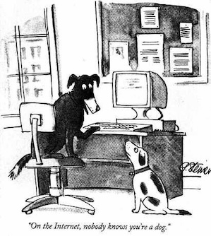
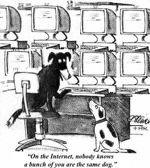
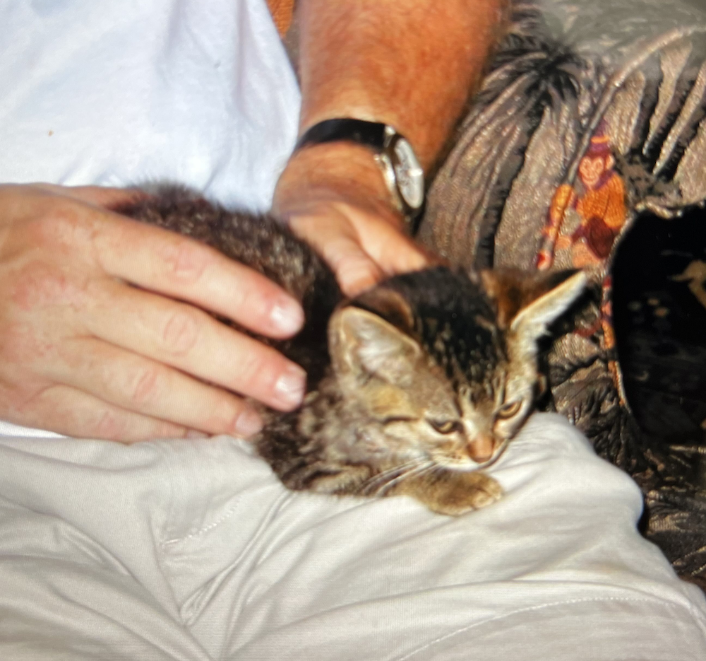

I recently encountered non-transparent automated behavior in a tech-community forum, and it really, *really* annoyed me. After confirming that my spidey senses were correct, and that this user was actively, regularly, and non-transparently performing and benefiting from automated interactions in the forum, I spent some time trying to figure out why exactly I was *so* annoyed by it.

I came up with a basic set of [Bechdel Test](https://en.wikipedia.org/wiki/Bechdel_test)-style criteria for determining if specific automated behavior (i.e., bot activity) is obnoxious within the community it inhabits.

 <h3 style="text-align: center">The Botfly Test</h3>

When a user programs an account to interact in an online community in automated ways:

1. Is the account **transparent** about being a bot when it performs an action?

2. Does the account provide a **prosocial**[^prosocial] service to the community it inhabits?

3. Is the user **unselfish** in how they benefit from the value generated by their automated account?

If the answer to one or more of these is "no," the user fails the test: through the bot they've programmed, they are behaving parasitically within the community.

[^prosocial]: By [prosocial](https://en.wikipedia.org/wiki/Prosocial_behavior), I mean provides a benefit to its community. For example: sharing resources; automating repetitive tasks that would otherwise have to be done manually; bringing joy.

The Botfly Test provides *minimum standards* for demonstrating prosocial community behavior. A bot that passes this test isn't necessarily of benefit to the community, but a bot that fails this test definitely isn't.

Or, more personally: if a bot passes the test, it may annoy me---if it fails the test, it almost CERTAINLY annoys me.

Notably:

- **If all answers aren't a definitive "yes," it fails the test.**

    Some of these questions are clearly open to interpretation, and/or depend on the community at hand. If you have to jump through hoops to explain why a bot passes, it does not pass.

    Also, the questions are ordered from most to least obvious and objective, to enable failing fast.

- **Community context matters: Automated behavior that passes this test in one community may fail in another.**

    The norms of a given community---both the written guidelines and typical human-human and human-bot interactions in the community---affect the answers to the Botfly Test.
    The criteria of the Botfly Test must therefore be applied to a bot's actions **as relate to a given community or sub-community**.

    For example, sufficient transparency in one community ("including 'bot' in the username") may not be sufficient in another; a "service" to one community might be an annoyance in another; the value (karma/points/etc) accrued by actions may boost an account's reach in one community but have no effect in another.

- **The Botfly Test is a *starting point* for assessing antisocial automated behavior. Passing it does not mean the bot should continue to exist in its current form.**

    For example, a bot that is not deemed a Botfly in one community may---with the same actions!---be actively be causing harm in another community. This is still bad, and should be addressed!

- **This test is designed for communities that are themselves prosocial.**

    You know what doesn't annoy me? People using their powers of programming and automation for good, to disrupt harmful and cruel activities.

The choice of test name is more than just a cute use of a word that contains "bot"; [botflies](https://en.wikipedia.org/wiki/Botfly) are a type of parasitic fly who lay their larvae to incubate and hatch under the skin of mammals---human and non-human alike. While they aren't deadly, they are prettttttty gross, and a good response to encountering one is to evict it. Identifying and removing botfly larvae improves the health of the affected individual and therefore also the overall health of its community.[^botfly]

For the sake of you, dear reader, I am not including a single photo of a botfly in this post---larva or otherwise.

[^botfly]: Okay, okay, `[citation needed]` on that last fact! That said, this has been true in my personal experience, and a cursory lit review indicate the trend holds.

## Case study: A HackerNews botfly

The situation that prompted the creation of this test: a [HackerNews (HN)](https://news.ycombinator.com/news) user is automatically cross-posting content to HN from a smaller tech community's feed ([lobste.rs](https://lobste.rs/)). Within minutes of a new post being made to lobste.rs, this account reposts it to HackerNews. This account does interact manually in the community as well, leaving the occasional non-automated comment.[^hn] [^hn2]

[^hn]: It doesn't succeed in cross-posting all posts; whether that is because it is only programmed to cross-post a selection of posts, or someone else (automated or not) previously posted the same link to HN, but it reposts enough (and quickly enough!) to convince me that it is highly unlikely to be fully or partially manual behavior.

[^hn2]: When I shared my observations with other folks in a third tech community, I found out that I was not the first person to have noticed this specific user's automations or been annoyed by them, which was nicely validating. I am intentionally not sharing the username or proof here; enough of us have independently noticed this user's behavior that I don't feel a need to be more vague about it, though.

How does this user's automated behavior in the HN community score?

1. **Transparent?** FAIL.

    - The username does not disclose that it is a bot.
    - The profile describes the human author, including links to their associated company, without disclosing that any/most of the account's behavior is automated.

2. **Prosocial?** SOFT PASS.

    - The cross-posted links are arguably of interest to the HN community,[^interest] providing the service of sharing relevant content.
    - As far as I can tell, the automation does not explicitly violate any HN community guidelines.[^guidelines]

[^guidelines]: The most relevant implicit point seems to be "HN is a community—--users should have an identity that others can relate to" [[source](https://news.ycombinator.com/newsguidelines.html)].

[^interest]: Both theoretically, since the communities have significant overlap in underlying mission, and in reality, as at least some of the cross-posted links are up-voted by HN users, as evinced by both looking at the post history and the account's karma score.

3. **Unselfish?** FAIL.

    - The early-and-often automated posting has yielded a wildly high karma score.[^quality] While HN says[^ranking] that karma does not directly contribute to post ranking (and therefore high-visibility presence on the front page of HN), it does seem to have some effect on the reach of a user's other interactions on the site (e.g., comment rankings, flagging, etc). This gives this user inflated influence relative to community peers who are not also automating their actions, especially relevant when the account is used to post the occasional manual comment.

[^quality]: Not least of which because the posts are specifically sourced from lobste.rs, which itself has [relatively stringent posting guidelines and a semi-curated community](https://lobste.rs/about).

[^ranking]: [According to HN](https://news.ycombinator.com/newsfaq.html),

    > **How are stories ranked?**
    >  
    > The basic algorithm divides points by a power of the time since a story was submitted. Comments in threads are ranked the same way.
    >   
    > Other factors affecting rank include user flags, anti-abuse software, software which demotes overheated discussions, account or site weighting, and moderator action.
    >   
    > **How is a user's karma calculated?**
    >  
    > Roughly, the number of upvotes on their posts minus the number of downvotes. These don't match up exactly. Some votes are dropped by anti-abuse software.
    >   
    > **Do posts by users with more karma rank higher?**
    >  
    > No.

    I would love to know more about how the algorithm works, because I once saw this user's cross-post immediately land in 2nd place on the front page, within minutes of being posted, which must have been exceedingly good luck (my seeing it happen, that is, despite only looking into the cross-posting behavior on a couple of occasions).

A very clear case of Botflyism!

If the user wants to course-correct, they could do a few things:[^course]

- Retire the existing account in favor of two new accounts, one which they use for their manual interactions in the HN community (voting, commenting, posting, etc), the other of which handles the bot actions.
- Make the username of the bot account reflect that it is a bot (`lobsters_bot`, etc), and describe the automation behavior in the account's profile.
- Bonus: Add some human-scale pauses into the automated behavior, to give human users who want to cross-post a chance to do that. There is no time-sensitive reason to cross-post; might as well do it batched once a day, or 24-hours after an original lobste.rs post has been published.[^delay]

[^delay]: I posit there's a greater benefit to the HN community by a human-posted rather than bot-posted link, as I suspect a human invested enough in an article is likely to contribute to any ensuing conversation about it. This could be answered by doing some comparison of posts-vs-score-vs-conversation analysis that I have no interest in actually doing!

[^course]: Why am I writing about it here instead of reaching out to them directly? Well, I'm not the first to notice their behavior, and the example I saw of them responding to a previous botfly-type call-out wasn't the "whoops, I'll adjust things" response of a well-intentioned user who had accidentally run astray of community norms. That said, I'm intentionally not naming them outright, and I hope that if they see this post they choose to update their behavior so that it stops being an annoyance.

## FAQs

* **Q:** *Why does it matter if a user in a community has pre-programmed automated interactions in the form of a bot? I think that's totally fine!* 

    **A:** Yeah, that's a valid question. I think it comes down to trust, scale of influence, and harm mitigation.

    Automation allows activity to be performed on a super-human scale, and the result of that activity---a flood of comments in support of a specific idea, downvoting any post that is counter to the bot author's interests, etc---influences the very real feelings and very real downstream actions of the rest of the community it inhabits.

    

    <figure>
    
    <figcaption>Peter Steiner for the New Yorker, 1993 [[source]](https://en.wikipedia.org/wiki/On_the_Internet,_nobody_knows_you%27re_a_dog)</figcaption>
    </figure>
    

    While [on the internet, nobody knows you're a dog](https://en.wikipedia.org/wiki/On_the_Internet,_nobody_knows_you%27re_a_dog), folks interacting with you in an environment specifically designed to foster communication---forums! social media! etc!---should be able to reasonably assume that the set of users they're conversing with are unique maybe-dogs, rather than a **single** maybe-dog who has programmed a bunch of computers to do its bidding.

    

    <figure>
    
    <!-- <figcaption></figcaption> -->
    </figure>
    

    Specifically, I agree with HN's [community user guidance](https://news.ycombinator.com/newsguidelines.html):

    > HN is a community—--users should have an identity that others can relate to.

    I think this applies to any other community that is based around conversational human interactions.

* **Q:** *So I've unintentionally **created** a bot that fails the Botfly Test---what now?* 

    **A:** Easy: Disable it. Bam. You know what's better than introducing an annoying and potentially harmful agent into a community? Not introducing an annoying and potentially harmful agent into a community.

* **Q:** *No, but, like, I really think my bot should continue to exist, and I swear I am acting in good faith here?* 

    **A:** Cool, figure out which pieces of the test it fails, and make them pass: Be transparent that your bot is a bot, make sure it isn't stepping on toes or causing harm, tweak the parameters of what it posts or how often it posts or the language of how it posts, etc. Make sure that any potential conflict-of-interest behavior that could be perceived to benefit you is split out so that it does not benefit you, e.g. by creating separate accounts for your manual vs automated interactions.

* **Q:** *So I've **found** a bot that fails the Botfly Test---what now? * 

    **A:**  Well, the test is about annoyance. So maybe you just be annoyed? ¯\\\_(ツ)\_/¯

    More seriously: reach out to the author---if you can identify them---and kindly let them know, and if they are well-intentioned and acting in good faith, they will address it.

    Or if it is more than just annoying---causing harm or otherwise violating community practices---take it to a mod.

    Or make sure the rest of the community is aware of the behavior.

    ...or obsess about it and then write up a ridiculous number of words about the situation and then delete most of them and turn the remainder into a set of criteria that you share as a blog post, thereby soothing your peevish soul?

## Bonus anecdote

When I was a kid my family adopted a pair of barn kittens, and the kittens both had botflies. Never fear, once the botflies had been removed the kittens grew up into healthy, cute, pro-social kitties!

Here is Adelaide, shortly after her botfly was removed:

Now go forth, and don't be a jerk on the internet. Or if you're going to be a jerk, do it on a human scale. Or if you're going to do it on a super-human scale, at least be transparent about it.
