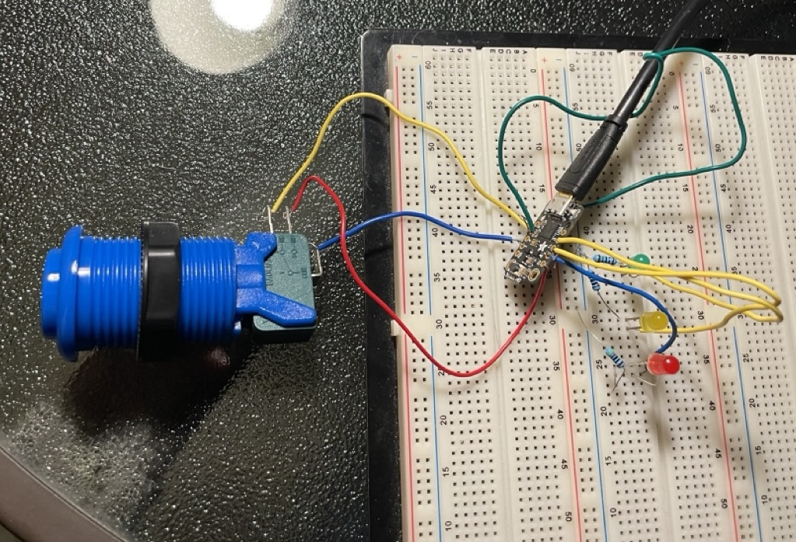
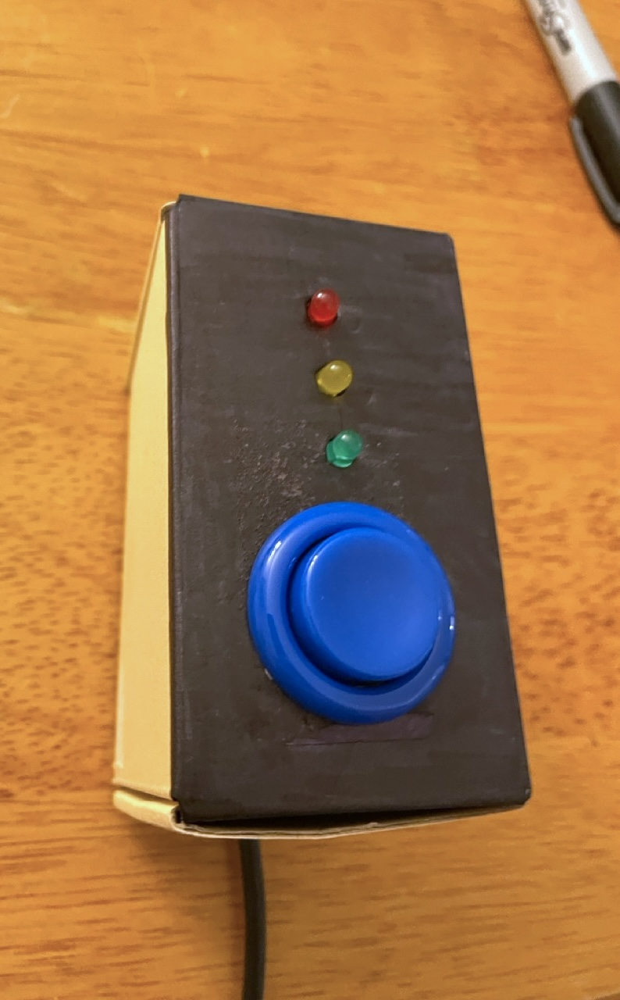

This weekend I built a little timer box to hang up next to my desk. It has one job: to gently remind me to be less sedentary, using colored LEDs to signal that its button has not been pressed recently. It lives far enough away from my seat that I cannot press it without standing up.

I installed it today, and so far so good: it is unobtrusive enough that it isn't distracting, obvious enough that it reminded me to stand up on several different occasions, and pleasing to push. Also, it turns out that it feels nice to stretch semi-regularly. Who could have predicted?

I [wrote up the instructions](https://github.com/hannahilea/button-box-timer), if you want to make one yourself! 
It is a straight-forward electronics project so would make a good starter project for anyone relatively new to hardware. It runs on an [Adafruit Trinket M0](https://www.adafruit.com/product/3500) microcontroller, programmed in CircuitPython.

The timer is easily customizable in both function and form.
As far as function goes, mine counts up---green to yellow to red---but perhaps you want yours to count down? It could just as easily be a reminder of when a minimum allowable amount of time has passed, e.g., to signal that it is now safe to take more motrin or to give the cat more treats.[^trick]

[^trick]: Trick question, the cat can _always_ be given more treats. (This message endorsed by Cosmo.)

As far as form, mine uses a fun [arcade-style button](https://www.adafruit.com/product/3490) that I've had lying around for a while; yours could use whatever button or sensor you have---or something that catches your fancy upon [browsing](https://www.adafruit.com/category/235). I built it into a cardboard box, because that's what I had on hand. This timer would work just as nicely in a custom enclosure, a repurposed little tin, or some more sculptural element. Go wild! 

Or just use a little cardboard box that you've colored with a Sharpie.

***Instructions for building your own button-box timer (including a component list and code) are [here](https://github.com/hannahilea/button-box-timer). Let me know if you make one!***
