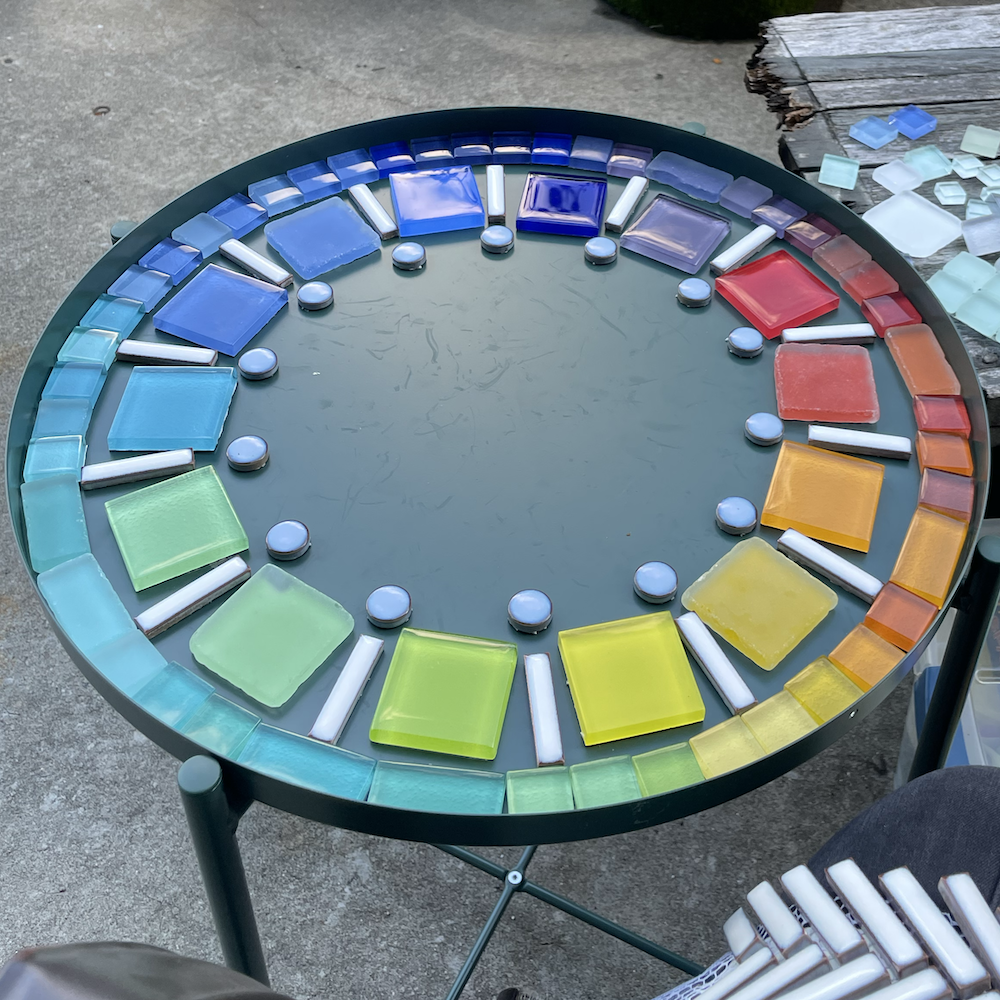
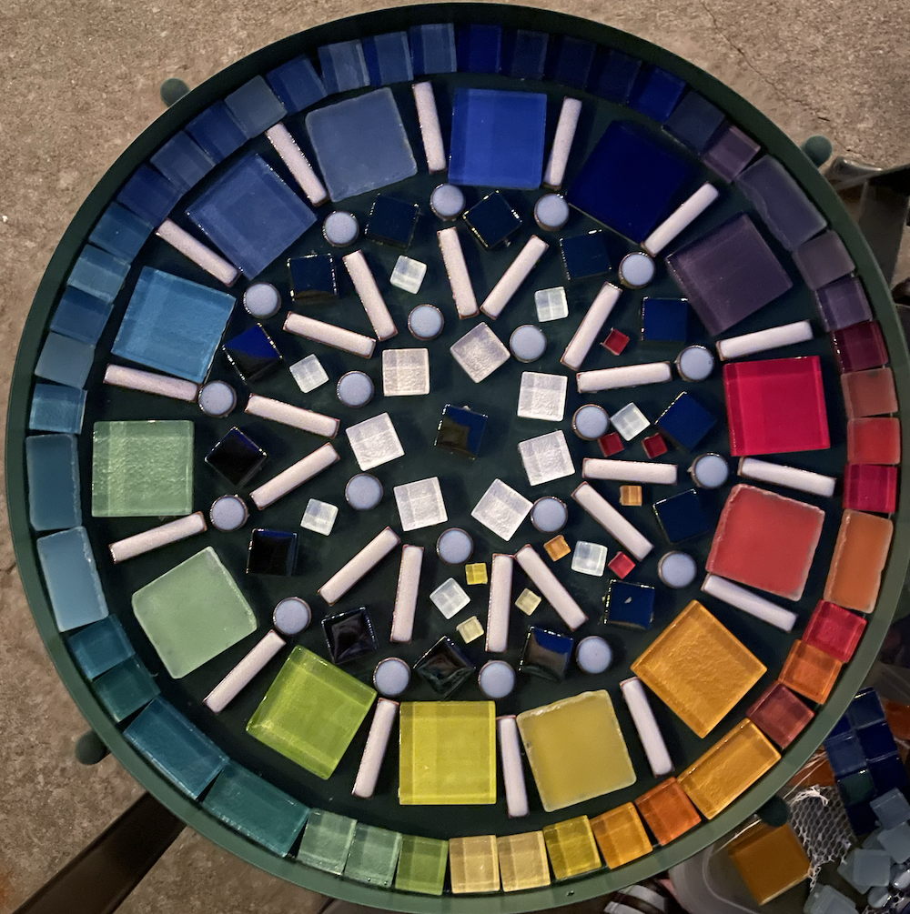
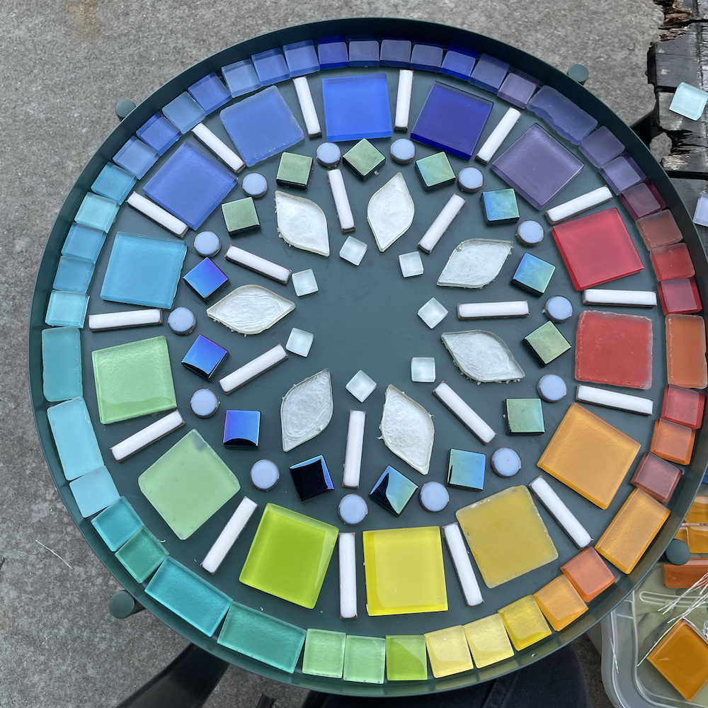
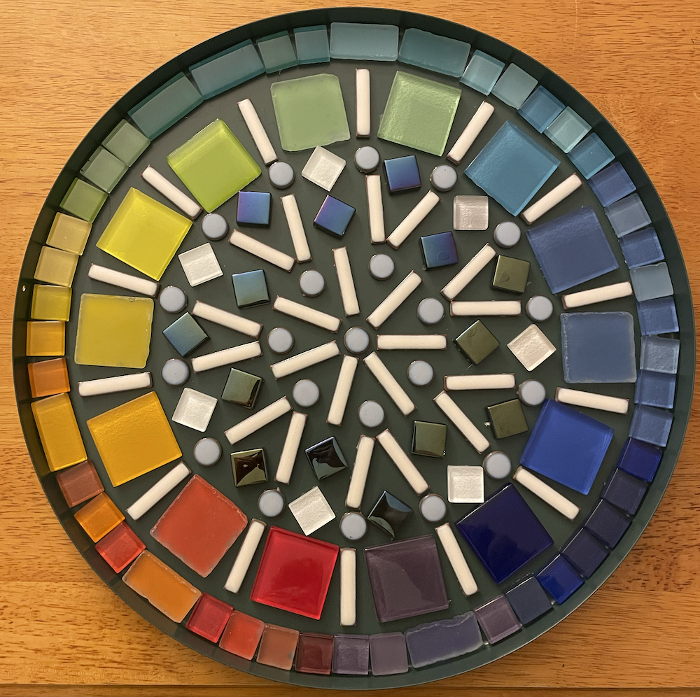
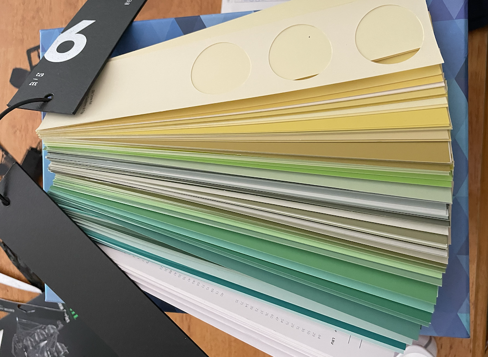

</img>

At the beginning of the summer I came into some treasure, artistically speaking: a friend of a friend was clearing out vast quantities of material samples from her architecture studio, and invited her community to come and salvage what they wanted from her ~~piles of treasures~~ discard pile. Tile, flooring, wall treatments, wood, shingles---each with an array of colors and treatments. Imagine a garage sale, made up of only the type of object you are most interested in, and where everything is free. It was *magnificent*.

I was relatively restrained in my choices, mostly due to the knowledge that my apartment does not have a lot of storage space. Anything I selected needed to either 

(A) be relatively small in footprint, 
(B) be something I could imagine actively using soon and as-is, without first acquiring equipment, tools, or skill sets, or 
(C) be too glorious not to leave behind.

After pouring through her offerings and actively talking myself out of many, many cool materials that I did not have the space to deal with---physically, emotionally, or spiritually!---I ended up choosing:

- A box of assorted linoleum tile samples (criteria A and C); 
- A couple of cabinet door samples (B); 
- Half a dozen keyrings of large-size paint color swatches, the grown-up version of the paint chips they have at the hardware store (C! C C C C C); and 
- A cardboard box full of various glass tiles in assorted colors, most still ~~trapped in~~ adhered to their cardboard binder books (B and C! But mostly C. Definitely not A. Very C.).

As soon as I got home I got to work detaching the tiles from their binders.

## Project 1: Magnetic mosaics

My original plan was to turn all of the tile into mosaics, and to attempt to do so relatively soon, before the creativity adrenaline wore off.[^mosaic] In the process of freeing the glass tiles from their ~~mortal coils~~ sample books, I encountered one particular set of glass tile samples that were so fun to rearrange and reorder that I couldn't possibly imagine cementing them into a single "final" mosaic arrangement.  Instead, I wanted to be able to continue to play with them. 

[^mosaic]:  I find mosaics straightforward to do at home: they require relatively few materials, most of which I already own, and aren't particularly messy. More importantly, I have proven to myself that mosaics are a type of art I will actively create, rather than think about for years and never actually do! Looking at you, pile of years-old stained glass materials still waiting for their opportune moment... 

Inspired by a set of multicolor fridge magnets my mom got me during college that are still on my fridge, I bought a bunch of magnetic backing tape and some allegedly weatherproof adhesive and turned the tiles into magnets...

...which I then stuck onto my apartment's steel porch railing. Bam, art installation!

</img>

They look *so* good, have fascinating interactions with light at different times of day, and make me happy whenever I see them out the window. Also, they are fun to play with.

</img>

</img>

</img>

One of my favorite patterns thus far was made by Alex's dad, using the greens and blues; I liked his pattern so much that I replicated it in the remaining warm colors. 

</img>

I'm excited to see how the next porch visitor chooses to rearrange them!

## Project 2: GLADOMOSAIK

Alex showed me [a bunch of folks mosaic-ing](https://www.apartmenttherapy.com/ikea-mosaic-table-hack-37362124) onto Ikea's [GLADOM tray table](https://www.ikea.com/us/en/p/gladom-tray-table-black-50411990/); did I want her to order me a GLADOM for my new tiles? I sure did!

After it arrived, I pulled out the remaining portion of my salvaged glass. The outer rim was the easiest part---I arranged the remaining colored glass tiles into the table as I pulled them out of their storage box, sorting as I went. They looked great, no changes needed. Ship it!

Figuring out the inside fill took considerably more time. I made a bunch of different variations---possibly more iteration than on any art project I've ever done before?---until finally settling on the one I was happy to make permanent.[^preference]

[^preference]: If you prefer a different one than I did, don't tell me. :D I will say, some of them look a lot better in the photos than they did in real life; it's harder to see from the photos, but the respective heights of the various tiles played a key role in how happy I was with a given pattern.

I glued it all down. A few days later---after the adhesive cured---it was grout time:

Then, after the grout cured, paint:

That's it! Well, modulo applying a clear grout sealer that I have yet to acquire...

This was a perfect summer project, and I am exceedingly pleased with how it turned out. This is my first-ever outdoor mosaic; it remains to be seen if I made effective adhesive, grout, and grout sealer choices. Check back after the winter!

## Project 3: Have giant hole punch, will travel

I had an idea for making a bunch of mobiles and/or bunting out of the paint color swatches, which conveniently would let me make use of a super chonky circular hole punch I picked up the other day.[^mm] I got to punching!

[^mm]: Thanks, [Make & Mend](https://makeandmendshop.com)!

It took...a while. Luckily, it went fairly quickly and was a good activity to do while listening to a book.

I thought that once the holes were punched out, the remainder of the paint strips could be recycled. Joke's on me, it turns out they look really really cool themselves. What I do with them is yet to be determined, but "just recycle them" is no longer a viable option.

¯\\\_(ツ)\_/¯ 

## Next up?

What now? Nothing pressing, as I've now used up enough of my haul that the remainder isn't taking up a significant amount of space in my home! The remaining tiles fit into my pre-existing mosaic materials box, the linoleum squares have taken up residence with my linocut materials, and...okay, well, I need to move on to the next step with those punched holes AND with their remaining hole-less strips, which actually do take up a Certain Amount™ of space. But still! I'd say I did a pretty successful job of only acquiring materials that I could put to use fairly immediately.

Well, nothing pressing from *this* set of materials. 😅 A couple weekends ago we took a trip to [Swapfest, aka The Flea at MIT](https://web.mit.edu/w1mx/www/swapfest/swapfest-2025.08.pdf), and now I'm back to square one with the whole "pile of awesome objects to be turned into creative projects" situation...

Stay tuned, I guess!

***Thank you thank you thank you to CL for all the colorful materials, which were the creative spark I needed to jump-start my summer!***

</img>

