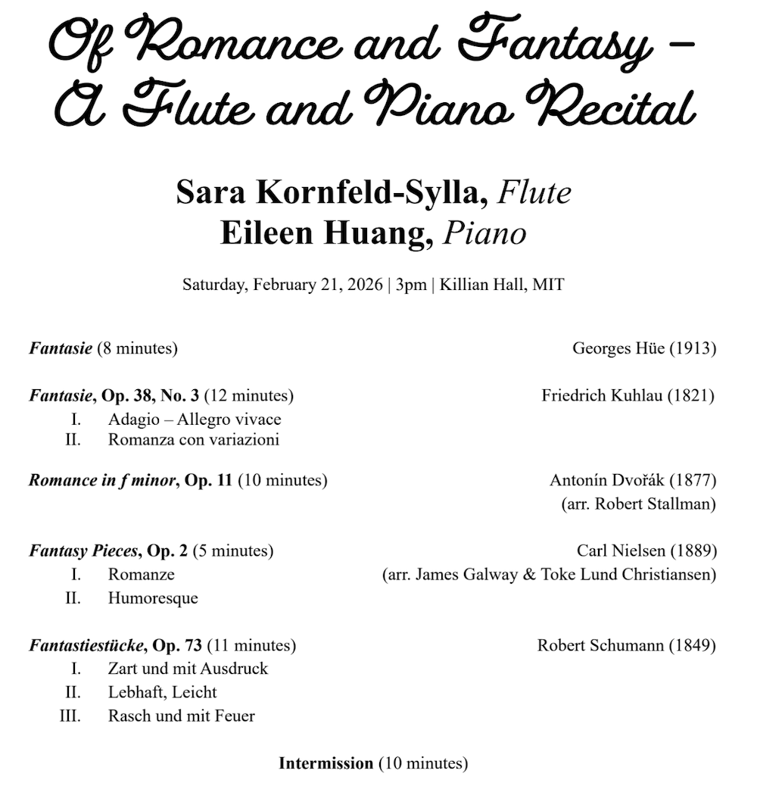
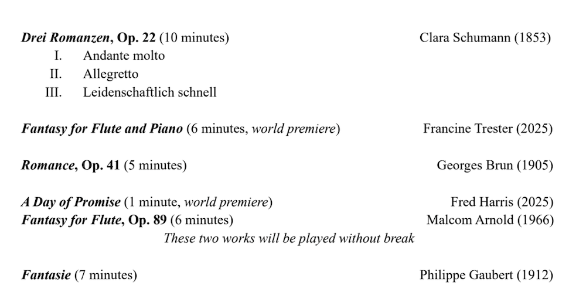
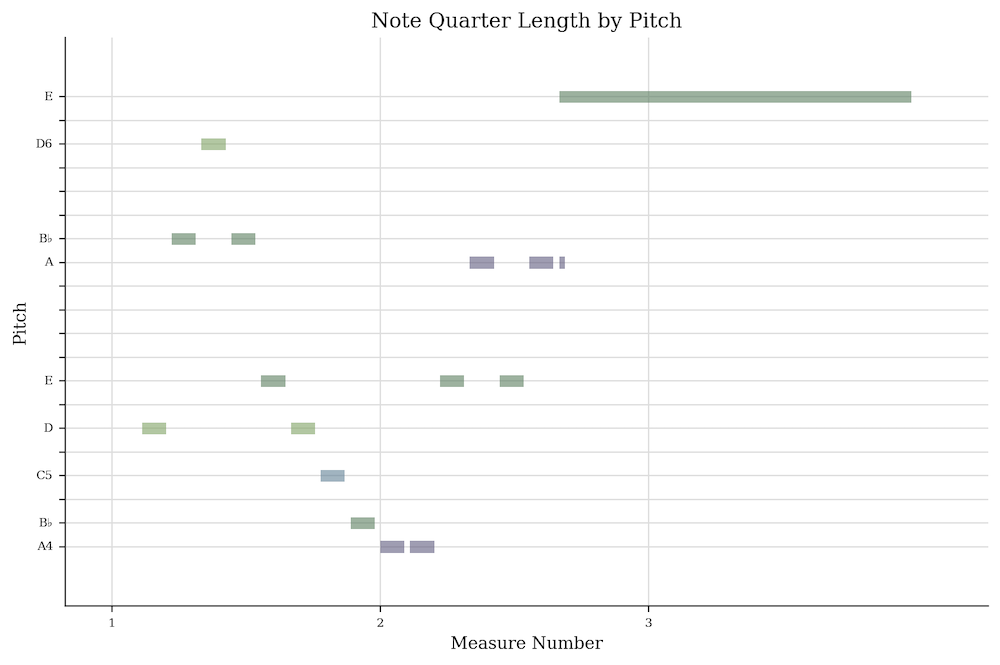
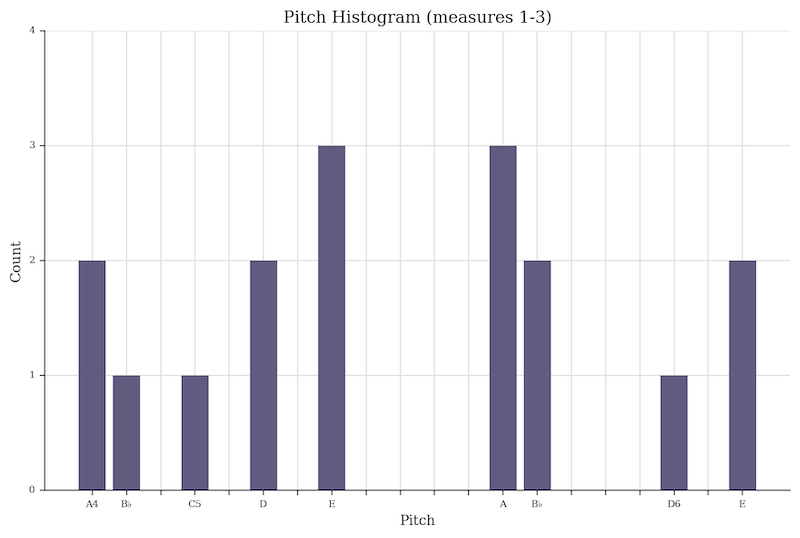
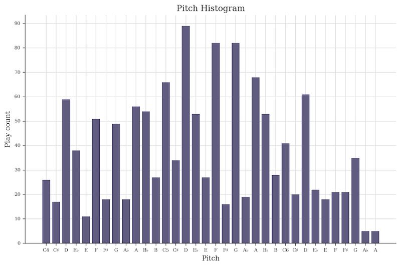
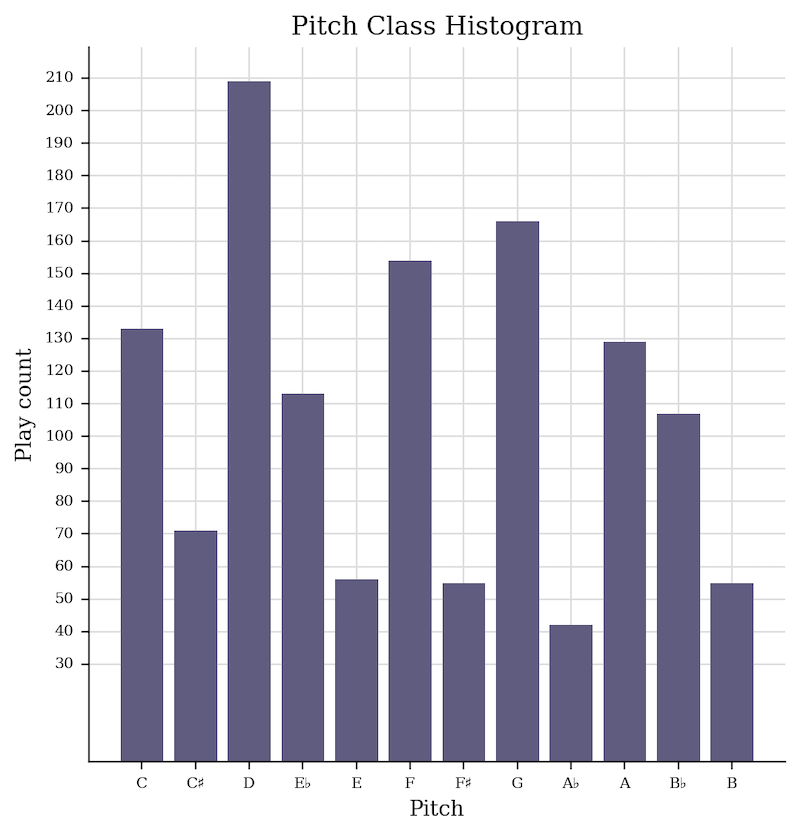
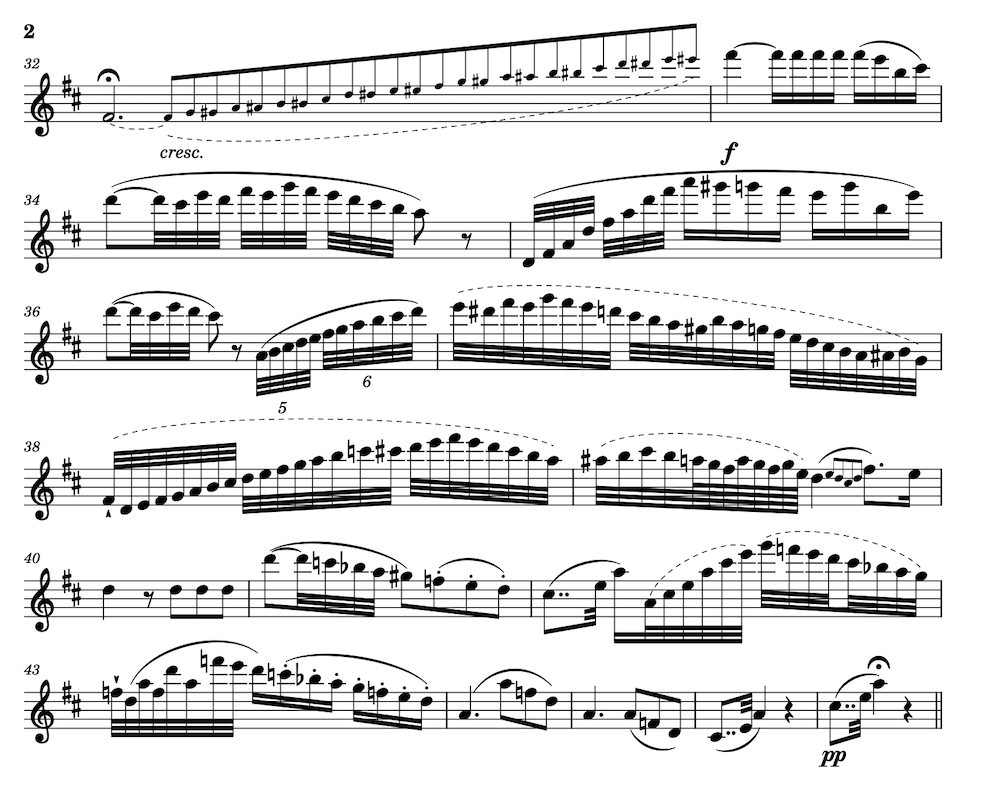

My friend Sara is an accomplished flautist. After attending [her recent recital with pianist Eileen Huang](https://www.eventbrite.com/e/of-romance-and-fantasy-a-flute-and-piano-recital-tickets-1982186535286?aff=ebdsoporgprofile), another friend and I were musing about how many notes she had just played. We settled on "a lot" and "at least a gajillion", but I wanted a more exact number---without physically counting the notes on her sheet music by hand.[^foreshadow]

[^foreshadow]: We can't always get what we want.


{width="600"
height="auto" style="border:solid,1px"}
{width="600"
height="auto" style="border:solid,1px"}


Automated analysis of pre-digitized[^foreshadow2] sheet music is relatively straight-forward. Tools such as [Music21](https://music21.org/music21docs/about/what.html), "a Python-based toolkit for computer-aided musicology," enable tasks such as counting notes. Although I haven't used Music21 in over a decade, I'm about to use it for an upcoming project so am interested in refamiliarizing myself with it.[^mysterious]

Let’s take Music21 for a drive, in service of answering the critical question **_"how many notes did Sara play in her two-hour recital?!"_**

[^foreshadow2]: Foreshadowing.

[^mysterious]: Upcoming project intentionally left vague! So ✨m y s t e r i o u s✨...

<div class="centered-children">
<iframe width="560" height="315" src="https://www.youtube-nocookie.com/embed/bEALE13kaOM?si=KJcHb-QKtCVY5xqQ" title="YouTube video player" frameborder="0" allow="accelerometer; autoplay; clipboard-write; encrypted-media; gyroscope; picture-in-picture; web-share" referrerpolicy="strict-origin-when-cross-origin" allowfullscreen></iframe>
<p><small>Sara and Eileen premiering Francine Trester's _Fantasy for Flute and Piano_ at their recital.</small></p>
</div>

## First things first: Explore a score with Music21

Let's start by looking at one of the pieces performed: Phillipe Gaubert's 1912 composition ["Fantaisie pour flûte et piano"](httpfs://imslp.org/wiki/Fantaisie_for_Flute_and_Piano_(Gaubert%2C_Philippe)).

First, let's load up the sheet music. I'm using a score in MusicXML format, downloaded from [MuseScore](https://musescore.org/en).[^annoyed]

[^annoyed]: For the record, I'm annoyed at how expensive it is to use MuseScore; I remember the days when it was free and [almost?] entirely community-driven. This is especially frustrating given that---at least for the pieces involved in this blog post!---the quality of most of their scores is not amazing. Which makes sense, since again, those scores were transcribed _for free_ by regular folks! [Enclosure of the commons](https://en.wikipedia.org/wiki/Enclosure) strikes again.

``` {.python .cell-code}
from music21 import *
score = converter.parse('fantaisie-philippe-gaubert.mxl')

# Show the first three bars
score.measures(1,3).show()
```

{width="708"
height="338"}

``` {.python .cell-code}
# Extract just the flute part and view its first three bars
flute = score.getElementsByClass(stream.Part).first()
flute.measures(1,3).show()
```

{width="674"
height="169"}

``` {.python .cell-code}
# Display those three measures in piano-roll format, where x-axis is time and y-axis is pitch
flute.measures(1,3).plot('pianoroll')
```

{width="812"
height="540"}

``` {.python .cell-code}
# Let's listen to the computer play it
flute.measures(1,3).show('midi')
```

<div id="midiPlayerDiv19102"></div>
<link rel="stylesheet" href="https://cuthbertLab.github.io/music21j/css/m21.css">

<script
src="https://cdnjs.cloudflare.com/ajax/libs/require.js/2.3.6/require.min.js"
></script>

<script>
function midiPlayerDiv19102_play() {
    const rq = require.config({
        paths: {
            'music21': 'https://cuthbertLab.github.io/music21j/releases/music21.debug',
        }
    });
    rq(['music21'], function(music21) {
        mp = new music21.miditools.MidiPlayer();
        mp.addPlayer("#midiPlayerDiv19102");
        mp.base64Load("data:audio/midi;base64,TVRoZAAAAAYAAQACJ2BNVHJrAAAAGgD/UQMJ844A/1kC/gAA/1gEAwIYCM5g/y8ATVRyawAAAKoA/wMGRmxhdXRhAMBJAOAAQADASekAkEpamiCASgAAkFJamiCAUgAAkFZamiCAVgAAkFJamiCAUgAAkExamiCATAAAkEpamiCASgAAkEhamiCASAAAkEZamiCARgAAkEVamiCARQAAkEVamiCARQAAkExamiCATAAAkFFamiCAUQAAkExamiCATAAAkFFamiCAUQAAgFEAAJBRWgCQWFqCuwCAWADOYP8vAA==");
    });
}
if (typeof require === 'undefined') {
    setTimeout(midiPlayerDiv19102_play, 2000);
} else {
    midiPlayerDiv19102_play();
}
</script>


``` {.python .cell-code}
# Plots are fun! Let's look at a histogram of the pitches played in the first three bars...
flute.measures(1,3).plot('histogram', 'pitch', xHideUnused=False, 
                         title='Pitch Histogram (measures 1-3)')
```

{width="805"
height="541"}

``` {.python .cell-code}
# ...and across the entire piece
flute.plot('histogram', 'pitch', xHideUnused=False, xLabel="Pitch", yLabel="Play count")
```

{width="811"
height="540"}


``` {.python .cell-code}
# While we're at it, let's look at the pitch classes---e.g., instead of plotting
# a separate E for each octave, combine the E's across all octaves into a single bin.
flute.plot('histogram', 'pitchClass', xHideUnused=False, xLabel="Pitch", yLabel="Play count")
```

{width="517"
height="540"}

Lots of D's, bunch of G's and F's and C's! Moving on.

## Second things second: Count some notes!

Our goal is to count the number of notes played by the flautist. We're already pretty close!

Remember that the first three bars looks like this, and contains 16 notes played. I count the grace note as a note played, but do not count the second note of the tie as a note played (it is a note held!).

{width="674"
height="auto"}

``` {.python .cell-code}
# What does Music21's raw notes count give us? 
# Apparently includes grace notes (good) but double-counts ties (bad)
len(flute.measures(1,3).recurse().notes)
```

::: {.cell-output .cell-output-display}
    17
:::

``` {.python .cell-code}
# Instead of counting all written notes, let's only count 
# notes that are either not part of a tie OR are the start of a tie
# Also, throw it into a function, for good measure (heh).

def count_notes_played(input):
    return len([n for n in input.recurse().notes if  not n.tie or n.tie.type == "start"])

count_notes_played(flute.measures(1,3))
```

::: {.cell-output .cell-output-stdout}
    16
:::

Success! Okay cool, now we trust this definition for the full piece:

``` {.python .cell-code}
    count_notes_played(flute)
```

::: {.cell-output .cell-output-stdout}
    1220
:::

Only 1,220 notes for the flautist to play in Gaubert's _Fantaisie_. Nice! 

## Sidebar things sidebar: What about the pianist?

The piece is for flûte _et piano_---so what about the pianist? How many notes do they play? 

``` {.python .cell-code}
piano_rh = score.getElementsByClass(stream.Part)[1]
piano_lh = score.getElementsByClass(stream.Part)[2]

print("  Piano left hand: " + str(count_notes_played(piano_lh)) + 
"\n Piano right hand: " + str(count_notes_played(piano_rh)) + \
"\nPiano total notes: " + str(count_notes_played(piano_lh) + count_notes_played(piano_rh)))
```

::: {.cell-output .cell-output-stdout}
    Piano left hand: 586
    Piano right hand: 490
    Piano total notes: 1076
:::

``` {.python .cell-code}
# Huh, really? That seems kind of low to me. Let's visualize the first few bars
piano_rh.measures(1,3).show()
```

{width="674"
height="166"}

``` {.python .cell-code}
# And what does our function say?
count_notes_played(piano_rh.measures(1,3))
```

::: {.cell-output .cell-output-stdout}
    2
:::

``` {.python .cell-code}
# ...well THAT isn't right! :D What's going on? My hunch is that we aren't 
# counting notes, we're counting chords---but handling the chord correctly.
# Let's look at the so-called notes:

list(piano_rh.measures(1,3).recurse().notes)
```

::: {.cell-output .cell-output-display execution_count="132"}
    [<music21.chord.Chord G5 B-5 D6>,
     <music21.chord.Chord E5 A5 C#6>,
     <music21.chord.Chord E5 A5 C#6>]
:::


Yep, that's it!

Flutes are monophonic, meaning that when they're only expected and able[^usually] to play one pitch at once. Pianos are polyphonic, meaning they can play multiple pitches at once (chords!), and in Music21 it looks like notes and chords are handled similarly in a stream.

Let's make a polyphonic note counting function so that we can figure out how many notes the piano is playing here.

[^usually]: With some caveats that I'm not going into here!

``` {.python .cell-code}
def count_notes_played_polyphonic(input):
    total_notes = 0
    for n in input.recurse().notes:
        if n.tie and n.tie.type != "start":
            continue
        if n.isNote:
            total_notes += 1
        else:
            total_notes += len(n.pitches)
    return total_notes

count_notes_played_polyphonic(piano_rh.measures(1,3))
```

::: {.cell-output .cell-output-display execution_count="135"}
    6
:::

``` {.python .cell-code}
# That's more like it!

# And the whole piece?
print("  Piano left hand: " + str(count_notes_played_polyphonic(piano_lh)) + 
"\n Piano right hand: " + str(count_notes_played_polyphonic(piano_rh)) + \
"\nPiano total notes: " + str(count_notes_played_polyphonic(piano_lh) + count_notes_played_polyphonic(piano_rh)))
```

::: {.cell-output .cell-output-stdout}
      Piano left hand: 787
     Piano right hand: 763
    Piano total notes: 1550
:::

Okay, great! While Sara was busy playing her 1,220 notes, Eileen was playing 1,550. Same order of magnitude!

### Third things third: Tallying the full concert!

Now that we have the ability to count flute notes played, we can hunt down digitized scores for the rest of the pieces in this performance, and run our counting function on them. Easy!

...well, easy, except for the few pieces that don't exist in digitized score format. While it would be fun to go down a further rabbit hole of applying optical music recognition (OMR) algorithms to those remaining scores, I chose not to do that today. Instead we (AF and I) counted them by hand.

Oh also: because Sara helpfully included piece duration in her program, we're able to calculate each piece's average notes-per-minute (NPM).

*Drumroll...*

***

| Labeler   | Composer         | Composition                                  |   Duration</br>[min] |   Note count |   Avg. NPM |
|:-------------:|:--|:--|--:|--:|--:|
| 🤖        | Georges Hüe      | Fantasie                                     |                8 |          290 |    36.25   |
| 🤖        | Friedrich Kuhlau | Fantasie, Op. 38, No. 3, Mvmts I and II  |               12 |         5,253 |   437.75   |
| 🤖        | Antonín Dvořák   | Romance in f minor, Op. 11                   |               10 |         1,115 |   111.5    |
| AF        | Carl Nielsen     | Fantasy Pieces, Op. 2, Mvmts I and II        |                5 |          714 |   142.8    |
| 🤖        | Robert Schumann  | Fantastiestücke, Op. 73, Mvmts I, II, III    |               11 |         1,021 |    92.82 |
| 🤖/HR     | Clara Schumann   | Drei Romanzen, Op. 22                        |               10 |          983 |    98.3    |
| --         | Francine Trester | Fantasy for Flute and Piano |                6 |            N/A |     --      |
| 🤖        | Georges Brun     | Romance, Op. 41                              |                5 |          517 |   103.4    |
| --         | Fred Harris      | A Day of Promise                             |                1 |            N/A |     --      |
| HR        | Malcom Arnold    | Fantasy for Flute, Op. 89                    |                6 |         1,368 |   228      |
| 🤖        | Philippe Gaubert | Fantasie                                     |                7 |         1,228 |   175.43  |


_Total note count: over **12,489 flute notes played** over 81 minutes of performing._

***

<p><small>Caveat: Why "over" 12.5k notes, and not an exact count? Two reasons:
    1. I don't have access to the scores for two of the pieces (they were premiered at this recital!) and 
    2. I didn't break trills into their constituent runs of notes.[^tremolo] 
This final count is therefore a lower bound on the number of flute notes played.</small></p>

If you look at each composition's average NPM, you'll see one stand-out: the Kuhlau. What's going on? Did we miscount? 438 notes per minute seems ridiculous! Let's look at a snippet of the score:

{width="300"
height="auto" style="border:solid,1px"}

Oh. Yep. That'd do it.

[^tremolo]: We do count tremolos!

    ``` {.python .cell-code}
    # Thanks to this bar, we updated our note counting algorithm to include tremolos
    score.measures(15,15).show()
    ```

    ::: {.cell-output .cell-output-display}
    {width="701"
    height="213"}
    :::


    ``` {.python .cell-code}
    def count_notes_played(input):
        total = 0
        for n in input.recurse().notes:
            if n.tie and n.tie.type != "start":
                continue
            if len(n.expressions) and type(n.expressions[0]) is expressions.Tremolo:
                if n.expressions[0]._numberOfMarks != 1:
                    print("Unhandled: tremolo notation with >1 slash")
                total += 2
            else:
                total += 1
        return total

    count_notes_played(score.measures(15,15)) == 44
    ```
    ::: {.cell-output .cell-output-display execution_count="5"}
    True
    :::
   

### Last things last: Musical marathons

The ability to count notes in a musical composition opens up an exciting opportunity: planning a concert *around playing a certain number of notes*.[^count] Runners define marathons as 42.195 kilometer distances, regardless of the terrain or route; why shouldn't we define a musical marathon as playing 42.195 kilonotes-worth of any repertoire or genre?[^km]

While counting the number of notes played in a composition or recital is hardly the most musical measure of a performance, it's still an interesting stand-in for the endurance and technical skill required of a performer. 12.5k notes in 81 minutes means 12.5k mechanical finger motions---and on a flute, often multiple fingers must move in order to switch notes. 

By this metric, Sara's 12,489+ notes mean she played almost a third-marathon recital---whew!

[^km]: After all, why let runners have all the competitive fun? What's *your* time for performing a 5k[note] program?


[^count]: At least, exciting if you are someone who loves to count!
<iframe width="560" height="315" src="https://www.youtube-nocookie.com/embed/A_OWe0OiuTA?si=GEtvrOQoZntLVWHf" title="YouTube video player" frameborder="0" allow="accelerometer; autoplay; clipboard-write; encrypted-media; gyroscope; picture-in-picture; web-share" referrerpolicy="strict-origin-when-cross-origin" allowfullscreen></iframe>
    
    Alternatively, the [~~N~~SFW version](https://www.youtube.com/watch?v=6AXPnH0C9UA)...

_The code for this post is published in my [`notebook-playground`](https://github.com/hannahilea/notebook-playground/tree/main/music21-exploration-1); I converted my [Jupyter notebooks](https://jupyter.org/) to static Markdown via [Quarto](https://quarto.org)._

***Thanks to [Sara and Eileen](https://www.youtube.com/@eileenhuang_music) for the lovely concert! Thanks to AF for hand-counting one of the pieces for me.***
