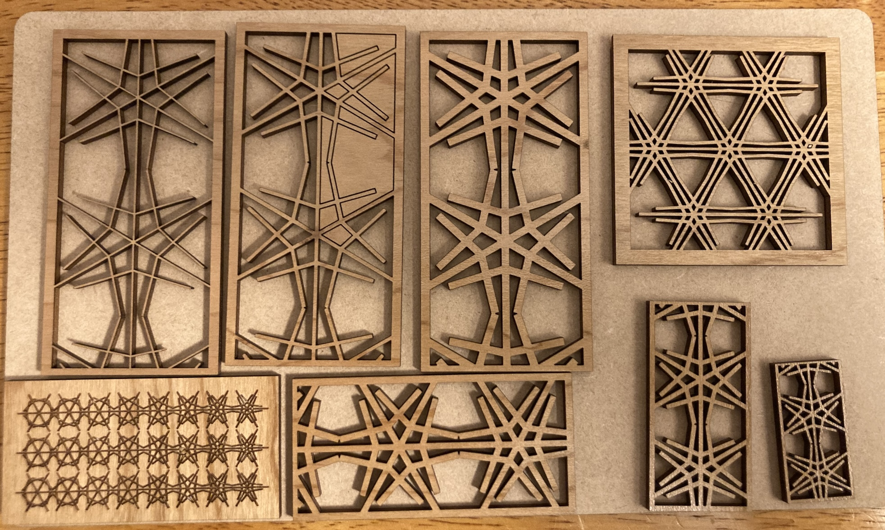
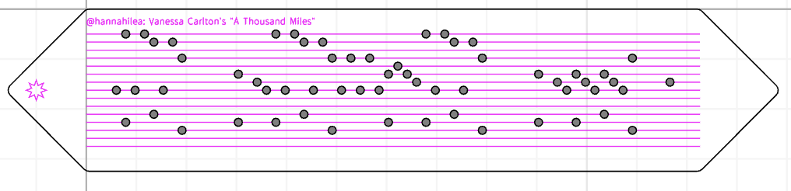
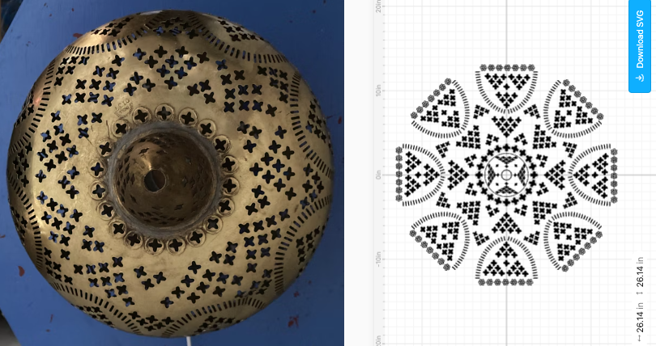

# Obsessed with Cuttle: Parametric CAD for prototyping, producing, and procrastinating

One of my primary creative outlets this year has been playing with the CNC laser cutter[^cutters] at my library's makerspace. It is the first CNC ("computer numerical control", i.e., computer-programmable) shop tool I've gotten comfortable and fluent with: while I've worked informally with plenty of *manual* shop tools for wood and metal, I've never previously bridged that programming/shop divide.[^attempt] Unsurprisingly, it is SO. MUCH. FUN.

[^cutters]: Technically my makerspace has two laser cutters, an [Epilog Zing](https://www.epiloglaser.com/laser-machines/legacy-systems/zing-16-24/) and a [Glowforge](https://glowforge.com/); while I've trained to use both, I prefer the Zing. I'll save the reasoning---and my Zing workflow---for a future write-up. Both are great, though, for different reasons. 

[^attempt]: I had one aborted attempt many years ago, where I got trained to use a very large (and very cool!) CNC laser cutter for working with sheet metal. Lack of materials, lack of transport for acquiring materials, and lack of initiative for solving either issue proved prohibitive, so I never ended up making anything with it. Now that I feel comfortable with this desktop-sized CNC machine, I feel a lot more empowered (not to mention motivated!) to try the large-format version.

There is a vast and inspiring community of makers who share their laser cutter designs and knowledge online. I used some of these pre-existing projects to get comfortable with the machine, and then wanted to move on to designing my own projects---both fully from scratch and by iterating on projects I've seen someone else create. To do that, I found [Cuttle](http://cuttle.xyz).

Cuttle is a web-based 2D parametric computer-aided design (CAD) tool. It is easy to learn, has a full-featured free tier, and---most importantly---it Just Works™. It has a clean and usable interface (not a given with CAD!), several high-quality tutorials for getting started, and a bunch of project templates of varying degrees of complexity, which serve as both a teaching tool ("how was this piece constructed? look at the internals to figure it out!") and a starting point for customization (it is trivially easy to clone an existing project and modify it yourself). While it includes many built-in components and modifiers, it also supports custom JavaScript code. This means that it is both easy for non-programmers to use, and extensible by folks who want additional customization.

In short, Cuttle is a powerful design system with an exceptionally shallow learning curve, a commendable set of tutorials and pre-existing templates, and an active and welcoming [community](https://cuttle.xyz/discord) in which its developers actively participate.  

Also, now I'm addicted to it.

## How do I CAD thee? Let me count the ways

There are several types of activity for which I've turn to Cuttle:

- **Creation of physical laser-cutter objects.** This is the most straight-forward situation, and why I started using Cuttle in the first place: I have a set of shapes that I need to be able to cut with the laser cutter, in service of building a physical object. I build them in Cuttle, export them as SVG files, and then import and print them from the laser cutter.

    Examples (to be described shortly!): [decorative bookends](#bookends), [a doorbell chime cover](#a-cover-for-a-set-of-doorbell-chimes), and assorted [calibration tools](#a-handful-of-calibration-tools).

- **Exploration of arbitrary patterns/shapes/concepts.** This situation is a natural result of Cuttle being fun to play with. When I see an interesting shape or pattern, I now think "hrm, how might I construct that?" and then I give it a try. Notably, instead of hard-coding specific dimensions or qualities of the item (number of sides, number of repeats, sizes of angles, etc), I attempt to parameterize them in different ways: instead of making a 6-sized shape, I'll make an `n`-sided shape and set `n` as a Cuttle variable. Then, once I have successfully completed the original item, I can play with those parameters to see what other interesting shapes or designs fall out. (In case it doesn't go without saying, there is no one way to parameterize a design! Therein lies the creativity.)

    Examples: [assorted pattern studies](#pattern-studies), [poem](#a-poem).

- **Non-CAD prototyping.** These situations have come about because when I am having fun in CAD software, every problem looks like it can be solved with CAD. Instead of defaulting to other more familiar-to-me programming paradigms/languages/environments when working on these projects, I used Cuttle for the prototype stage. 

    Examples: [music box punch cards](#punch-cards-for-music-boxes), [weaving cartoon](#weaving-cartoon), [parallax animation](#animating-parallax).

## Show, don't tell

The following are an un-ordered selection of projects I've designed myself---or in a couple cases, have significantly modified from someone else's initial design.[^gift] I encourage you to go to at least one of the associated project pages and play around with any parameters that are visible; you can't possibly break anything, and it's really fun. 

[^gift]: I'm not including pre-existing Cuttle templates that I've printed-but-not-altered, although those are also nifty. E.g., this [mini Crankie](https://cuttle.xyz/@cuttle/Crankie-Moving-Panorama-8fpsa2kxvOgg), which makes a particularly fun/customizable gift. 

### Bookends

*Play with this project [here](https://cuttle.xyz/@hannahilea/Bookends-eBHfPdCNGTIH)!*

These decorative bookends were designed as a gift. There are two aspects of this project I'm especially proud of. First, the initial conception of "faceplate designed to attach (with magnets) to cheap metal bookends," including correctly managing registration (i.e., alignment of the piece) during printing, to engrave both front and back.

Second, I'm pleased with the specific book icon I designed. The book icon is parameterized on number of pages, page and cover thickness, and open angle: 

You can see that the bookends each play with that design in a different way---note the changing number of pages for the left design, and the degrees of openness of each book on the right.

***

### Doorbell chime cover

*Play with this project [here](https://cuttle.xyz/@hannahilea/Doorbell-box-q6JyrDmh1bNq)!*

I designed this decorative doorbell cover for my parents, to replace an original doorbell chime cover that they didn't like. I started from a basic [Cuttle box template](https://cuttle.xyz/@cuttle/Open-Box-with-Finger-Joints-D2ugGEvYUNfd), and then added a design to the sides, a decorated front plate, and a cutout on the bottom for the chimes. 

It took me a while to build this, as I did a lot of angsting over how to decorate it---the only project requirement was that the size and bottom cutout matched the original, so that it would fit. Eventually I got unstuck by building a single little snowflake pattern unit and then playing around with with repeating and incrementally scaling a couple parameters until it felt visually pleasing.

I also had to cut a bunch of test pieces to see how thin I could get the lines on the decorative cutouts before they were too thin for the laser to handle.

***

### Punch cards for music boxes!

*Play with this project [here](https://cuttle.xyz/@hannahilea/Music-box-punchcards-iTT4lnLVNL5f)!*

This was a project I've wanted to do for a long time: automatically generate and cut the music rolls played by a mechanical music box. I'm planning to document this project with its own write-up, so am intentionally skimping on details here.

These music box rolls are an example of using Cuttle to prototype: rather than building out an end-to-end MIDI-to-SVG pipeline (`midi2svg`!), I instead converted MIDI to note index coordinates in an external Julia script, and then plugged the output coordinates of that script into a Cuttle template. This allowed me to spend my development time easily tweaking print parameters (hole spacing, metadata engraving, roll pagination, etc) with immediate visual feedback. When I turn it into an end-to-end system in the future, I won't include Cuttle in the pipeline, and I knew that from the start, but it still made the development process easier and faster for me than I would have been without it.

***

### Card display for a truck-loving kid

*Play with this project [here](https://cuttle.xyz/@hannahilea/Tabletop-card-stand-A4tFugrfB4wg)!*

My young niblings have a [Yoto](https://us.yotoplay.com/yoto-mini) player, along with a collection of various story and music cards; I made this card holder for them so that they could see their entire library at a glance.[^remember] (A Yoto player is a small portable music box for kids; specific playlists are triggered by inserting a corresponding card.) While I CADed this myself, I modeled it off of card holders I saw elsewhere on the internet, parameterized to be customizable to the number of cards in a collection. 

The aspect of this project that I was most excited about was the color: I cut the piece from Glowforge Draftboard---a medium-density fiberboard material---and then painted it with watercolor paint (!) and sealed it. 

The aspect of this project that the recipient was most excited about was that the truck design was one that he specifically likes to color in during quiet time, when printed at a slightly larger scale.

[^remember]: "...and remember that music other than *Helper Cars* exists," I thought, to no avail! 

***

### A handful of calibration tools

*Play with the various calibrators [here](https://cuttle.xyz/@hannahilea)!*

Most of these were in support of some other project, either public or non, for learning how to appropriately tune the laser cutter across different materials. You can see the ones where I thought I was engraving words but was actually cutting all the way through the material (whoops!), and also the ones where I scrawled on them to be able to later map back to various print settings.

***

### Weaving cartoon

*Play with this project [here](https://cuttle.xyz/@hannahilea/Weaving-cartoon-Fireplace-SFpVg2LNsz41)!*

My mom is a weaver; she asked me to make a "weaving cartoon" (i.e., a mock-up) to see how this nifty doormat might look if scaled up, in service of potentially weaving a site-specific piece. (What she requested was a very basic hacky photoshop collage...instead I had some fun in Cuttle. Overkill!)

***

### Pattern studies

*Play with these projects [here](https://cuttle.xyz/@hannahilea)!*

This motivation is the one I use to "let" myself procrastinate. I *could* respond to that email...or I could see how quickly I can implement a basic [moiré pattern](https://en.wikipedia.org/wiki/Moir%C3%A9_pattern). ¯\\\_(ツ)\_/¯ Before Cuttle I didn't really do this type of rapid programmatic pattern prototyping, except *maybe* by hand. Now I can, and it scratches the dual creativity itches of "constrained problem solving" followed by "open-ended exploration and search for visually interesting results". (Translation: Making pretty pictures is fun.)

The approach is basic: I see a pattern I think is cool and then I have a go at CADding it. 

Once you start thinking in CAD components, it is very hard to stop---but it does make the world more interesting at large! Hard to be bored if you can instead be thinking through how you'd replicate the design of the wallpaper/that building across the street/the figure you saw in a scientific paper/etc.

I was sick for a week mid-summer,[^guess] and while I was both low-energy and going stir-crazy, I ended up sketching up some [kumiko](https://en.wikipedia.org/wiki/Kumiko_(woodworking)) patterns to keep myself amused:

After the initial pattern recreation, I love seeing the additional patterns that fall out of tweaking various angles and ratios. For example, here's a close-up of one of the kumiko patterns:

And that same pattern, after scaling some of the parameters to various degrees:

And an alternate set of variations:

[^guess]: I'll give you one guess what with... 

***

### Animating parallax

*Play with this project [here](https://cuttle.xyz/@hannahilea/Prototype-Parallax-animation-M6sxlTXsZYTz)!*

I wanted to test out a basic animation with parallax, in service of a future flip book-type application. It worked! Onward to images that take longer than 3 minutes to draw...

***

### A poem!

*Play with this project [here](https://cuttle.xyz/@hannahilea/RC-CC-Everybody-has-a-hungry-heart-pqGODlplgbMg)!*

Last but not least, the most off-label task I've used Cuttle for thus far: a poem. I made this as a creative coding exercise while at the [Recurse Center](https://www.recurse.com/). During the weekly creative coding session, attendees have ~1.5 hours to build something based on a prompt received at the start of the session (anything, in any programming language or paradigm!). The week's prompt had been "Everybody has a hungry heart," so I approached it by way of a very basic custom modifier in Cuttle. 

I'm actually really pleased with how this one turned out, and it makes me want to do more interactive poem-type pieces in the future. I encourage you to make your own Cuttle poem---it doesn't have to be fancy! If you do, please share it with me.[^discord] 

[^discord]: You can find me over in the [Cuttle Discord server](https://cuttle.xyz/discord), at the handle `@hannahilea` (naturally!).

***

## Wrap-up

And that's all that's worth sharing for now! The amount of time it took to make any of these depended strongly on the complexity of the pattern, my familiarity with the various tools at the point I made it, and how much time I spent strategizing ahead of time. Some of the projects here took days (the music box rolls, the doorbell chime box, etc) while others were much faster. The moiré pattern took ~15 minutes, if that.

Cuttle isn't without flaws---but also, it is relatively new software, and is under active and responsive development. So far I've been able to design around any limitations I've encountered.[^limitations] The biggest problem with Cuttle is that it is fun. Too fun. Too easy to say "oh, let me just try one more thing..." and then come up for air to find that it is 1am. 🙃

[^limitations]: Sometimes large numbers of objects (or modifiers that I'm asking to do A Lot™) cause my browser to choke. Is that truly the fault of the software? I suspect that it's more that my approach to a given design needs rethinking, and I need to simplify it. So far I haven't run into anything so problematic that I've needed to ask for assistance, as it has been fast enough to redesign the offending part in an alternate way. Until further notice, let's assume that this browser choking is a me-issue and not a fundamental limitation of the software.

***A gallery of all my Cuttle work can be found [here](https://cuttle.xyz/@hannahilea). Thanks to the folks at the [The Hive](https://www.cambridgema.gov/Departments/cambridgepubliclibrary/Locations/mainlibrary/thehive), the Cambridge Public Library's makerspace, for their laser cutter trainings and assistance. Thanks to the team at Cuttle for building such an awesome tool.***

---
### Footnotes

<footnotes/>

--- 
- created: 2024-09-27
- last updated: 2024-09-27
- tags: project-writeup, cuttle, cad, programming, prototyping, javascript, creative-coding, makerspace
