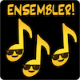

This pitch is for an app that does not yet exist[^far] and that I'm not planning to build,[^build] but that I would love to use. Please, take this idea. Build this thing. And then let me use it.

[^far]: As far as I know...
[^build]: Unless someone wants to commission me to build it... 👀

------

*Are you interested in playing music with other people, but not sure how to find them?*

*Do you have fond memories of casually playing in various ensembles throughout your school years, but no longer have access to an available pool of other musicians, space to make music in, or relevant equipment?*

*Have you ever had a sudden longing to play some duets, and then remembered that none of your former musical co-conspirators live nearby?*

*You aren't alone! Enter...*

**Ensembler**, the swipe-to-match app for finding musicians near you!

[^name]: Official name pending. Other names under consideration: Trumpetr, eMelody, Baroque-ayCupid, DuoSing-o, (T)ub(a)er, PlinkedIn, and my personal favorite, [FeadógMhór](https://inirish.bitesize.irish/how-to-say/6667-flute)Dash.

Simply fill out a few basic profile questions, then peruse the profiles of Ensemblers near you, swiping right or left to indicate interest in meeting up to play together---ensemble!
If you both indicate interest, you'll be able to message each other to set up a session. You'll be making music together in no time!

> "Moving to a new city used to be so isolating: it would take me years to find my way into the hidden musician networks to find people to play with. Now I can be playing duets with a new acquaintance across the street before I've even unpacked my dishes."
>   
> —*Ensembler musician (woodwinds)*

### Profile elements

Any given profile will include some combination of:

- Instrument(s) and skill levels at musical activities, e.g., sight reading, preparing sheet music, improvisation, learning by ear, etc.;

- Type of playing of interest, e.g., playing from notated sheet music or freeform jamming or pre-preparing selected pieces, etc.;

- Genres of interest;

- Practice space availability, e.g., whether you have access to a place to meet---and if so, its properties (e.g., amplification, sound-proofing, a drum-set, neighbors, a piano, etc.) 

An Ensembler can set up as many sub-profiles as is relevant for them, i.e., one profile for each advanced proficiency clarinet, one for beginner xylophone sight-reading, one for basic piano accompaniment for a vocalist singing show tunes, etc. 

> "Thanks to Ensembler, I sightread duets before work twice a week, and I've never felt so calm."
>   
> —*Ensembler musician (french horn)*

### Features

Some of the many features include:

- Ability to set up multiple profiles, for folks who play multiple instruments at various levels.

- Ability to bookmark musicians you've enjoyed playing with in the past, to be notified of their current jam availability;

- Ability to assemble a whole multi-player ensemble---rock band, string quartet, or polka trio;

- Ability to match with local venues that offer their space for music playing, at a set fee, for those without private practice space access;

- Ability to limit potential matches to those within your known sphere, e.g., only people with whom you have a mutual Ensembler in common or (for younger players) folks who share a professional music teacher.

- You can also add each other to your pool of on-demand "let's play ASAP" players, for when you have a sudden urge to play some music and want to broadcast that availability to pre-matched players. 

> "I'm not a musician myself, but I used to love listening to my kids practice. Now that I've made my living room piano available on Ensembler, my neighbors stop by to sing show tunes and practice their sonatas. My home feels lively again."
>   
> —*Ensembler host (piano)*

### Upcoming features

The following features will be released in the upcoming months:

- *Broadcast or join pre-scheduled events!* Our bandleader feature supports forming larger ensembles---set a time and place, then open your music session to the broader community. 

- *Venue availability* feature: Are you a community space or business with an open room that could be used by one or more musicians for solo or group practice, on a part-time basis? Make your space available to ensembles!

- *Sheet music subscription service*: Link your account to existing sheet music providers to receive event-relevant recommendations for sheet music for your given ensemble and expertise. 

- *Commission arrangements for your specific ensemble*: Can't find a tuba, piccolo, oboe trio arrangement of "Make a man out of you" as a bossa nova instrumental? Want to tailor-written piece for your tin whistle quartet? Use our network of music composers and arrangers to commission a custom work![^ai]

[^ai]: No AI will be used in the creation of these arrangements, nor in any other part of the ecosystem. Use of generative AI devalues the skillsets of the composers and arrangers in our community; as a site by and for musicians, AI will not be part of the Ensembler ecosystem in any way.

- *Instrument rental/swaps*: Do you have an instrument that you're looking to sell, donate, or trade? We facilitate that here, as well as linking with other pre-existing instrument resale sites.

- *Teacher connections*: Is there a specific skill you'd like to learn? Get matched with folks who offer paid lessons or lesson swaps, where you learn Irish ornamentation from them and and they learn tips for practicing crossing the break on a clarinet. In the future, multi-musician teaching loops will be facilitated: teach something to person A who teaches something to person B who teaches something to person C who teaches something to you.

- *Calendar integration*: Allow your bookmarked Ensemblers to invite you to play based on your calendar availability.

> "I used to be envious of the folks who assembled pick-up bands for Porchfest every year; now I don't have time to be envious, I'm too busy debating what songs we should prepare with the new friends I made through Ensembler!"
>   
> —*Ensembler musician (guitar, vocals)*

### Professional features

While Ensembler's target demographic is the casual musician, the app is also useful for professional and semi-professional musicians---and includes features specifically designed around their needs:

- *Gig match*: Post a gig, find players to join your ensemble.

> "I no longer need to be a part of 17 different Facebook groups called 'Pit Orchestra Musicians (Boston)'!"
>   
> —*Ensembler musician (trumpet, flugelhorn)*

- *Substitute finder*: Need a sub to sit in for your rehearsal or show? Find qualified folks here!

- *References*: Share recommendations from other verified professionals.[^linked]

[^linked]: In a more useful way than LinkedIn does. How? Join to find out!

- *Composition read-throughs*: Are you a composer or arranger? Easily assemble an ensemble to preview your current work-in-progress.

> "These days when I travel, I always bring my fiddle along---thanks to Ensembler, I'm always able to find someone to teach me a local favorite tune!"
>   
> —*Ensembler musician (folk musician)*

**Ensembler:** forging community through music making, one neighbor at a time! 
 
*Find your musical neighbors and make some noise.*

> "I don't know what this app is, I thought I was ordering pizza but now there are two bassoonists in my kitchen. Please send help. 1 star."
>   
> —*Ensembler user (accidental)*

***Thanks to [EmojiKitchen](https://emojikitchen.dev/) for the emoji used in the logo and to AF for the Facebook quote.***
