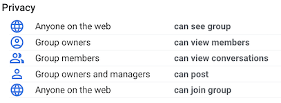
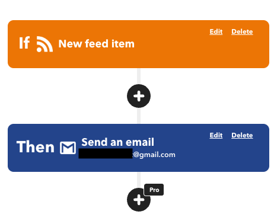

Say you want to know when I've written new blog posts, but you don't want to have to manually check my site every few hours (or every day, or every week, or once a month). What do you do?

One option: you could subscribe to [my RSS feed](/rss.xml)! But what if you don't (yet![^RSS]) use an RSS aggregator, and you don't want to set one up right now? 

[^RSS]: Unfamiliar with RSS? Check out ["A Gentle Explainer for the Ever Obscure RSS"](https://cuene.com/2023/03/07/a-gentle-explainer-for-the-ever-obscure-rss/) and ["What is an RSS Feed: Complete Beginners Guide"](https://riverside.fm/blog/what-is-an-rss-feed). I've been using the [Feedly](https://feedly.com/) aggregator and am fairly happy with it.

A new option: you can sign up for my mailing list, such that you'll get an email when a new post is published:

<a class="button" href="http://groups.google.com/group/hannahilea-blog-rss" target="_blank" rel="noreferrer noopener">Subscribe via email</a>

If you have your own site, and want to add a similar subscription option---i.e., email notifications whenever you update your RSS feed, without paying some external service to handle it for you---the rest of this post is for you. 

## General approach 

My requirements:

1. A self-serve subscription option for receiving "new post" notifications by email. (By "self-serve", I mean subscribers can add and remove themselves without my intervention.)
2. Fully automated---i.e., I don't have to add any manual steps to my current publication process
3. Trivially easy setup, with no maintenance after initial set-up
4. Easy to change in the future---i.e., I have access to the subscriber list, so that I can easily change my approach (or migrate the service elsewhere) as my needs change
5. Known up-front cost (ideally free!) with no surprise charges

There are [various services](https://buttondown.com/alternatives) that offer email subscriptions, but I didn't find one that met all of the above requirements. The closest I came was "requirements 1-4 met, and free below a minimum subscriber number," but the potential for surprise costs was a deal-breaker.[^free] 

[^free]: Honestly, I don't expect to go over that minimum subscriber number! But if for some reason I do, I don't want to suddenly be   locked into paying whatever the service costs at that point in time or go through the same process I'm using here to move to a new system.

Instead, I chained together the free tiers of two existing services on top of my (pre-existing) RSS feed: 

- For a mailing list with self-serve membership, I made a [Google Group](https://support.google.com/groups/answer/46601).
- To notify the world at large that a new post has been published, I update my RSS feed.
- To check for new posts and send an email to the group when one is published, I use [IFTTT](https://ifttt.com/).

I like that this approach decouples the "new post triggers action" component from the "subscribed group of people" component, as it means I can swap out the specific implementation choices for either without having to swap out both. For example, I considered setting up a [GithubAction](https://docs.github.com/en/actions) to watch for new posts, rather than using IFTTT. I decided against it for now---based purely on the setup time it would require!---but in the future I could easily make that change without touching the membership component.

My choice of specific external services leads to a few limitations that I've deemed acceptable for now:

- Using Google Groups as the subscription service means that subscribers must have a Google account that they can sign up with. 

    I suspect that folks who'd prefer receiving an email over using an RSS aggregator feed are likely willing to use Google services, and/or already have a Gmail account setup (primary or burner!). And if not, they are likely used to jumping through tech hoops to avoid Google services so could (e.g.) use IFTTT to directly poll my RSS feed and email their non-Gmail account themselves.
- IFTTT's free tier only polls for new RSS updates once an hour. 

    Fine! If you are that desperate to see my posts about [slide whistles](../slide-whistle-trombone-champ-controller/) the moment I publish them, you should probably watch the RSS feed directly anyway...

(If you think I'm missing something critical here, do let me know.)

## Set-up instructions

Want to set up this pipeline for your own site? These are the specific steps I followed:

1. Set up an RSS feed for my site[^setup]
2. Signed up for a new Gmail account, and set that account to forward any incoming mail to my primary email. (I don't expect it to get messages, but if it does, I'd like to know about them!)
3. [Created a Google Group](https://support.google.com/groups/answer/2464926) from my normal google account, and then locked down everything in it that wasn't "allow new users to subscribe/unsubscribe" and "allow my new account to send messages on behalf of the group". Specifically:
    1. Updated my membership settings to receive messages (I want to receive the same set of messages that my subscribers receive, so that I can see if there's anything wonky happening)
    2. Subscribed the new email account to it and assigned it the role "Group manager"
    3. Updated the permissions/privacy such that **only owners or group managers can post or view members**: 
        

        This means that no one else can send messages to the group, either initiating or replying to a message. This is the important one!!
    4. Enabled "allow email posting"---which now only applies to owners/group managers, given the above privacy settings---to allow the new account to send group updates via email (critical for connecting it with IFTTT).
    5. Set the "Default sender" as "Group address"---since the group will only ever receive automated messages, there's no reason to have those messages come from the new email account rather than the group account.
    5. Enabled "rejected message notification" so that if folks do try to email the group, they'll a message back saying that they can't.
    5. In "email options", added a subject prefix ('`[hannahilea]` ) and a custom footer that links back to the main website, to try to make the notification emails easy to for recipients to identify.
    6. Set "Post replies to" to "Group owners only", so that if anyone responds to an automatically sent group message, the reply will be sent to me rather than to the group. (I may need to disable this later, if it turns out I get bot subscribers and spam.)

4. Signed up for an [IFTTT](https://ifttt.com/) account using the new email 
5. In IFTTT, created and enabled an IFTTT applet (i.e., automation) with the following settings: 
    
    - Trigger: [New feed item](https://ifttt.com/feed/details) 
        - Feed URL: `https://www.hannahilea.com/rss.xml`
    - Action: [Send an email (Gmail-specific variant)](https://ifttt.com/gmail/details)
        - Gmail account: `new email account`
        - To address: `<new google group>@googlegroups.com`
        - Subject: `{{EntryTitle}}`
        - Body: `New blog post published at <a href="https://www.hannahilea.com">hannahilea.com</a>: <a href="{{EntryUrl}}">{{EntryTitle}}</a>`
    
    The resultant IFTTT applet looks like this: 

6. Tested it by publishing [a new blog](../autobibliography-1/) and updating my RSS feed as usual, and then receiving the expected email!

[^setup]: How to do this varies based on how your site is normally built/hosted. If you're using a static site generator (e.g. Hugo, Jekyll, etc), you may already be auto-generating one (or it may be as easy as setting a flag in your "build" command). I auto-generate mine whenever I add a new post to my site; I haven't documented that yet, but you can see it in action [here](https://github.com/hannahilea/hannahilea.github.io/blob/99ef4a67ead996f7f999b987e7eceee12c058210/build-site/run.jl#L198).

A few notes:

- The choice to set up a new email account to be used purely for communicating between IFTTT and the Google Group  isn't required; I could have used my existing Gmail account. I don't love the idea of having anything sent automatically from my primary email that isn't intentionally written and sent by *me*, though, so chose to make a new account. I chose Gmail so that I'd be able to sign it up for the Google Group (as per the original limitations).
- I chose to use IFTTT's `Gmail` applet rather than their default email one: the default email applet includes a bunch of templated "this post sent via IFTTT etc" footer cruft that I didn't like, and didn't want my mailing list subscribers to receive. The Gmail applet skips the cruft.
- I considered having the email notification include the whole blog post, rather than just a link to it, but decided against it for a few reasons: 
    1. I don't want to have to think about how the content is formatted in an email, and whether it looks good, etc; and
    2. More importantly, I often post stuff and then realize I have spelling or formatting errors that I need to fix. I'd rather not have those errors memorialized in the inboxes of any subscribers!

