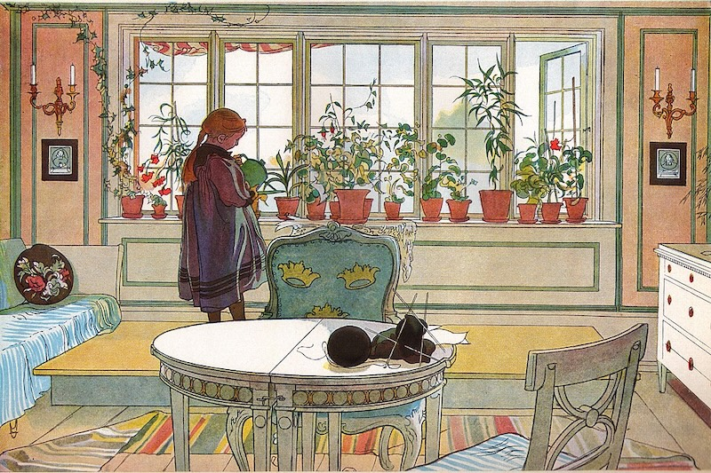
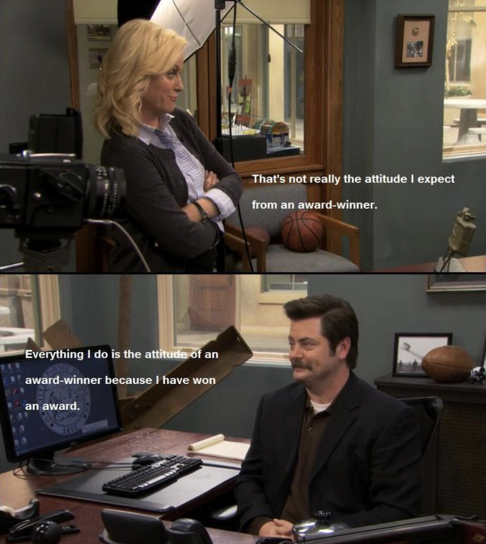
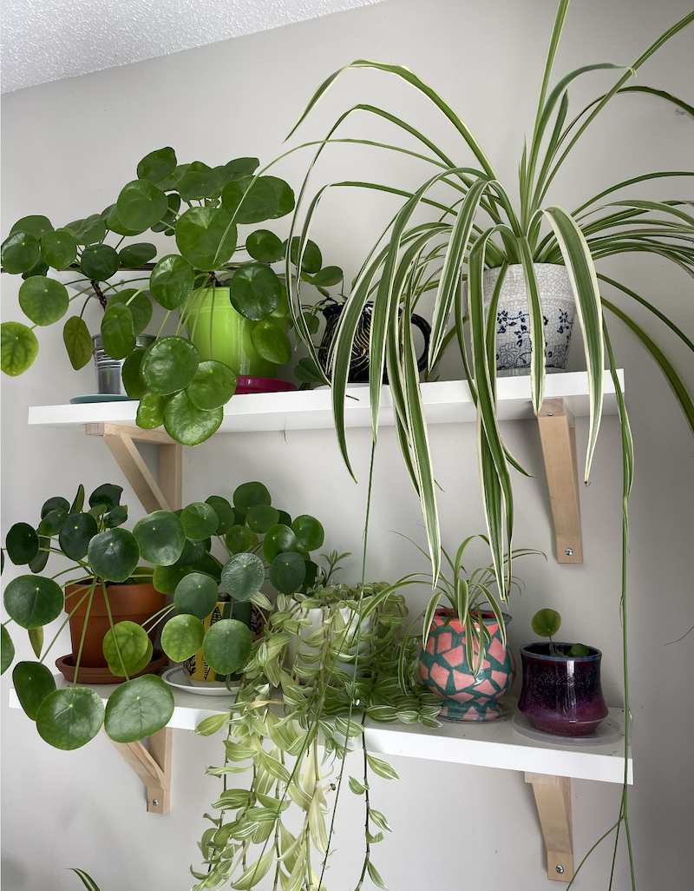
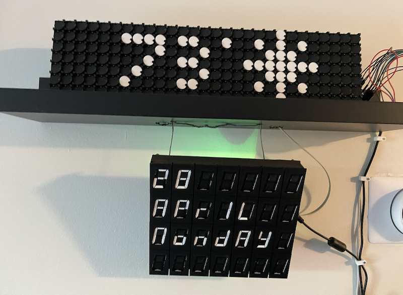
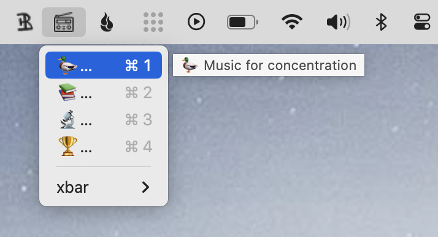
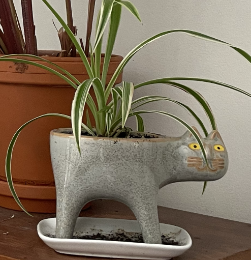
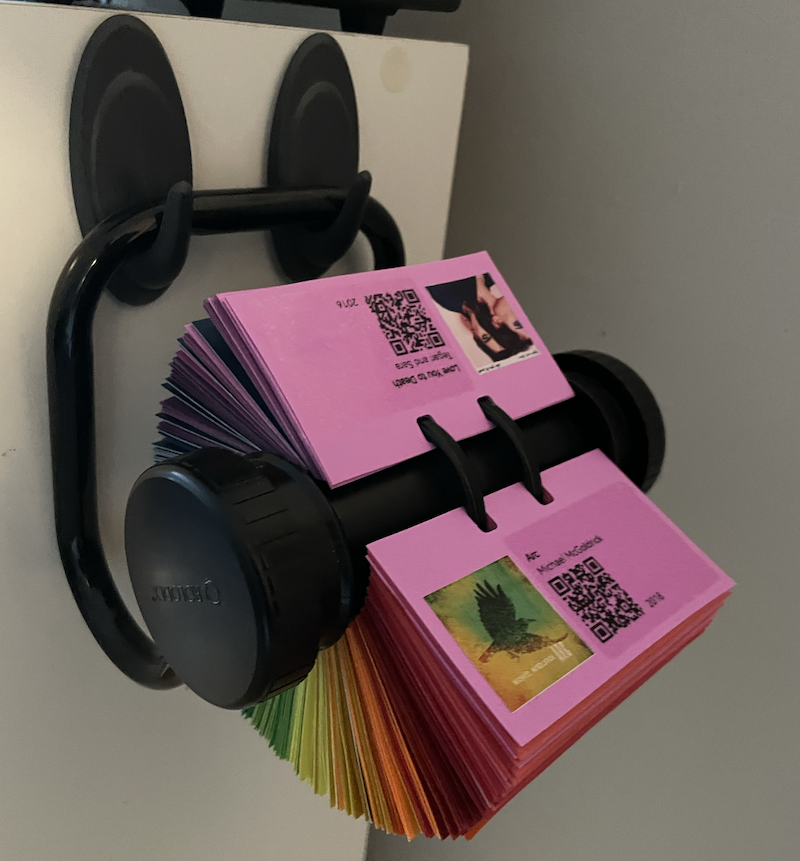

[Recurse Center (RC)](https://www.recurse.com/) peer [Ryan](https://rygoldstein.com) recently coined a phrase that I instantly fell in love with: *houseplant programming*.

In Ryan's words:

> [The tool I built] solves my idiosyncratic problems and may not address yours at all. That’s fine---take it as an ad to write tiny software just for yourself. Houseplant programming 🪴<sup>[2]</sup> !
> <br><br>
> <sup>[2]</sup> This isn’t an existing phrase as far as I know, but the closest I can think of is “barefoot developers” which a) is a little more granola than my vibe and b) is maybe tied up in some AI stuff. I guess this is [situated software](https://gwern.net/doc/technology/2004-03-30-shirky-situatedsoftware.html) but even smaller: I’m not building for dozens of users, I’m building for one user in particular.<br>
<span class="source">[[source]](https://rygoldstein.com/posts/introducing-mirror-darkly)</span>

Houseplant programming: tiny software just for yourself. *Perfection.*

At the risk of overexplaining and thus cheapening the analogy, I feel the need to wax poetic.🪴

<div class="centered-children">
<figure>

<figcaption style="text-align:right;font-size:smaller"><a href="https://commons.wikimedia.org/wiki/File:Blomsterf%C3%B6nstret_av_Carl_Larsson_1894.jpg">Blomsterfönstret</a> by Carl Larsson, 1895. Public domain via Wikimedia Commons.</figcaption>
</figure>
</div>

## When "It works on my machine" is the goal, not the excuse

Things I have found myself saying about some personal projects, almost apologetically:

- It works for me, but...
- It's held together with [string and electrical tape and visibly disorganized wires](../slide-whistle-trombone-champ-controller/)...
- I have to do [manual restarts after the power goes off](../clapping-music-for-flip-disc-displays/)...

In the world of houseplant programming none of these statements are apology-worthy. In a workplace, about a project that is intended for productionization[^productionization] and mass dissemination? Sure, production-ready code---code that has a job, or provides the infrastructure for a job---needs to be some flavor of robust and tested and reliable. For a project that lives in my house and does what I need it to and periodically needs a little extra help? No worries.

[^productionization]: What is "production code"? Everyone seems to have their own non-standardized definition, but in general, it is code that is being actively used by someone other than its creator, such that some flavor of stability and uptime is expected. 

    Or, my favorite definition, by way of Reddit:

    > "Production code has a phone number to call when it breaks"
    <span class="source">[[source]](https://www.reddit.com/r/datascience/comments/16jdvsn/what_does_production_code_mean_to_you)</span>


[^potted]: Should it be "houseplant programming" or "houseplant programming 🪴"? Unless Ryan weighs in definitively, I'll keep using the two interchangeably.

[Aditya Athalye](https://www.evalapply.org/) (another RC peer!) perfectly captures this vibe in the project description for his software project [`shite`](https://github.com/adityaathalye/shite?tab=readme-ov-file):

> `shite`'s job is to help me make my website: [https://evalapply.org](https://evalapply.org).
> Thus, `shite`'s scope, (mis)feature set, polish will always be production-grade, where production is "works on my machine(s)" :)
<span class="source">[[source]](https://github.com/adityaathalye/shite?tab=readme-ov-file)</span>

Strong "Everything I do is the attitude of an award winner because I have won an award" energy:



Any code is production ready, if you redefine the scope of your production environment! 

## Properties of houseplants, programmatic and chlorophyllous

Before we get to the self-reflective bit,[^escape] here is a non-exhaustive list of parallels between my houseplants and my houseplant programs:

[^escape]: As if you didn't know that was coming!

- **A happy home**: I love having both plants and homemade projects in my living space. Sharing a space with them reminds me of things that I like about the world and about myself. 

<div class="centered-children">
<figure>

<figcaption style="text-align:center;font-size:smaller">Exhibit A: Happy houseplants on a happy houseplant shelf.</figcaption>
</figure>

<figure>

<figcaption style="text-align:center;font-size:smaller">Exhibit B: Happy flipdisc installation on a happy flipdisc shelf.</figcaption>
</figure>

<figure>

<figcaption style="text-align:center;font-size:smaller">Exhibit C: Happy [xbar](https://github.com/matryer/xbar#get-started)-based utilities for launching common tasks and starting music playback, on a happy menu bar on my laptop.</figcaption>
</figure>
</div>

- **Longevity**: Like my plants, I love my little projects and I want them to thrive, and I baby them a little bit to get them started. But also, if they don't work out? It isn't a big deal, into ~~the great compost bin in the sky~~ Github they go, where a hard-won line or two may be ~~composted~~ recycled into a future project. 

<div class="centered-children">
<figure>

<figcaption style="text-align:center;font-size:smaller">This cat once had a cactus tail. Now it has a spiderplant tail.</figcaption>
</figure>
</div>

- **Propagation**: Clippings! I love to propagate my plants and share them with friends. Do you want a pilea or a spider plant or a nice philodendron? Let me know, I'll hook you up! Similarly, do you want to set up [your own pen plotter](../ly-drawbot-setup/) or make some quick and easy [screenshot memes](../meme-making/)? Awesome, I try to document and share the code and steps for recreating most of my projects.

  That said, once a plant/code has taken up residence in your home, it is no longer my responsibility. While I'd love to hear about what you did to help it thrive, and if it starts looking sad I'll gladly help you think through what might help, if it never thrives I'm probably not going to lose sleep over it. 

  Besides, once you've gotten as far as propogating the code/plant I've given you, you'll know about as much about the situation as I do---maybe more---and now we can explore the next steps together.

- **Pet toxicity**: Just like some plants, some projects are practically poisonous to my cat and---if the cat had her way---should be rehomed with a pet-free pal.

<div class="centered-children">
<iframe width="560" height="315" src="https://www.youtube-nocookie.com/embed/Un1VF6QwQ7E?si=TEJnxtiWZ5pBCiUU" title="YouTube video player" frameborder="0" allow="accelerometer; autoplay; clipboard-write; encrypted-media; gyroscope; picture-in-picture; web-share" referrerpolicy="strict-origin-when-cross-origin" allowfullscreen></iframe>
</div>

- **Universalization**: I don't care to engineer my houseplants to thrive in every environment---and similarly, I don't feel a need to make my houseplant code fully generalizable, until there is a more specific reason to do so.

- **Knowledge sharing**: I love reading about other people's houseplant projects. While I occasionally take code cuttings for my own home, mostly I just want to wander around and admire their houseplants and learn more about the woes they encountered when figuring out how to help their code/plants thrive. 

  I do not need to propagate someone's houseplant [code] in my own home in order to admire it; I can learn to consider a different fertilizer or communication protocol without transplanting their program into my own home.

- **Capitalism**: One person's houseplants are another person's plant nursery. One person's houseplant code is another person's B2B SaaS product. Enough said.

- **Bugs**: Soil gnats. Where do they even come from?! It is unknowable. 

  Sometimes my weather station shows me the icon for snow, even though it is currently April and the temperature isn't predicted to dip below 32. ¯\\\_(ツ)\_/¯ [^snowflake]

[^snowflake]: Okay, so bugs aren't inherently specific to houseplant code, but still...

- **Fun**: It is really, really fun to grow plants.[^except1] It is really really fun to write code.[^except2]

[^except1]: Except when it isn't.
[^except2]: Except when computer is mistaek.

## Not an idea, not yet a Platonic ideal

While I build software as a career, I also like to muck about with code in service of other goals. When sharing those other projects it has taken me a long time be able to talk about what my code does do without adding a zillion caveats about what the code *does not* do.[^whoops]

[^whoops]: I'm actively trying to cut down, both for my current self and for my younger self. My younger self didn't have the confidence of concrete professional proof that something she'd done meant she no longer had to prove herself so much---but she had just as much to share, and I wish she'd felt more empowered to take up more space in the world, rather than feeling cowed by the folks she was impressed by all around her.

Why? I think somewhere along the line I picked up the unhealthy---and false!---assumption that it wasn't worth sharing my code until it was ready to be reused easily by whoever was able to access it---specifically, not sharing that code until it was "production ready," for some arbitrary and ever-growing definition of "production" that I never *quite* fully defined for myself.[^perfectionism]

[^perfectionism]: If this is something you resonate with, I encourage you to look up "perfectionism" and some techniques for remedying it. Ditto "capitalism". 🙃

In the last year or so when presenting personal projects I've taken to saying that they're prototypes. Prototyping is a thing that makes sense to many folks in the field---it involves a first pass at trying to build something, with output that *won't* be optimized, might be hacked together with glue and dreams, and possibly even "only works on my machine". But it's proof that it is worth spending more time on something, or *not* worth spending more time on something.[^kids]

[^kids]: As the kids say, fail fast.

The thing is, a lot of the personal projects I've built are *not* prototypes, even if they share a lot of the same characteristics of a prototype: while they are a first-ish pass at bringing an idea to life, and they *could* be turned into a more generalizable or generic Thing, they're never designed to be more than that first pass with its context-specific configuration. 

While rebranding some of the projects I've built as "prototypes" helped me feel better about sharing something not totally polished, I've also felt like the term somehow devalues what I've built. Sure, sometimes what I've built *is* a prototype! But often, it isn't. It's a first pass, sure, but it's just a [weird little guy](https://www.patreon.com/posts/make-little-guys-112268885) of an idea, and doesn't need to promise to be any more than what it already is. Just existing is enough,and I'm not necessarily interested in developing it into a less-weird less-little guy!

Thus: houseplant programming. Tiny software for just myself.

## Epilogue: Bouquet programming 💐

I'm going to spare us all a further brainstorm of plant/code parallels, with the exception of one spin-off term: *bouquet programming* 💐. 

I'm hereby defining bouquet programming as one-off code that is written for one specific user *to support one specific use-case*, in a non-recurring way. By definition, it needs no maintenance and simply provides proof of what once was one run. Examples of bouquet programming: an analysis script in support of a one-time plot, a scrappy proof-of-concept or a [minimal reproducible example](https://en.wikipedia.org/wiki/Minimal_reproducible_example).

Bouquet programming is still worth writing home about (!) and sharing generously in the same ways as houseplant programming---or agricultural programming!---but is even *less* likely to work off-the-shelf for a new application than houseplant code is, even if rerun by the same person who originally programmed it.

Examples of my own bouquet code: a script I used to scrape book cover images for generating miniature book covers as part of a physical gift, code run in service of helping a friend [prepare timelapse videos of her marbling process](../video-timelapses-with-ffmpeg/), etc.

<div class="centered-children">
<figure>

<figcaption style="text-align:center;font-size:smaller">My Musidex, for which I wrote a semi-reusable script to convert a set of playlists into a set of album art, metadata, and QR code stickers.</figcaption>
</figure>
</div>

## Bonus: Garden stakes for horticulturalist programmers

I made a status badge for houseplant repos---feel free to use it!

[](https://www.hannahilea.com/blog/houseplant-programming)

```
<a raw_href="https://www.hannahilea.com/blog/houseplant-programming">
  
</a>
```

And a bonus badge for bouquet programming:

[](https://www.hannahilea.com/blog/houseplant-programming)

```
<a raw_href="https://www.hannahilea.com/blog/houseplant-programming">
  
</a>
```

***Thanks to [Ryan](https://rygoldstein.com) for the coinage and to AF for introducing me to strategies for recognizing and countering perfectionism.***

