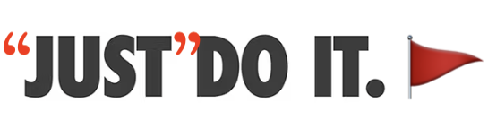

Let's document a concept I lean on constantly: the "just" flag. 

> The phrase **"just" flag** describes the phenomenon where the word "just" is as a cue that the following task is worth additional attention, and is likely not as trivial as the speaker is indicating. Although the word "just" is a qualifier that implies simplicity, it is often used to gloss over complex and nuanced situations.

Example 1: "The users want a feature that allows them to save their data in a special compressed format. **Just** add another button at the top of the main UI for it." _(Yes, but...What should the button say? What does the button do, specifically? Is the specialized format already implemented? If it exists as an external library, are we allowed to use that library? Does it have a license that enables us to use it as-is? Does the design team know about this? The marketing team? Etc.)_

Example 2: "I'm basically ready to leave, I **just** need to pack my suitcase." _(...sure, trivially easy, as long as you've already thought about the weather, you've done your laundry, you know what you want to bring and that it will fit in your bag, etc.)_

In addition to describing this phenomenon (and the recognition of its occurrence!), the literal phrase "just flag" can be used facetiously: "My blog post is nearly done, I (air quotes) **just-flag** need to add a couple examples and then it's good to go." _(Cue a stupid amount of time spent waffling...)_

Once you start listening for "just" in your own speech and that of the people around you---especially in working environments[^env]---you'll realize that its presence rarely adds anything to the meaning of a statement except a subtle presumptuousness.[^def]
I don't think this presumption is intended on the part of the speaker; I don't think most people even realize they're broadcasting it. I've noticed, however, that when statements about tasks include "just," they rarely get pushback on the item _following_ the "just", except by people of equal-or-higher seniority, authority, or domain expertise.[^pres]

[^env]: By "working environments" I mean any place where there is a shared goal to accomplish, and a set of (possibly unknown) tasks that must be completed in service of it, including (literally) in workplaces. I'm intentionally not using "technical communication" here, even though that's what I mean, because I think some folks have a much narrower interpretation of "technical" than I do.

[^def]: "_Presumptuous_: too confident in an expectation or assumption especially in a way that is rude." Source: [Merriam-Webster](https://www.merriam-webster.com/dictionary/presumptuous) 

[^pres]: And understandably so: "just" is a word that implies that both parties are in agreement that a task is trivially basic; if the listening party doesn't know much about the task, or has never done it, or believes the speaker to have more experience or expertise, or the speaker has more authority, it makes sense to accept the "simplicity" without pushback, and figure out the details later. Use of "just" by someone at the upper end of a power imbalance implies that, if questioned more about it, the speaker is likely to think less of the ask-ee. (Whether this is true in practice is besides the point! The implication is there, which is what affects the person with less power.)

I encourage sharing the phenomenon with your colleagues, as it provides a useful shorthand. By throwing air quotes around the word "just", or otherwise emphasizing it, or giving a knowing look when you use it, the group of you can share in the knowledge that you are *currently* glossing over a step that is almost certainly complicated but not worth immediate focus. This aids in team communication, mutual understanding, and camaraderie.[^joy]

[^joy]: Arguably the most important aspect of team cohesion and shared progress! After all, there's nothing like a deep chortle over a "and then we *air quotes* Just *air quotes* fix the bug and tag a new release!"

## History

I was introduced to the "just"-flag concept by my friend and then-colleague [Russell](https://www.russellmcc.com/).[^dsp] We'd just left a meeting where it had been implied that our team could and should make a number of wildly drastic changes to a complex project we'd been thoughtfully (and publicly) building for months. I remember him saying, in an impressively neutral tone, something to the effect of, _"Have you noticed that when someone says the word \"just\", it nearly always indicates that they have not spent time thinking about the statement that follows it?"_ [^memory]

Once he'd pointed it out, I started noticing it everywhere---at work, at home, in other people's speech and my own.

[^memory]: Precise wording is lost to the ravages of time and memory! Assume that Russell's delivery was professional and non-snarky.

[^dsp]: If you, reader, have worked with me before, you will almost certainly have encountered Russell's work already, through his excellent write-up of [true peak detection and intersample peaks](https://techblog.izotope.com/2015/08/24/true-peak-detection/), which I share with people early and often. He was a significant role model and mentor to me in my first software engineering role.

I have yet to encounter the "just"-flag phenomenon elsewhere, so I'm going to continue to credit Russell with its provenance (if not its name).[^cite]

[^cite]: I recently asked if he remembered the conversation where he first told me about the "just" phenomenon. In his words (quoted with permission):

    > This topic is one I do think about often, and is definitely a guiding principle for technical communication for me.  I’m not sure I have a name for it and can’t recall pontificating about it recently… I honestly don’t remember discussing it with you but seems like something I probably would have done :-).   I can’t claim originality here, although not sure where I first encountered the idea myself… maybe it’s best to credit me anonymously since for all I can remember I heard it from someone else!

## FAQ

* **Q:** *Should I not use the word "just" in my own speech at all?* 

    **A:** Keep using it to your heart's content! "Just" isn't a bad word, merely a sometimes loaded one. I use it all the time and don't plan to stop. Just (heh) recognize when you've used it, so that you can make sure to clarify your intent and address any unintentional minimization. Be extra aware of your own usage in situations where you are communicating with someone who might not feel comfortable "bothering" you with minutia, especially when working on a task they might think _you_ think should be trivially easy.

    I try to omit "just" from conversations where I'm explaining how I think a task could be accomplished, or when I'm providing instructions.

* **Q:** *Is the word "just" always a flag?* 

    **A:** Nope! I trust you to correctly assess when it is being used as an unintentionally-minimizing qualifier versus when its use is directly operative.

* **Q:** *What if I notice other people using the word "just"? Should I say something to them?* 

    **A:** Uh, probably not, there's no need to make things weird! The "just" flag is a phenomenon, not a problem.

    When you notice other folks using "just" in technical situations, consider asking clarifying questions about the trivialized task, or following up with the task-ee afterwards, especially if you know the task to be far from trivial, and suspect that others in the group do not share the knowledge to know that yet.

    That said, I encourage sharing the concept of the "just" flag with your team, so that you can collectively use it to your advantage.

* **Q:** *I understand the "just" part, but what does "flag" have to do with anything? I see no flags!* 

    **A:** Ah, by "flag" I mean "cue" or "qualifier". When you encounter the word, it is like encountering a warning flag, indicating that it is worth paying extra attention to the statement that follows.

* **Q:** *What if I want an emoji to use in my team's slack/zulip/discord/whatever?* 

    **A:** You're in luck! There's the good old standby "triangular flag emoji", `🚩`, with the label `:just-flag:`. You can also style it---in text---as ":just: or ":just-flag:", as in, I :just-flag: need to get the rest of the team to agree with me and then we can move on.

Learning to notice the "just" flag caused a fundamental and ongoing shift in how I interact in technical conversations. It affects both how I listen to others and recognize that I need to be specific in my own statements, in both professional and personal settings. Perhaps it will do the same for you.

***Thanks once more to Russell, for sharing his observation with me!***
