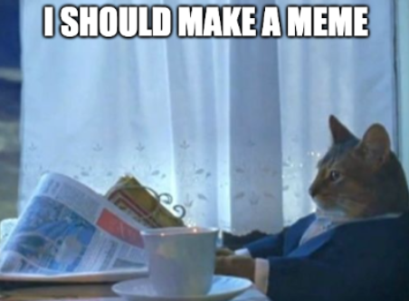
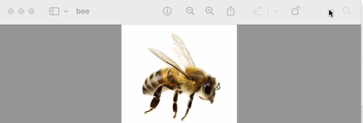
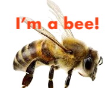
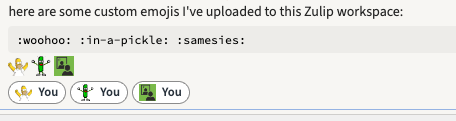
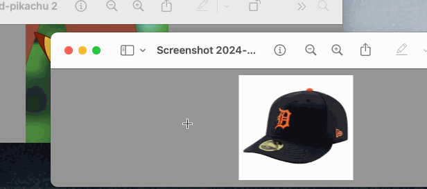

*Adapted from a non-programming talk given while at the [Recurse Center](https://www.recurse.com/).*

A brief tutorial on taking and manipulating screenshots, so that you can quickly have fun making motivational quote images, custom Zulip/Slack emojis, templated memes, goofy "photoshop"-like composites, and whatever else your heart desires.

## How to take screenshots quickly

If you remember one thing from this post, let it be that there is a shortcut for copying a selected region on your screen:

| OS[^OS] | Copy selection to your clipboard | Save selection to a file|
| -- | -- | -- |
| **Mac** | `command + control + shift + 4` | `command + shift + 4` |
| **Windows** | `windows logo + shift + s` | `windows logo + shift + s`, then select "save" |

Hit the selected key combination, then draw a box on your screen around whatever you want to be in the screenshot. That's it! If you used the "save" option, it'll save to wherever your default save location is (e.g., your desktop or documents or downloads folder); if you used the "clipboard" option, it'll be saved into your clipboard and ready for you to paste somewhere else.

[^OS]: Other OS (phone, etc): Sorry, you're going to have to look it up yourself. Go ahead and do that now! :) 

Go ahead and try it right now:

1. Save a screenshot of the above table to a file (now you can reference it later!)
2. Copy a screenshot of that table to your clipboard, then paste it[^paste] somewhere: into an email, a text message to your landlord, a Slack thread, a Zoom chat, wherever!

[^paste]: Like you would normally paste any copied text: `cmd+v` / `ctrl+v` / etc.

## How to edit screenshots quickly

Get familiar with your default basic image editor. I'm on Mac, so use the Preview application. Alternatively there's this online [MS Paint remake](https://jspaint.app/) that works pretty well.

The functions you'll want to get comfortable with are:

- Cropping 
- Adding text---and styling that text (resize, color, font if you're feeling fancy)
- Bonus: selecting and removing background fills.

The faster you can do those actions without thinking about them, the easier it will be to respond with an image instead of with text. Here's an example of me doing a quick edit in Preview:

with output 

[^you]: I'm not going to write up specific editors; there are almost certainly loads of tutorials for whatever computer/program you have access to, so use that! 

Go ahead and try a basic edit with your program of choice[^you]:

1. Save a screenshot of a portion of your screen
2. Open it in your image editor
3. Crop it into a thin rectangle
4. Add a line of text that says "hello, I did this" and then turn the text purple and make it fill the whole box.

## What to make?

Right, those are the basic skills: taking a screenshot, editing the screenshot. What to do with them?

### Motivational quotes

Start with a pretty landscape; add a text box with your quote of choice.

Especially delightful for workplace commentary. #TODO-add text to image

### Traditional templated memes

1. Using an online meme template site (e.g., [imgflip](https://imgflip.com/memegenerator/X-X-Everywhere)), add your text to a given template:

2. **Take a screenshot** of the updated template. Don't bother with the "generate meme" or "download" buttons! (They'll try to make you sign up for stuff, and this way is quicker anyway.)

This use-case is especially excellent for rapid-response comments in video chats. Did you know you could paste images from your clipboard directly into Zoom? You can! 

### Emoji for Slack/Zulip/etc

1. Save a screenshot of the image you want to upload.
2. Crop it down into a square
3. Bonus: use a "remove background" tool to make the background transparent. Think about whether it will show up in both dark and light modes; if not, add your own background to it first.
The simpler the image, the better it will read from within your message application. 
4. Upload it into your messaging software. E.g., in Slack, within a workspace go to `Tools > Customize Workspace > Emoji`; in Zulip, do `Settings > Organization > Custom emoji`.

### Composite images

Save screenshots of a couple images. Open one and remove its background, then copy it into the clipboard. Open the second; paste from the clipboard over top, then resize and move the pasted image until it looks good. Note: "good", not "perfect". The goal is quick-and-good-enough, not "make it look like a professional Photoshopped this."

What should you make? Put a hat on your friend, put a penguin on a rollercoaster, I don't know! Whatever suits your mood.
Why? Because it is funny.

### Other screenshot uses

My primary screenshot selection usage is actually more for taking screenshots of things I want to remember from otherwise ephemeral video call chats: charts, citations, quotes. I also keep a folder on my desktop of things that make me happy: comments, praise, and general goofiness from otherwise ephemeral chat situations (Zoom/Slack/group texts, etc).

I also like it for making quick and goofy responses in conversations---a picture is worth a thousand words, etc.[^k] Things I have done with these images: frame it and gift it. Put it on a puzzle and sent that puzzle to a friend. Print it in triplicate and tape it all over my team's meeting room.

[^llm]: And none of that LLM auto-generated image nonsense, please. This is all about using your human creativity!

[^k]: Bet you thought you were going to make it through the whole piece without me saying that!!

## With great power comes great responsibility

It should go without saying, but it is important, so I'm going to say it anyway: 

1. **Respect assumptions of privacy!** E.g., no sharing Zoom screenshots (of people, slides, the chat) without their permission.

2. **Be respectful in your choice of meme templates, text, and imagery.** Avoid -isms ([subtle](https://www.recurse.com/social-rules#no-subtle-isms) or otherwise), inadvertent microaggressions (such as [digital blackface](https://www.teenvogue.com/story/digital-blackface-reaction-gifs)), and [punching down](https://dictionary.cambridge.org/us/dictionary/english/punch-down).

## Homework

- [x] Read this post
- [ ] Make a doofy image with a screenshot
- [ ] Share it with someone (me, if we know each other irl!)

Congrats, now you're an artist! Put your friend's profile picture into that historic photo (maybe even more than once??), slap a watch on a loon, make it quick and sloppy[^llm] and share it and move on.
