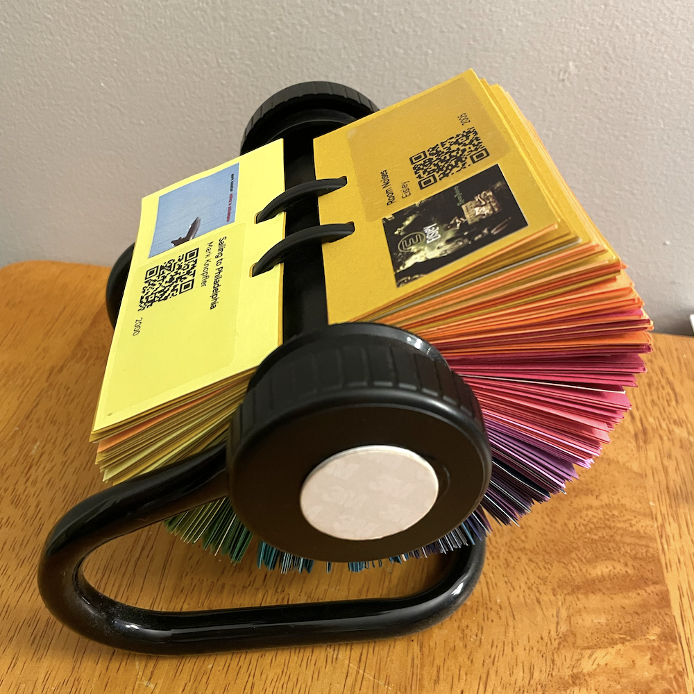
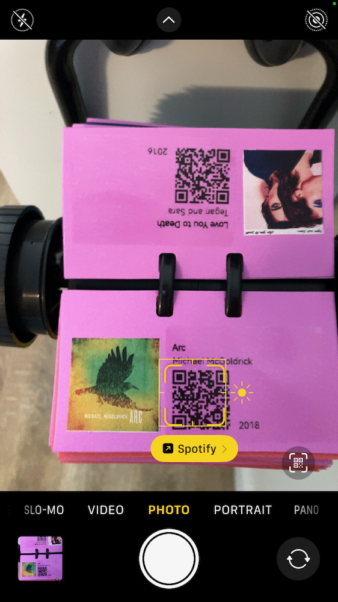
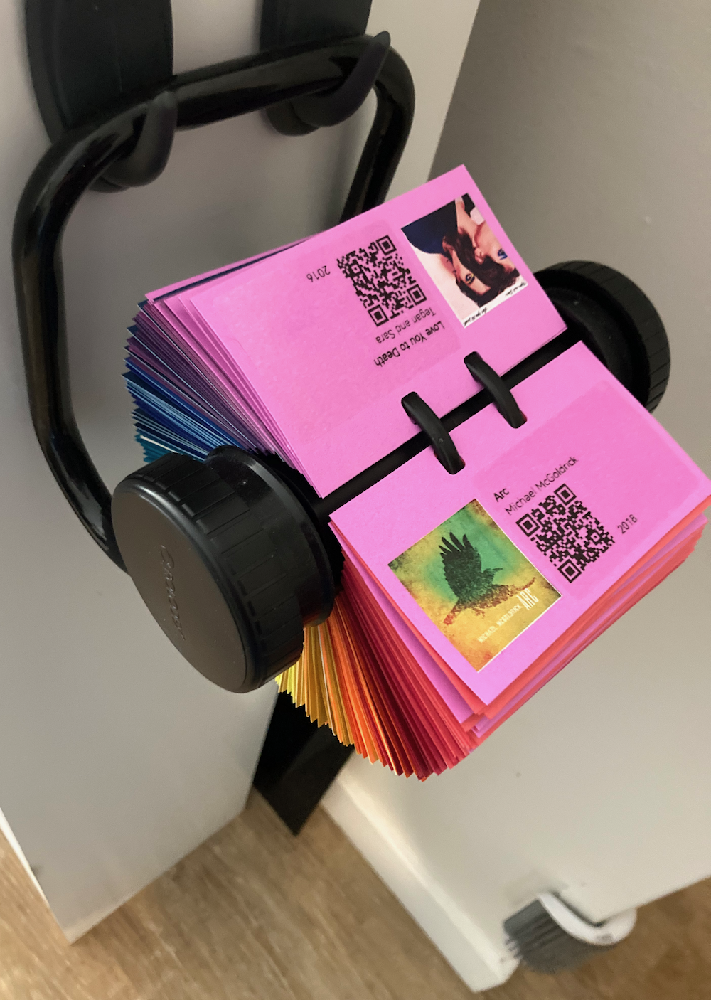
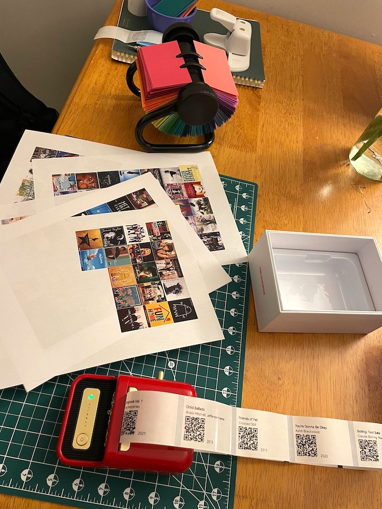
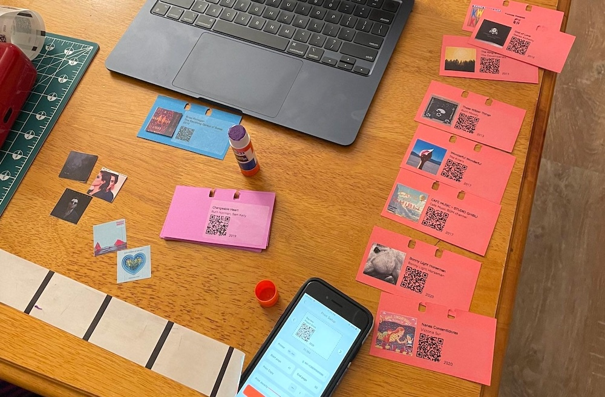
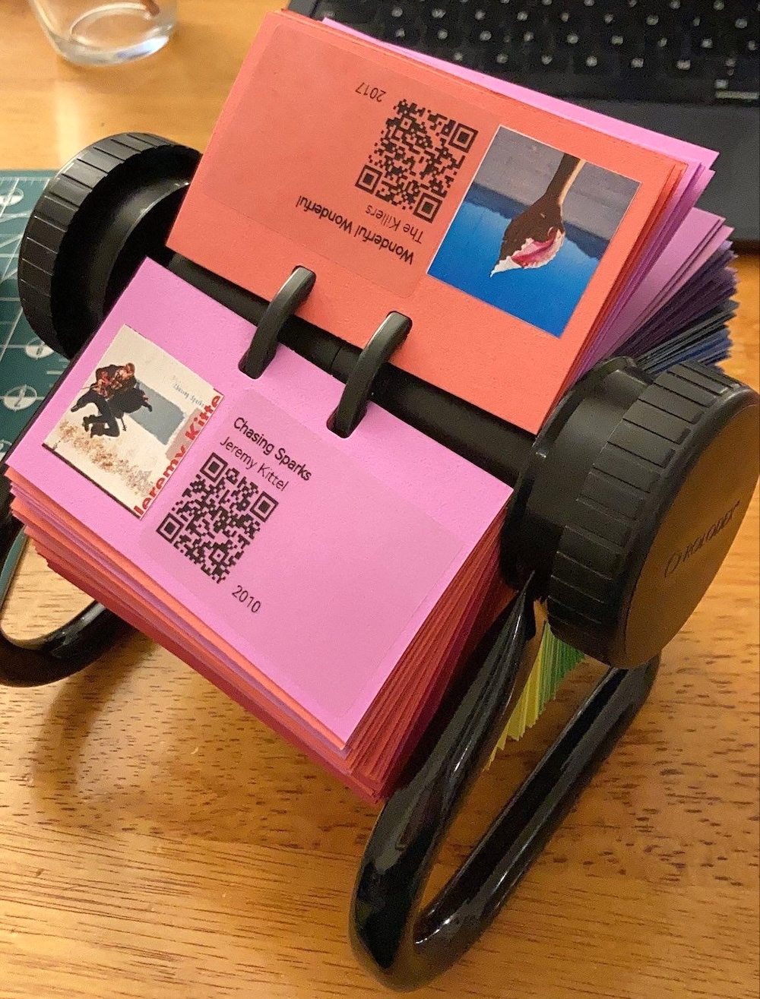
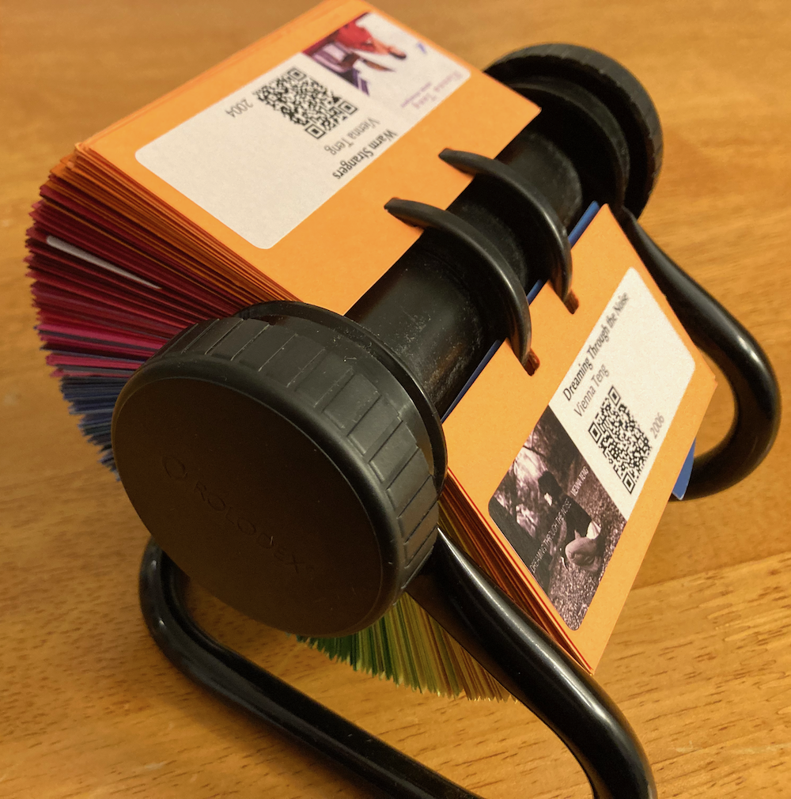
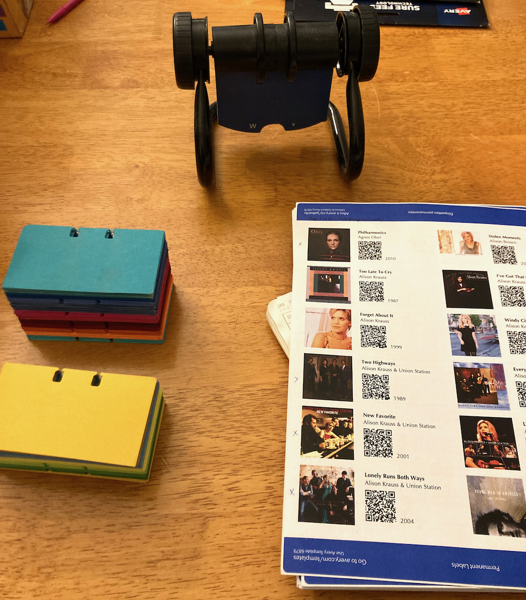
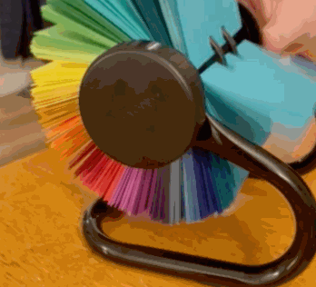

While I listen to a lot of music, my ~~object permanence~~ active recall is weak when it comes to remembering the artists and albums that I love.[^recall] This didn't used to be a problem, as flipping through my CDs or (later) scrolling through my iTunes library would jog my memory.

When I switched over to using music streaming services my listening patterns shifted towards recent releases, and I found myself inadvertently losing track of the broad back catalog of music I loved.

[^recall]: To the point where when asked what kind of music I like, I've panicked and not been able to come with anything at all.

Several years ago I decided that I wanted a physical manifestation of my favorite albums, an analog reminder of myself through reminding me of the music I've loved. A collection for re-discovery, by myself or anyone visiting my home. I didn't want to stop using a streaming service, but I did want to supplement it with a physical link of some sort.[^jukebox]

I couldn't find a suitable solution, so I made one. Enter: the Musidex!

The Musidex is a Rolodex[^rolodex] full of albums. Each page presents a single album's art and basic metadata---album title, artist, release year---along with a QR code that links to playback on a music streaming platform.[^platform]

It has an NFC tag to the side knob; when I tap my phone on the tag, the phone connects and starts broadcasting to my living room speakers. I mounted the Musidex on a pair of hooks next to the speakers.

[^rolodex]: For the uninitiated, a [Rolodex](https://en.wikipedia.org/wiki/Rolodex) is a desktop directory of contacts---addresses and phone numbers---in a characteristic cards-on-axel shape. They used to be very very common in office and home settings; I was surprised to discover that they [still exist as a brand](https://www.rolodex.com/).

[^platform]: The music streaming platform itself is immaterial; the QR codes are simply URLs, so can link to any streaming service. Ideally they'd link to some sort of centralized index, such that the choice of service could be swapped out with the flip of a switch, when it turns out that the service you bought into years ago is not only exploiting its artists but also [funding](https://mixmag.net/read/spotify-ceo-daniel-ek-pledges-600-million-investment-into-ai-defence-company-news) and [shilling for](https://www.sfgate.com/sf-culture/article/no-kings-organizers-spotify-boycott-21127453.php) fascism.

    In the interim, there is no need to limit a Musidex to a single music streaming provider: different pages can link to different services. [Bandcamp](https://acampbellpayne.bandcamp.com/album/flow-control) wherever possible, megacorps when not, perhaps?

[^jukebox]: What I *really* wanted was a jukebox---but none of the jukeboxes on Craigslist were in my budget, but even if they had been, they probably weren't within the space or weight limits of my apartment. I did do a fair amount of research on Jukebox acquisition, though...

Several years in, I continue to appreciate my Musidex: both because I use it on a semi-regular basis, and because I enjoy its colorful presence in my home. 

I've built two Musidexes[^plural] now, and have found them to be relatively cheap, lightweight, and easy to make. The details are as follows.

## Exhibit A: Musidex I 

The first Musidex I built, pictured above, was for myself.

On the software and curation side, I wrote a couple of scripts to parse (1) my ancient iTunes library backup and (2) a streaming service playlist, to which I added tracks from my most recent decade of listening. The scripts took in the specific song, found the album that the song came from, and then dumped the album's metadata into a table with its streaming service URL, along with links to locally downloaded album art.

I then did a bunch of manual deduplication and title/artist cleanup within that spreadsheet, to make sure that all of the text would fit nicely on the Rolodex cards.

On the real-world side, I acquired a Rolodex and removed its pages, cut a bunch of cardstock into the correct page size, used a specialized die to punch the specially-shaped notches into the cards, and arranged them by color.[^key]

I then printed sheets of the album art at a local print shop and printed clear stickers containing the rest of the metadata using a mini thermal printer. 

I cut out the albums by hand and glued one to each page, paired with its metadata sticker.

[^key]: Probably the most important step of the whole project, tbh.

**Details**

- Roughly 300 pages, space for two albums per page (one each front and back)
- Highly curated, with only one album per artist
- Some pages intentionally left blank, to allow future additions
- No album ordering---fully randomized
- A few pages linking to playlists instead of albums, each on a shiny (instead of solid color) page
- Albums printed on regular paper and glued to pages; metadata printed on clear stickers

**Challenges**

- Music curation and selection was rough; narrowing this collection down to one album per artist was *really* rough.
- Matching iTunes albums to albums on my streaming service was rough, and only partially successful, and required using an external service to do the translation.[^service]
- I had to accept that some of the songs I'd listened to obsessively in the past just didn't exist on a streaming service, and without spending the time to set up a local server, I wasn't going to be able to include them here.

[^service]:  In hindsight, it would probably have taken less time to do this manually than it took to find a service, try it, run it for real, quality-check it, and correct it post-hoc---it required a *lot* of correction. I used [Soundiiz](https://soundiiz.com/), which seemed like the best option at the time, and the lack of resounding success was not their fault; it's a tough problem!

## Exhibit B: Musidex II

The second Musidex I built was for my dad.

I thought I'd made choices and learned lessons when making the first one that would make creating a second one trivially easy---after all, I had the scripts to pull in album art and generate QR codes already, and our listening tastes overlap enough that I knew a majority of his library had links to our streaming service. How hard could making the thing really be? 🙃

Only one aspect was actively easier: instead of printing the metadata and album art separately, I printed both together onto white stickers, one per page. This improved both speed of assembly and legibility on darker-colored cards.

**Specification**

- Roughly 300 pages containing 600 albums (one each front and back)
- Highly curated, with multiple albums per artist in a few cases and no pages left blank
- At the recipient's request, albums roughly sorted into five genres
- Metadata and album art printed together on a single white sticker

**Challenges**

- It turned out that the iTunes script I'd made for pulling in my library didn't work with my dad's exported iTunes library, thanks to a differing XML version; I had to clean it up instead of using it verbatim.
- Figuring out a usable genre grouping was tricky and angst-ridden, lol.
- Even with years of listening history by which to sort the albums---thanks, iTunes "play count"!---the task still required a *lot* of manual curation, including some back and forth with my sister and parents to figure out which albums should take precedence.

## Future directions

There's a lot of room for creative solutions to the "tangible curation of digital items" problem. While there are some commercial systems out there already, nothing I've found has been particularly useful as an augmentation to my existing listening workflow.[^space]

The Musidex's approach to tangible computing---a collection of links to to a collection of digital artifacts, presented physically---is easily adaptable.[^term]

[^term]: If you want a fun [tangible computing](https://en.wikipedia.org/wiki/Tangible_user_interface) rabbit hole to fall into, check out Spencer Chang's ["computing-infused ceramic explorations"](https://news.spencer.place/p/touching-computers)!

In the abstract, any collection of URLs (QR code or NFC or written) will do, in any form factor you find pleasing: a deck of cards! A mobile! A collection of fridge magnets! A poster for your wall! Some decoupaged dominos![^dunno] Assorted objects in an antique [curio cabinet or card catalog](https://en.wikipedia.org/wiki/Library_catalog)![^march]

Sticking with the Rolodex base, collections that could lend themselves well to the Musidex treatment:

- Mediadex: Movies/videos/tv shows, with links to their streaming service;
- Bookdex: Books, with links to their accompanying audiobook, or to your review of them, or with no link at all
- Ornitholodex: a collection of birds, with links to their birdcall or recently tracked migration patterns
- T-Rexdex: ...no idea, but it sounds cool!
- Chromadex: what you get before you add the albums to a Musidex:

[^dunno]: I dunno, man. I just work here.
[^march]: At a formative age I read Lousia May Alcott's *Little Men: Life at Plumfield with Jo's Boys*, and I will forever yearn for Dan's cabinet of collected naturalist curiosities.

[^space]: For example, there's the NFC card-based [Yoto](https://us.yotoplay.com/) system designed for kids. While Yoto has been an amazing way for me to interact with my nephews, through sending them "mixtape" cards(!), it wasn't a good solution for my own collection: audio is hosted in their proprietary database, and linking to the database requires  purchasing their proprietary NFC cards, both of which are non-starters.

    There are some open-source Yoto alternatives, which similarly use NFC cards to trigger playback; at some point, I purchased myself the parts to build a [TonUINO](https://github.com/tonuino/TonUINO-TNG?tab=readme-ov-file). I haven't assembled it yet, but when I do it still won't quite fill the same niche as the Musidex. Still cool, though!

[^plural]: `index:indices::Musidex:Musidices`? `ex:exes::Musidex:Musidexes`? ¯\\\_(ツ)\_/¯

***Thanks to AF for being the assistant producer of my first Musidex, by listening to my errant brainstorming and then seeking out and gifting the requisite components: Rolodex-shaped hole punch, Rolodex, and mini sticker printer. <3 ***

<!-- ***The code to collect album data, generate QR codes, and format stickers is at [github.com/hannahilea/musidex](https://github.com/hannahilea/musidex).*** -->
