I recently acquired and assembled a pen plotter!

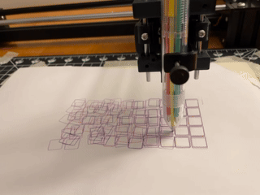

It's an [LY Drawbot](https://www.aliexpress.us/item/2251832781162574.html), size A4, controlled by an Arduino. More generically, it is a type of computer numerical control [(CNC)](https://en.wikipedia.org/wiki/Numerical_control) machine that uses a [Cartesian coordinate system](https://en.wikipedia.org/wiki/Cartesian_coordinate_robot):

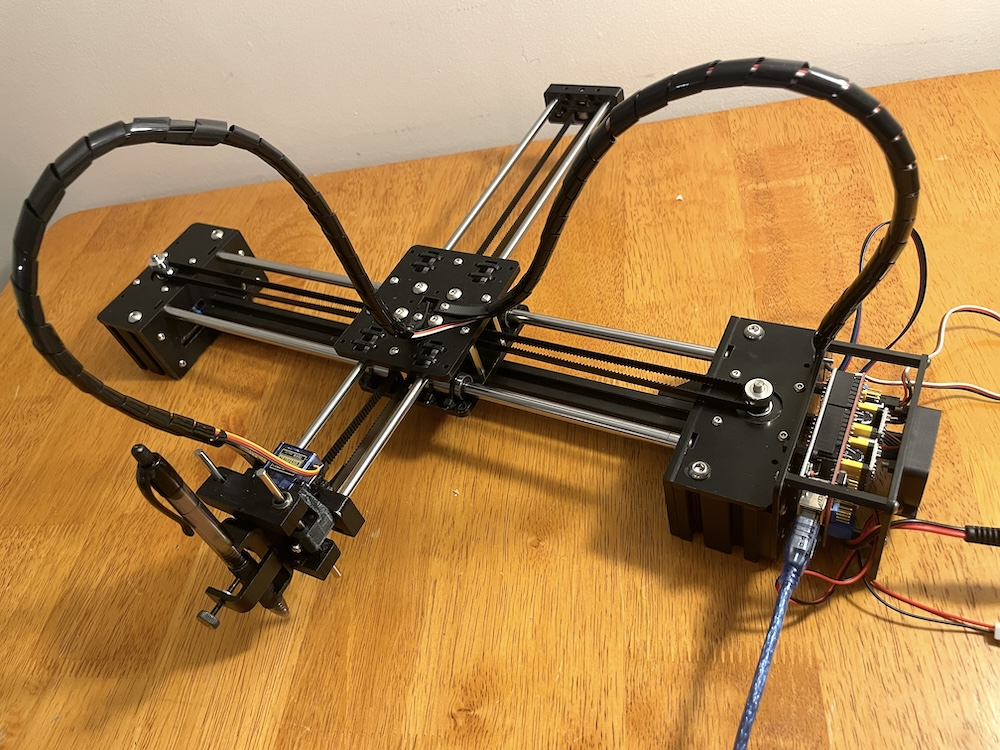

[G-Code](https://en.wikipedia.org/wiki/G-code) commands are used to move the plotter pen to specified coordinates at specified speeds, as well as control the pen's height, which determines whether the pen makes a mark as it is moved around.[^saying]

[^saying]: This may go without saying, but is a key source of hilarity/frustration while plotting---it is quite easy to draw lines that you do not want, and alternatively to move the pen around while leaving NO lines when you do want them!

In this post I describe how I got my LY Drawbot assembled and running, as well as provide some observations and next steps for exploration. Thanks to some excellent pre-existing documentation the build itself isn't particularly long or involved.

## What type of plotter, and why?

Many of the plotters on the market are kind of pricey and take up a Certain Amount of Space, so fit neither my workspace nor my budget.[^diy] The cheapest one I could find was this LY Drawbot, from AliExpress, which was in-budget but felt risky in terms of quality or assembly effort.

Luckily, I then found Pierre Paslier's 2020 write-up ["LY Drawbot, a $70 pen plotter"](https://www.generativehut.com/post/ly-drawbot-a-70-pen-plotter). Pierre vouched for this model being "a good fit if you're a maker on a budget and you're not afraid of troubleshooting." Excellent! That is, in fact, me.

[^diy]: There are a bunch of instructions for cool DIY plotters out there, too, but my current interest is in playing with plotting rather than learning how to source/build a plotter, so those were out.

I put in my order---$122 including shipping---and eight days later it arrived in the mail.[^carrot]

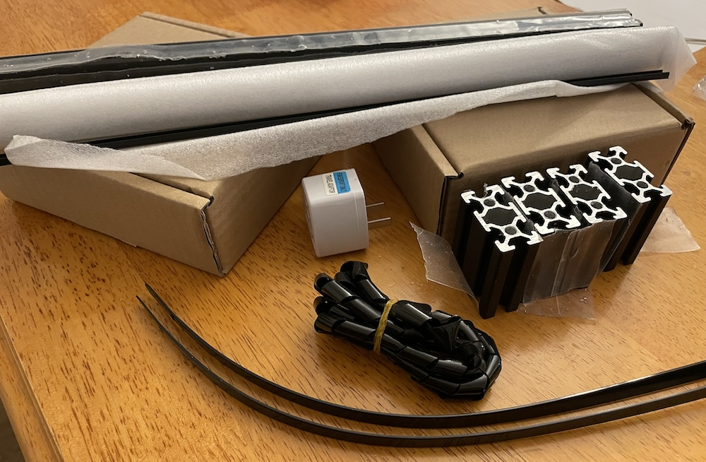

[^carrot]: When I ordered it, I was told it would take three months to arrive, which was perfect: it would be a carrot dangling at the end of some less creative work that I needed to do at the beginning of the year. And then it arrived super early! I thought about waiting until March to set it up anyway...and then didn't. It has been a rough few months. I needed a little treat.

## Hardware assembly

This part was super fun, and relatively easy. I'm not going to detail the assembly much---if you're assembling your own, do as I did and follow [Pierre's write-up](https://www.generativehut.com/post/ly-drawbot-a-70-pen-plotter)!

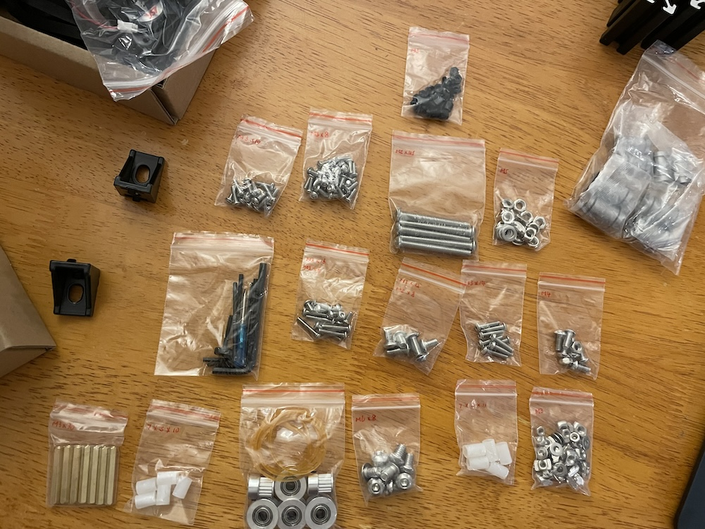

The seller provided supporting documentation, which turned out to be identical to the instructions that Pierre linked. The assembly documentation is comprehensive and well-illustrated: with the exception of one page, the text was basically extraneous. It felt like nothing so much as assembling a Lego kit.

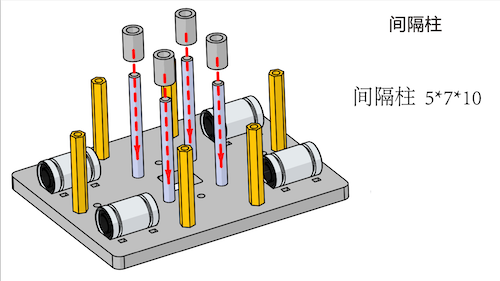

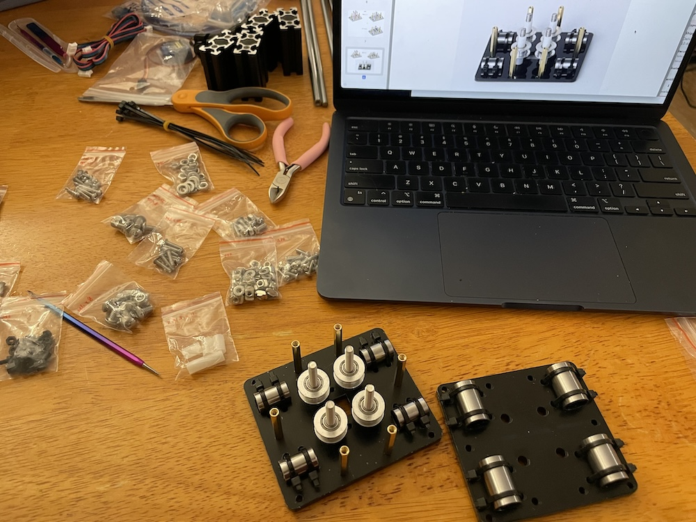

I used Google's image translate to decipher the lone line of text that wasn't clear from context:

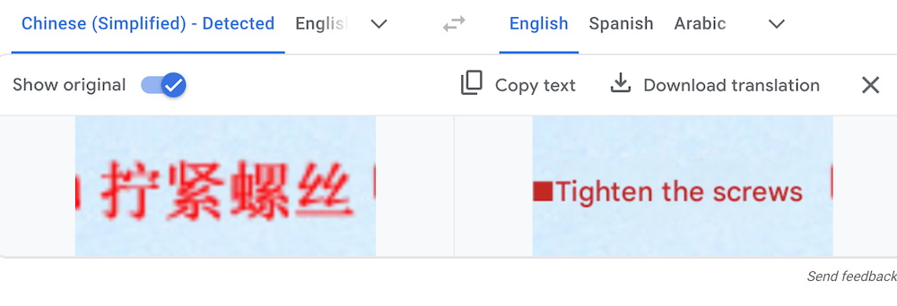

Easy! Done.

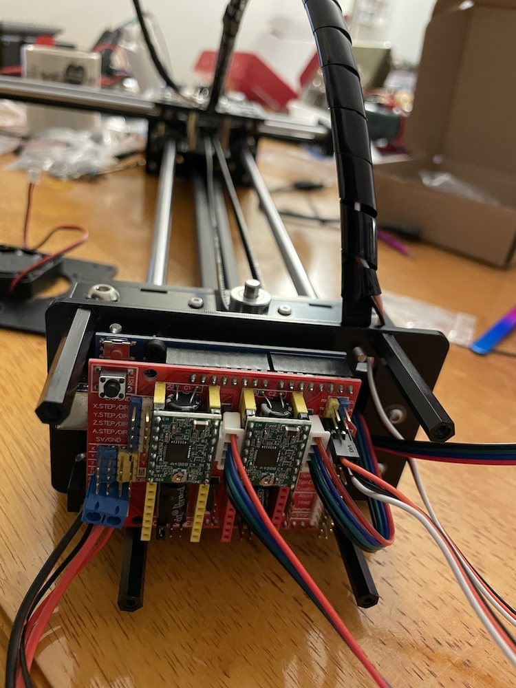

The fully assembled plotter forms an XY gantry, with an Arduino at the end of the fixed axis and a pen holder at the end of the moving axis.

It feels solid and heavy; some of the pieces are metal, some plastic, but none of it feels cheap or otherwise hacky. The notched belt responsible for the gantry's movement is fastened with tiny zip ties, which I was originally skeptical about but have worked out great so far.

A few of the 3D-printed components didn't exactly match those in the book, but it was fairly easy to figure out which way to orient them; I only had to disassemble and re-assemble one section after making an incorrect guess. Here's a photo of that section *in situ*, in case you run into a similar issue with your own build:

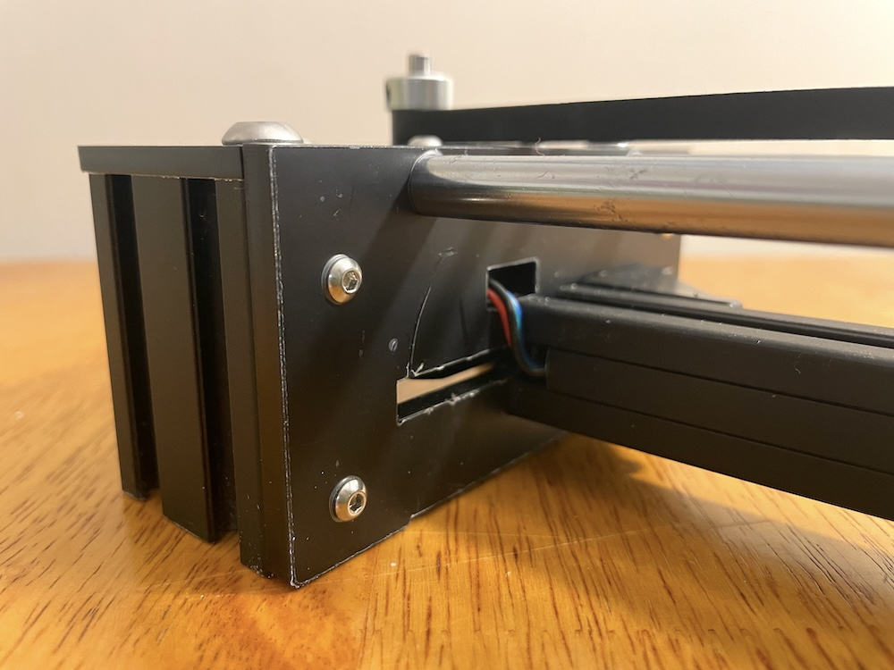

Overall the assembly went very smoothly, and was quite relaxing. I accomplished it over two evenings, moving at a slow-and-steady pace. I could have completed it faster if I'd wanted to, and someone experienced with assembling these types of materials could probably get it done in an hour or two.

### Post-hoc hardware adjustments:

- I ended up needing to go back and tighten the notched belt, to smooth out fast pen strokes; if assembling your own plotter, make sure the belt is as tight as possible from the start.

- The 3D-printed pen holder component didn't move smoothly up and down on its rails; there was just enough friction that the gravity-based "pen down" action didn't move properly. Alex took a basic drill bit to that particular hole and hey presto, now that movement is smooth!

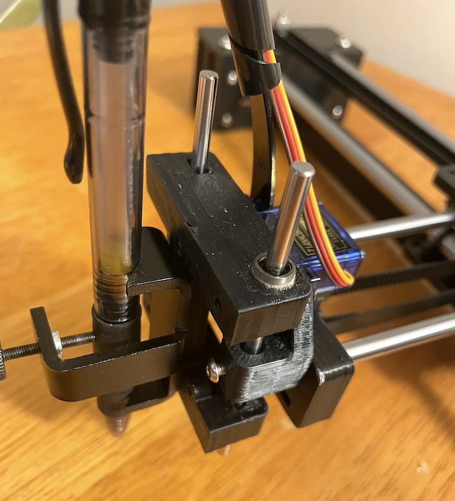

## Software setup

Once assembled, I plugged the power cord into the wall and the serial USB cable into my laptop, and...now what? The Arduino lights were on, the fan was spinning (inaudibly!), but I had no idea what to do next.

I checked the seller's documentation---a big zip of documents and software that were mostly in Chinese, and which referenced images of desktop software that I didn't really want or want to install. So I skipped that, and worked from Pierre's notes once more.

Specifically, I:

1. Installed the CH340 drivers on my laptop (OSX), following the Sparkfun instructions [here](https://learn.sparkfun.com/tutorials/how-to-install-ch340-drivers/). My laptop immediately and automatically restarted upon their installation, which was distressing.

    Now that I'm rereading those instructions, it seems the drivers were actually pre-installed on my current machine, so my [re-]install was extraneous! Whoops.

2. Verified driver functionality by powering the plotter on and plugging it into my laptop, and then running `ls /dev/cu*` in the terminal. I saw `/dev/cu.usbserial-110` in the output, which confirmed that my laptop recognized the that the plotter was connected.

2. Installed [Universal Gcode Sender (UGS)](https://winder.github.io/ugs_website/download/)

## It's alive!

It was trivially easy to connect to the plotter via the UGS interface:

After connecting, the first thing I did was use the Jog Controller's X and Y commands to to move the plotter arm around in individual steps. Notably, moving the pen holder up and down requires typing `M5` and `M3 S1000` (respectively) into the UGS console; the Jog Controller's Z button has no effect on the plotter.[^understanding]

[^understanding]: In my limited understanding, this is because the Z-axis control is relevant for CNC tools that have a Z-dimension (routers, milling machines, 3D printers, etc) and a no-op for a 2D tool like an XY plotter.

Fixing a pen in the pen holder was easy enough; it took some fiddling to adjust to an optimal height for any given pen, but wasn't hard, just a little annoying. I was expecting the type of pen to matter a lot more than it did, but most pens I had lying around worked. Ditto the type of paper---I taped a small stack of printer paper to the table with masking tape (to keep it from moving around) and found that to be sufficient.

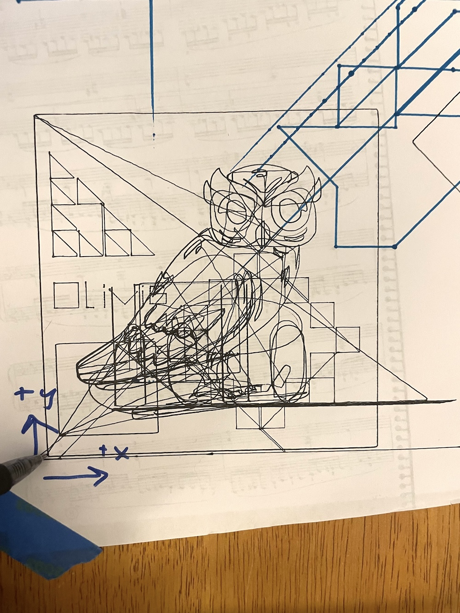

## Plotting SVGs

Plotting individual images via UGS was similarly straightforward---and extra fun, due to [Olivia](https://olivia.website)'s collaborative assistance. We used [an online tool to convert an SVG to G-Code](https://sameer.github.io/svg2gcode/), then uploaded and plotted the G-code from UGS:

<iframe width="560" height="315" src="https://www.youtube-nocookie.com/embed/p04iNzCBkdQ" title="YouTube video player" frameborder="0" allow="accelerometer; autoplay; clipboard-write; encrypted-media; gyroscope; picture-in-picture; web-share" referrerpolicy="strict-origin-when-cross-origin" allowfullscreen></iframe>

## Multicolor plotting

Before moving on to my list of "level up" tasks, I wanted to draw one intentional multicolor piece. I really like [Georg Nees' "Schotter"](https://collections.vam.ac.uk/item/O221321/schotter-print-nees-georg/), so used Antoine Beyelers' [parametric "Schotter" implementation](https://whisk.rs/) to generate a set of six slightly-varying SVG images, using a different random seed for each image.

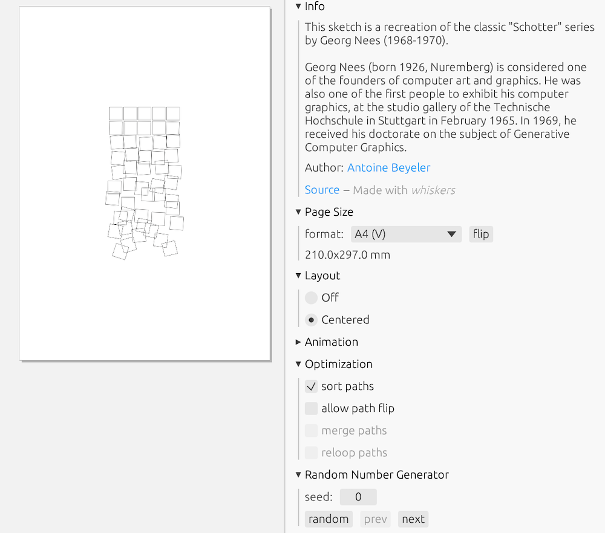

I [rotated](https://products.aspose.app/words/rotate/svg#)[^lol] and [converted](https://sameer.github.io/svg2gcode/) each SVG to G-code, and then plotted each one sequentially with UGS, with the same starting coordinates each time. I stopped between each file to switch the pen's color. To keep from having to swap out pens and adjust their relative heights each time, I used a pen that contains multiple color cartridges.

[^lol]: ...I needed the orientation to be correct on the plotter. This absolutely seems like something I could do with a single G-code command, and I feel a little silly admitting to having rotated it using yet another program! But I don't know G-code well enough yet, so this was an easy short-term fix.

<iframe width="560" height="315" src="https://www.youtube-nocookie.com/embed/Uzpar5x9Vp8" title="YouTube video player" frameborder="0" allow="accelerometer; autoplay; clipboard-write; encrypted-media; gyroscope; picture-in-picture; web-share" referrerpolicy="strict-origin-when-cross-origin" allowfullscreen></iframe>

The result would have been cleaner if I hadn't accidentally hit the wrong commands in UGS a couple of times(!), resulting in drawing an errant incorrect line and needing to re-set the pen's home coordinates manually. Ah well! I'm reasonably happy with the quality of the resultant piece given the minimal effort involved in tuning it to be cleaner:

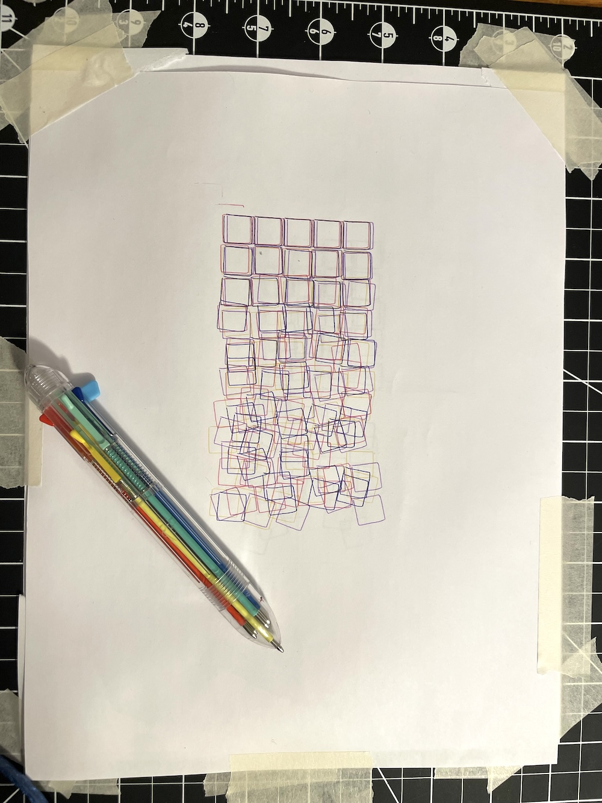

## Plotter observations

In no particular order:

- The plotter is really fun, both in manual ("jog") mode and "plot this SVG" mode!

- Even (especially?) when trying something that doesn't work, it's fun!

- Other people also think it's really fun!

- The pen line can be a little wiggly, especially when traveling at fast speeds. Tightening the belt helped a bit.

- The plotter makes a cute little sound when it runs! There are two motors, and their pitch depends on the draw speed of each direction, so if you're drawing a horizontal, vertical, or 45degree line, the machine plays a single pitch. But if you draw a curve?!?!?!?!!?!?! Suddenly there are *two different notes* playing---not to mention their overtones! Delightful.[^caveat]

[^caveat]: Not everyone thinks so: at least one onlooker has declared it unmanageably annoying, and noted that if the plotter were in HER house, she'd need earplugs. Ah well, Mom, we can't all have good taste. :)

- I can already tell that pen registration---i.e., alignment---will be annoying when switching among different pens. 

- Pens that have a top-click mechanism, rather than a cap, are easier to work with, especially as you don't have to worry about them drying out.

- While the plotter bed is A4 sized, the actual "width" required to plot is twice that of the y-axis arm, as the arm has to be fully extended to reach one edge of the paper and fully retracted to reach the other. This is fine, just something worth keeping in mind if you (like me) are working with limited physical space.

- The plotter feels solid enough that I'm comfortable picking it up and moving it to another room when it isn't in use. 

- I need to figure out some better approach to medium-term storage, as it isn't quite solid enough to just shove in a closet.

- It would be nice if there were somewhere I could set the plotter up and just...leave it to do its thing. Since that is not the case, it will continue to take up half the dining room table when in use.

## Next steps

Here are some basic things I'd like to do next, in relative order of importance:

- Set up UGS's hotkeys for the manual "jog" functions, so that I can use fun controllers to draw in a stepwise fashion (e.g., [this slide whistle that acts as a bluetooth mouse](../slide-whistle-trombone-champ-controller), etc).

- Send serial commands to plotter from the commandline, rather than via the UGS application (batched, e.g., "plot this file that I've generated externally").

- Send serial commands to the plotter interactively from the commandline, on a realtime one-command-at-a-time basis.

- Send serial commands to plotter from the browser, so that I can plot p5.js code directly. I have done a bit of reading so am medium confident this is doable!

- Adapt my realtime sound visualization from plotting HPGL commands for HP plotters ([HPGL.jl](https://github.com/hannahilea/HPGL.jl)) to plotting G-Code on this plotter!

- Figure out how to send commands to the plotter wirelessly, so that I don't have to be sitting next to it with a serial cable connection in order to plot stuff. (Current thinking: Raspberry pi running some sort of server? And/or some type of wifi-to-serial shield that the internet says exists and I have not yet vetted as appropriate for this project? Recommendations welcome!)

- Quantify the noises made by the plotter at different X/Y motor speeds, so as to play music with the plotter. :D

I have a whole list of slightly-less-basic projects I want to try, also, but am going to keep those closer to the vest for now.[^vest] Stay tuned!

[^vest]: In person I can't shut up about these, so really I'm only feigning secrecy here so that I don't have to write any more words today!

If you are a person who knows me irl (or via RC!) and you want to pair on any of these with me, reach out and let me know which one(s)---so far this has been an exceedingly fun project to collaborate on.

***Thanks to Alex for the pen holder fix and general enthusiasm; Olivia for her SVGsploration companionship; and Pierre Paslier for the excellent [write-up](https://www.generativehut.com/post/ly-drawbot-a-70-pen-plotter) that sold me on this plotter in the first place.***
