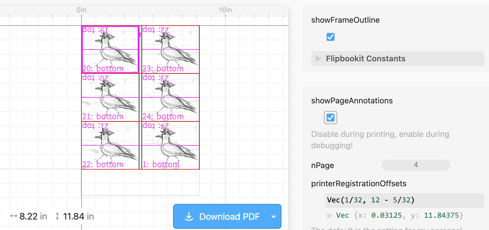
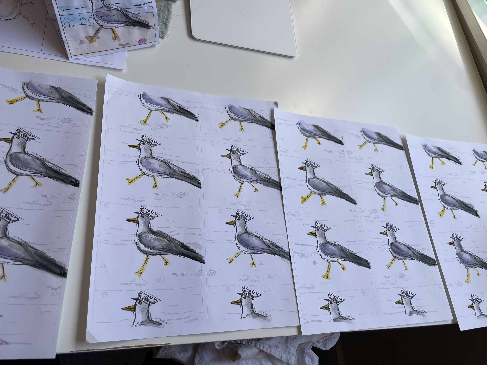
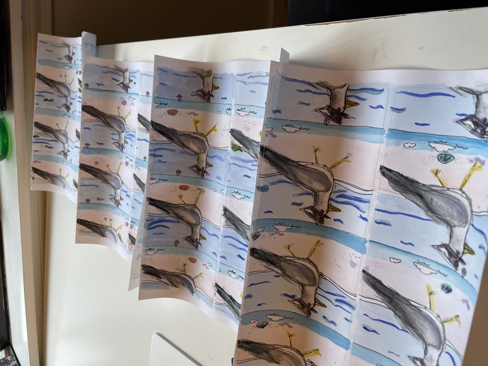
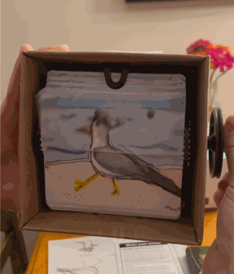

***

It is no secret that I like mechanical displays.[^blogslink] While scheming to realize my [split-flap display](https://en.wikipedia.org/wiki/Split-flap_display) dreams, I encountered [Fliposcope](https://www.fliposcope.com/about). 

Fliposcope is a mechanical flipbook kit produced by artists [Marvel & Rosen](https://www.mechanicalflipbook.com/#about-mechanical). Their kits contain a cardboard box display, a plastic axel-with-crank, a set of blank split-flap cards, and a set of blank stickers sized to fit the split-flap cards. Each kit results in a 40-frame physical animation. Folks have used these kits to make some really awesome, creative art:

<blockquote class="instagram-media" data-instgrm-permalink="https://www.instagram.com/p/CSsFHetlGv_/?utm_source=ig_embed&amp;utm_campaign=loading" data-instgrm-version="14" style=" background:#FFF; border:0; border-radius:3px; box-shadow:0 0 1px 0 rgba(0,0,0,0.5),0 1px 10px 0 rgba(0,0,0,0.15); margin: 1px; max-width:540px; min-width:326px; padding:0; width:99.375%; width:-webkit-calc(100% - 2px); width:calc(100% - 2px);">
 <a href="https://www.instagram.com/p/CSsFHetlGv_/?utm_source=ig_embed&amp;utm_campaign=loading" style=" background:#FFFFFF; line-height:0; padding:0 0; text-align:center; text-decoration:none; width:100%;" target="_blank"> 
 

 
 

 

 
<svg width="50px" height="50px" viewBox="0 0 60 60" version="1.1" xmlns="https://www.w3.org/2000/svg" xmlns:xlink="https://www.w3.org/1999/xlink"><g stroke="none" stroke-width="1" fill="none" fill-rule="evenodd"><g transform="translate(-511.000000, -20.000000)" fill="#000000"><g><path d="M556.869,30.41 C554.814,30.41 553.148,32.076 553.148,34.131 C553.148,36.186 554.814,37.852 556.869,37.852 C558.924,37.852 560.59,36.186 560.59,34.131 C560.59,32.076 558.924,30.41 556.869,30.41 M541,60.657 C535.114,60.657 530.342,55.887 530.342,50 C530.342,44.114 535.114,39.342 541,39.342 C546.887,39.342 551.658,44.114 551.658,50 C551.658,55.887 546.887,60.657 541,60.657 M541,33.886 C532.1,33.886 524.886,41.1 524.886,50 C524.886,58.899 532.1,66.113 541,66.113 C549.9,66.113 557.115,58.899 557.115,50 C557.115,41.1 549.9,33.886 541,33.886 M565.378,62.101 C565.244,65.022 564.756,66.606 564.346,67.663 C563.803,69.06 563.154,70.057 562.106,71.106 C561.058,72.155 560.06,72.803 558.662,73.347 C557.607,73.757 556.021,74.244 553.102,74.378 C549.944,74.521 548.997,74.552 541,74.552 C533.003,74.552 532.056,74.521 528.898,74.378 C525.979,74.244 524.393,73.757 523.338,73.347 C521.94,72.803 520.942,72.155 519.894,71.106 C518.846,70.057 518.197,69.06 517.654,67.663 C517.244,66.606 516.755,65.022 516.623,62.101 C516.479,58.943 516.448,57.996 516.448,50 C516.448,42.003 516.479,41.056 516.623,37.899 C516.755,34.978 517.244,33.391 517.654,32.338 C518.197,30.938 518.846,29.942 519.894,28.894 C520.942,27.846 521.94,27.196 523.338,26.654 C524.393,26.244 525.979,25.756 528.898,25.623 C532.057,25.479 533.004,25.448 541,25.448 C548.997,25.448 549.943,25.479 553.102,25.623 C556.021,25.756 557.607,26.244 558.662,26.654 C560.06,27.196 561.058,27.846 562.106,28.894 C563.154,29.942 563.803,30.938 564.346,32.338 C564.756,33.391 565.244,34.978 565.378,37.899 C565.522,41.056 565.552,42.003 565.552,50 C565.552,57.996 565.522,58.943 565.378,62.101 M570.82,37.631 C570.674,34.438 570.167,32.258 569.425,30.349 C568.659,28.377 567.633,26.702 565.965,25.035 C564.297,23.368 562.623,22.342 560.652,21.575 C558.743,20.834 556.562,20.326 553.369,20.18 C550.169,20.033 549.148,20 541,20 C532.853,20 531.831,20.033 528.631,20.18 C525.438,20.326 523.257,20.834 521.349,21.575 C519.376,22.342 517.703,23.368 516.035,25.035 C514.368,26.702 513.342,28.377 512.574,30.349 C511.834,32.258 511.326,34.438 511.181,37.631 C511.035,40.831 511,41.851 511,50 C511,58.147 511.035,59.17 511.181,62.369 C511.326,65.562 511.834,67.743 512.574,69.651 C513.342,71.625 514.368,73.296 516.035,74.965 C517.703,76.634 519.376,77.658 521.349,78.425 C523.257,79.167 525.438,79.673 528.631,79.82 C531.831,79.965 532.853,80.001 541,80.001 C549.148,80.001 550.169,79.965 553.369,79.82 C556.562,79.673 558.743,79.167 560.652,78.425 C562.623,77.658 564.297,76.634 565.965,74.965 C567.633,73.296 568.659,71.625 569.425,69.651 C570.167,67.743 570.674,65.562 570.82,62.369 C570.966,59.17 571,58.147 571,50 C571,41.851 570.966,40.831 570.82,37.631"></path></g></g></g></svg>

 
View this post on Instagram

 

 

 

 

 

 

 

 

 

 
 

 

</a>
<a href="https://www.instagram.com/p/CSsFHetlGv_/?utm_source=ig_embed&amp;utm_campaign=loading" style=" color:#c9c8cd; font-family:Arial,sans-serif; font-size:14px; font-style:normal; font-weight:normal; line-height:17px; text-decoration:none;" target="_blank">A post shared by Flip•o•scope (@flipbookit)</a>

</blockquote>

[^blogslink]: As discussed in [this post](../clapping-music-for-flip-disc-displays/) and [this post](../clapping-music-2/)! 

For my birthday my parents gifted me one of these kits, and I've been sitting on it for awhile, ~~paralyzed by indecision and perfectionism~~ waiting for inspiration to strike. And here we are!

## Parallaxxing in Cuttle

I wanted my flipbook to use drawings I'd made myself, but I also did not want to hand-draw 40 frames of an incrementally shifting scene. Parallax (and programming) to the rescue! 

> *Parallax: the apparent displacement or the difference in apparent direction of an object as seen from two different points not on a straight line with the object.*   [[Merriam-Webster](https://www.merriam-webster.com/dictionary/parallax)]

Basically, relative motion between different objects or scenes provides information about how far away their respective contents are from one another and the viewer. If you look out the window of a train, the foreground view changes rapidly---trees whip by!---while the background view changes slowly: those mountains in the distance don't change much at all for long periods of time. 

Parallax is a broadly applicable phenomenon,[^broad] and is commonly exploited in animation: moving background and foreground content at different speeds to add depth to a scene. Once you start recognizing it, you'll see it everywhere: in cartoons and video games and real life, when staring out the window of a moving vehicle. 

[^broad]: If you haven't encountered the term parallax before, it's worth [reading more](https://en.wikipedia.org/wiki/Parallax) about its applications. One of my favorites is astronomer [Henrietta Swan Leavitt](https://en.wikipedia.org/wiki/Henrietta_Swan_Leavitt) using stellar parallax in the early 1900s to calibrate her discoveries for measuring large (very large!) distances across the universe.

For my own use of parallax in animation, I used [Cuttle](https://cuttle.xyz/) a web-based parametric CAD software that I love and have written about [previously](../cuttle-obsession/). Here is my initial proof-of-concept prototype:[^template1]

[^template1]: This prototype template is [here](https://cuttle.xyz/@hannahilea/Prototype-Parallax-animation-M6sxlTXsZYTz); play with it!

In the polished Cuttle implementation, I sketched out and uploaded a couple of background layers (the background ocean, the foreground shore) and a main character (the seagull). 

Just rotating the gull back and forth didn't give the gull the movement I wanted, so I ended up giving it independently-moving legs: I cropped the legs from the original sketch, and then added them in as their own objects and gave those objects a rotation of a few degrees for every frame increment.

This is what the final animation looked like in Cuttle:

## Digital frames to physical frames 

To convert a frame (a single still shot) of the digital animation into a frame of the physical Fliposcope, it must be printed onto the accompanying stickers, and then stuck onto the kit's split-flap cards.
A single animation frame is split horizontally across two stickers (the top half and bottom half of the image). Furthermore, an single sticker contains the the top and bottom frames from two *consecutive* frames, rather than the same frame, as each sticker is folded around a single split-flap card. 

While Fliposcope provides a conversion tool for formatting a short video (or set of frames) to be printed onto the kit's sticker-sheets, I figured I was already far enough down the Cuttle path that I might as well do that piece myself. I set up a Cuttle object that formatted my frames ~~correctly~~[^foreshadowing] for the sticker paper.

[^foreshadowing]: Foreshadowing! (The photo is actually the correct template, I forgot to take a photo of the incorrect one.)

I then printed the frames onto the stickers,[^trivializing] put on some good music, and painted them with watercolor paints.

[^trivializing]: I'm sparing you the saga where I went back and forth and back and forth with my printer to convince it to print the correct margins AND print the full page. Lots of holding a printed proof sheet up and sticker sheet stack up to the light to check whether the margins were correct.... 

## Running with the Gull~~s~~

After the paint had dried, I put the stickers on the flaps, put the flaps in the Fliposcope spool, and hey presto! A running gull!

Womp womp---my gull was running  backwards. 😭

## Running with the Gull~~s~~, forwards edition

I ~~sulked a bit,~~ fixed up my Cuttle template, reviewed that fix several times, reprinted all the stickers, re*painted* all the stickers, 

re-stuck all the stickers, and hey presto! A running gull!

Huzzah!

## Conclusion

Overall, the challenging pieces of this project were:

1. Staying motivated to repaint 40 frames of running gull, after I realized I'd botched the first round, and
2. Configuring print settings for printing accurately to the sticker paper from my not-that-great secondhand printer.

Additionally, the relatively low-resolution 40-frame setup of the Fliposcope meant that my parallax animation was less obvious than I would have preferred, as a full loop of each layer had to fit into 40 frames. If I make another, I'll probably simplify the background layer and remove any significant objects from it (i.e., not include the sailboat or cloud clusters). If you make your own---and I encourage you to do so!---keep this in mind when you design your own layers. 

Would it have been faster to just draw everything by hand from the start? Perhaps! But that is besides the point.

***Want to make your own Fliposcope following this approach? My Cuttle template and instructions are [here](https://cuttle.xyz/@hannahilea/Fliposcope-parallax-animation-gk5ac9Em7rwa). Thanks to the Fliposcope team for developing the kit, and  to my parents for gifting it to me!***
