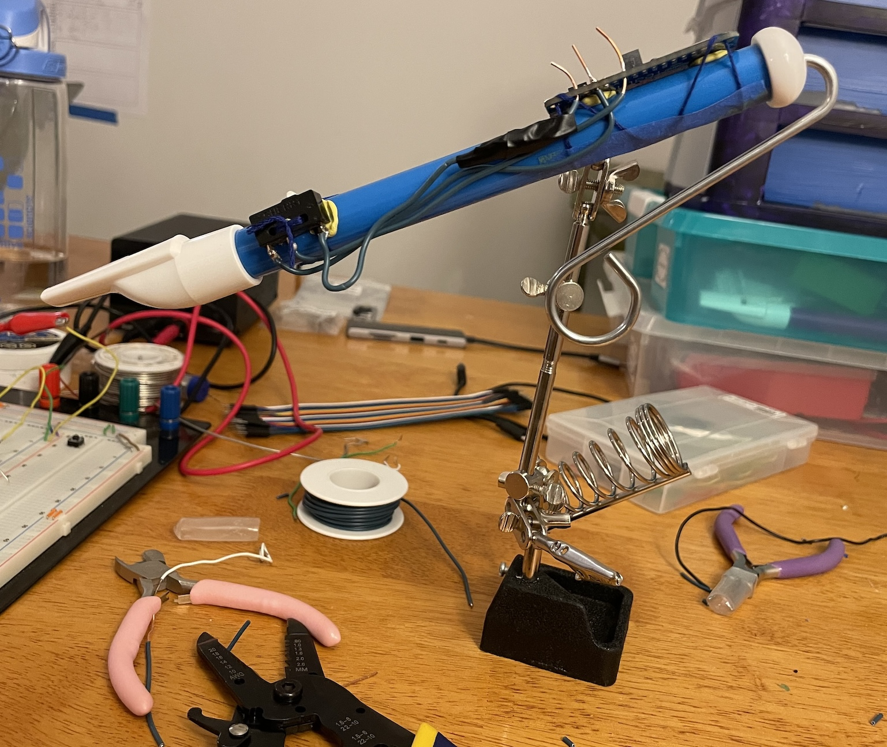
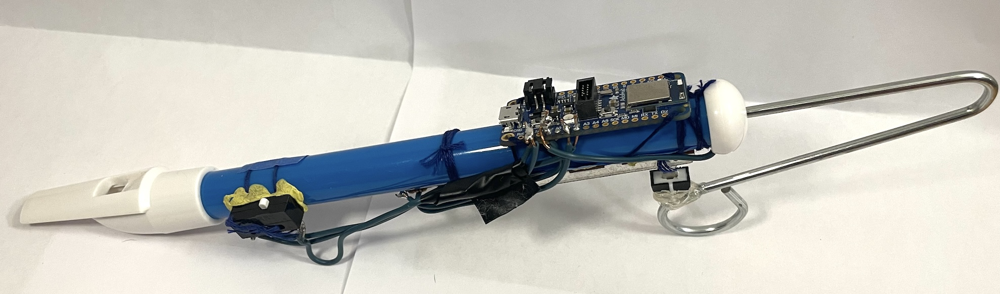

My initial response to the 2022 video game [Trombone Champ](https://www.trombonechamp.com/) was a simple HELL. YES. 

<div class="centered-children">
<iframe width="560" height="315" src="https://www.youtube-nocookie.com/embed/9o-3brNQOns?si=kh8EYeq9a8eiRQqs" title="YouTube video player" frameborder="0" allow="accelerometer; autoplay; clipboard-write; encrypted-media; gyroscope; picture-in-picture; web-share" referrerpolicy="strict-origin-when-cross-origin" allowfullscreen></iframe>
</div>

Upon playing it myself, I found that my joy in the game was blunted by the disconnect of controlling the trombone via computer trackpad. I yearned for the physical slidyness experienced by a true trombone god![^disclaimer] How, I wondered, could I easily and cheaply manifest a physical slide with which to control the game? 

Enter: the humble slide whistle.

[^disclaimer]: For the record, I am a flute/sax player, not a brass player, so this is purely speculation on my part.

<div class="centered-children">
<iframe width="560" height="315" src="https://www.youtube-nocookie.com/embed/NvyAqL3H4Js?si=_tKPi0gS_A6HDVtr" title="YouTube video player" frameborder="0" allow="accelerometer; autoplay; clipboard-write; encrypted-media; gyroscope; picture-in-picture; web-share" referrerpolicy="strict-origin-when-cross-origin" allowfullscreen></iframe>
</div>

Co-created with Alex Ferguson, this latest submission to the DIY Trombone Champ controller pantheon is wireless, (relatively) easy to replicate, and indisputably slidey.


[^bystanders]: Bystanders, roommates, and pets may disagree.

*NB: This is one of those projects that I started, didn't touch for a year, and then recently picked up to finish. In that time, Trombone Champ released a Nintendo Switch variant and a virtual reality variant, both of which provide more movement-based control options than those available when I started. I've also seen [3D printed controllers](https://www.reddit.com/r/trombonechamp/comments/xq54hn/trombone_champ_hero_i_made_a_trombone_controller/) as well as some [made from real trombones](https://www.youtube.com/watch?v=uzNMawGSed8). Excellent! The more Trombone Champ, the merrier.[^bystanders]*

### General approach

The original PC variant of Trombone Champ is controlled by basic mouse/trackpad inputs. We designed our slide whistle controller to act as a Bluetooth mouse: since the game already knows how to handle mouse inputs, packaging our controller's outputs as mouse commands meant we could control the game without doing any other sort of sensor-output-to-game-input translation. 

Trombone Champ has just two input parameters:

1. **Slide position**, a continuous value set used to set the output pitch of the played note.

    This is controlled by the y-dimension of cursor movement (i.e., up/down but not side-to-side), as input by either a mouse or trackpad.

2. **Sound production activated**, a binary (true/false) value that simulates a player blowing air through the trombone to make ~~noise~~ music. 

    This is triggered by holding down either a mouse button or any key on the keyboard. (If triggered for too long, the in-game player runs out of air, which is QUITE embarrassing.)

We therefore needed two sensors on our slide whistle: something to capture the slide position, which would be translated to a mouse y-direction movement command, and something to capture trigger sound production, to send a "mouse button is currently pushed" command.

We gave ourselves two additional requirements:

1. Must be relatively cheap and easy to build, and therefore relatively cheap and easy for anyone else to replicate; and
2. Must not be gross when shared amongst multiple players, i.e., should not involve players actually putting their mouths on the instrument.[^brass]

[^brass]: Have you *seen* brass players clear the spit from their instruments?! It's gross, yo.

### Components

To meet our requirements, we selected the following components:

- **Controller body**: a cheap [slide whistle](https://www.amazon.com/Syhood-Whistle-Instrument-Whistles-Birthday/dp/B0CDLGXSZS),
- **Microcontroller**: an [Adafruit Feather Express](https://www.adafruit.com/product/4062), powered by a basic external USB power brick,
- **Slide position sensor**: a [linear slide potentiometer](https://www.adafruit.com/product/4219), its knob coupled to the whistle slide with hot glue, and
- **Sound production trigger**: a basic momentary button.

The choice of button for the sound production trigger is...fine. What I'd *really* wanted is for this parameter to be breath-controlled, so I considered putting a cheap microphone on/in the whistle mouthpiece. Requirement 2 presented a reality check, however: as a musician, I know how gross it is to swap instruments around a group of people, and how annoying it is to have to clean a mouthpiece with rubbing alcohol before passing it along to someone else to play. I couldn't envision a sanitary way of setting up a microphone on this whistle in a way that would be playable without encouraging players to put their mouths directly on/around the mouthpiece of the whistle. There are of course other ways to sense breath, but I couldn't devise something cheap, easy, and minimally complicated, so as a starting point we settled for a basic button for now. I don't love it, but it is perfectly serviceable. I think something breath-based would be nicer, and I think this button is the weakest part of the controller, spiritually. :) 

### Assembly

We first hooked up the components in a breadboard, to test the overall circuitry. It worked!

<div class="centered-children">
<iframe width="560" height="315" src="https://www.youtube-nocookie.com/embed/YGRgp6Z2gFY?si=B6oVh24c1DM2jR_2" title="YouTube video player" frameborder="0" allow="accelerometer; autoplay; clipboard-write; encrypted-media; gyroscope; picture-in-picture; web-share" referrerpolicy="strict-origin-when-cross-origin" allowfullscreen></iframe>
</div>

Once we'd confirmed our circuit functionality, we attached the Feather and components to the whistle with a sophisticated combination of embroidery thread[^banks] and Blu Tack---to keep the flat backs of the components stable on the round body of the whistle. We then did the requisite soldering, and topped the whole shebang off with some strategically placed electrical tape. Classy!

[^banks]: [To quote Mr. Banks](https://www.youtube.com/watch?v=BA-g8YYPKVo), "with tuppence for paper and strings..."



Finally, we coupled the slide potentiometer's knob to the slide of the whistle with hot glue. 



Perhaps we'll make a cleaned-up version in the future! Or perhaps not.[^feelings] 

[^feelings]: Disclaimer on her behalf: Alex wanted to make it a much more professional, beautifully wired version of this controller, but I convinced her that this was a quasi-hacky prototype so string and electrical tape and visibly disorganized wires were totally fine. I take full responsibility for its current lack of polish!

Our circuit is slightly fancier than it needed to be, as the resistors we added in series with the button and slide potentiometer inadvertently duplicated pull-up resistors built into the Feather, which can be enabled in code (`button.pull = Pull.UP`). I didn't realize that until after we'd soldered in our external resistors, however. Ah well, no harm, no foul!

## Programming 

I used [this Adafruit tutorial](https://learn.adafruit.com/ble-hid-keyboard-buttons-with-circuitpython/ble-keyboard-buttons) as a starting point for sending sensor inputs as human interface device (HID) mouse commands over Bluetooth. CircuitPython libraries for both HID and Bluetooth made this setup fairly straightforward.

The run loop looks something like this pseudocode:
```
# Setup 
slide_potentiometer = connect_to_analog_pin(1)
button = connect_to_digital_pin(2)
hid = setup_mouse_controller()

def map_voltage_to_screen_min_max(v): 
    ...

# Run loop 
while True:
    y_previous = 0
    button_is_pressed = False
    
    ...wait to connect to bluetooth...

    while bluetooth_connected():
        # Handle slide behavior
        slide_voltage = slide_potentiometer.get_voltage()
        y_now = map_voltage_to_screen_min_max(slide_voltage)

        # The library expects a *relative* mouse movement, 
        # not an absolute one
        hid.send_mouse_y_update(y_previous - y_now)
        y_previous = y_now

        # Handle click behavior 
        button_state = button.get_value()
        if button_state != button_is_pressed:
            if button_state:
                hid.send_mouse_left_button_down()
            else:
                hid.send_mouse_left_button_up()
            button_is_pressed = button_state

```

The full script is [here](https://github.com/hannahilea/slide-whistle-trombone-champ-controller/blob/main/code.py). There's some extra functionality in the actual implementation to temporarily disable sending mouse commands from the controller, but otherwise this pseudocode is basically it.

With this code, once the Feather is powered, it automatically broadcasts itself as an available Bluetooth peripheral and is ready for pairing. Once connected, moving the slide whistle's slide back and forth causes the mouse to travel up and down the screen vertically. Clicking the button does a left click wherever the cursor happens to be located.

To play Trombone Champ, all we need to do is to open the game as usual. Of course, you don't need to have Trombone Champ open for the controller to function---e.g., you can also use it to scroll through a website:

<div class="centered-children">
<iframe width="560" height="315" src="https://www.youtube-nocookie.com/embed/BGke6a0LoaE?si=KIGE497RJ9ZR3Wn1" title="YouTube video player" frameborder="0" allow="accelerometer; autoplay; clipboard-write; encrypted-media; gyroscope; picture-in-picture; web-share" referrerpolicy="strict-origin-when-cross-origin" allowfullscreen></iframe>
</div>

The trickiest part of the software implementation was something I didn't end up needing to write at all. Because of how we'd initially prototyped on the breadboard, our connection between the Feather's input pins and sensors was tenuous at best, which lead to a significant voltage jump in the potentiometer whenever the button was pressed. We didn't successfully track down this issue at the breadboard stage, so I thought I was going to have to account it in code, and spent a fair amount of time thinking about how I might do that (definitely doable, just an annoying exercise in bookkeeping!). Then as soon as we soldered everything together we discovered that the jump was gone, and determined that it had been the Feather-to-breadboard connection that had been tenuous. Huzzah!

## Bring on the doots! 

First, a little warm up:

<div class="centered-children">
<iframe width="560" height="315" src="https://www.youtube-nocookie.com/embed/6XEAdTrbz-Y?si=tGdmMPXLZWzWpgj_" title="YouTube video player" frameborder="0" allow="accelerometer; autoplay; clipboard-write; encrypted-media; gyroscope; picture-in-picture; web-share" referrerpolicy="strict-origin-when-cross-origin" allowfullscreen></iframe>
</div>

And now let's really get into it! 

<div class="centered-children">
<iframe width="560" height="315" src="https://www.youtube-nocookie.com/embed/WTBGyS3Lx18?si=ORa5NRcX_1GndPz7" title="YouTube video player" frameborder="0" allow="accelerometer; autoplay; clipboard-write; encrypted-media; gyroscope; picture-in-picture; web-share" referrerpolicy="strict-origin-when-cross-origin" allowfullscreen></iframe></div>

In our defense, these videos were recorded without having practiced much with the controller. I will keep the name of the player here confidential, to protect their ~~pride~~ identity.[^alex]

[^alex]: It's Alex! But to be fair, I am significantly worse at this point, so we're lucky she was willing to be recorded and it didn't have to be me. 

## Discussion

This was a relatively straightforward project, all things considered---I chalk that up to the relatively small scope of the task and the existence of Adafruit's tutorials.[^adafruit] I initially thought it was going to require a much bigger lift, but once I realized that I could "just" treat the controller as a mouse input, everything fell nicely into place.

I find the slide whistle controller significantly more fun to play, and more fun to watch others play, than the default mouse controls. Additionally, you can get up and move around as the music ("music"?) moves you!

Even with this controller, though, it's still tricky to play the game well. As compared to a real trombone, the slide whistle has a significantly smaller range of motion, AND there are more discrete slide positions required (one per chromatic note!) as compared to the real deal. That said, it's no harder to play than the default mouse or trackpad! Of our several playtesters, our resident trumpet player (Alex) improved much more quickly than either our flute-playing friend or I did.

An additional side benefit of this project is that now we've built *this* Bluetooth HID that uses CircuitPython to handle external sensors, I've been able to pattern-match onto building other similar projects, and basically handle the electronics and hardware pieces on those by myself. (For this project, Alex handled basically all of the electronics parts.) I'm learning! :D It feels good. 

Future work, if we decide to spend more time on this project:

- Making a slightly more nicely-packaged version of the whistle + electronics
- Adding an "auto-tune" mode that snaps the slide movements to discrete pitches, which would make it easier to play intelligible tunes with less practice (but might be less fun...?)
- Diagnosing and fixing the slight lag that shows up occasionally, which I suspect is related to the controller being connected over Bluetooth
- Building a MIDI mode that sends out MIDI commands instead of mouse movements---which has been inadvertently assumed/requested by other folks throwing out their own cool "what if you did ___" follow-up ideas---so that the controller could be used for MIDI input (MIDI slide whistle anyone?).

Do you have follow-up ideas? Do you know me IRL and want to play some doots of your own? Let me know!

[^adafruit]: I have spent *so* much time browsing [Adafruit tutorials](https://learn.adafruit.com/) this year. Truly one of the sites I'm most grateful for.


***The code for this controller---including set-up instructions---is available [on GitHub](https://github.com/hannahilea/slide-whistle-trombone-champ-controller). Thanks to MC and SS for playtesting, WT for putting up with us playtesting(!), and [Holy Wow Studios](https://www.holywowstudios.com/) for creating this ~~cursed~~ delightful game in the first place.***
