Here's the project write-up for a little cathedral speaker I made as a gift earlier this year.

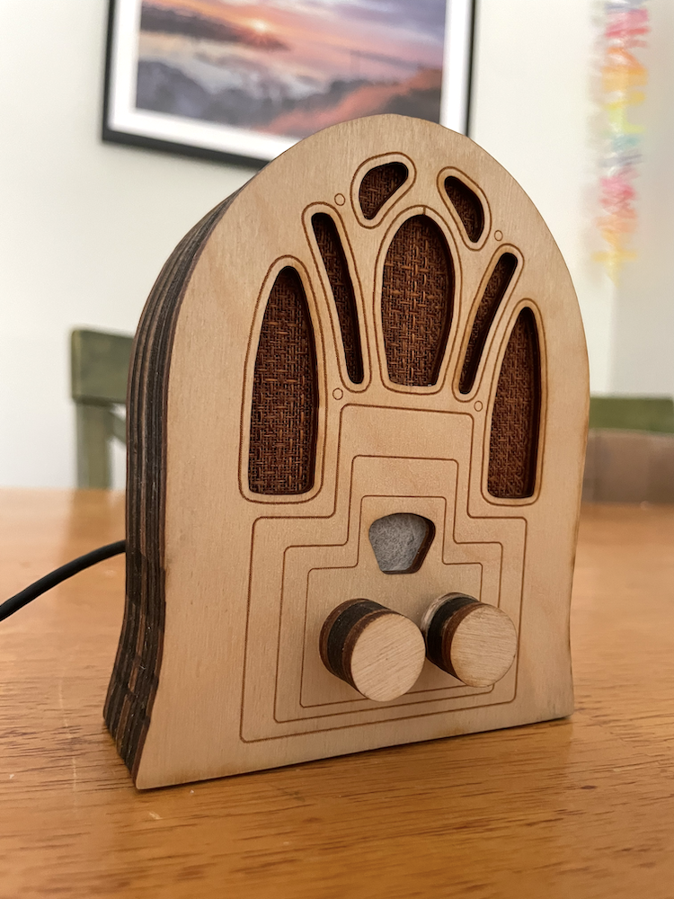

## What?

A Bluetooth speaker in a housing modeled off a vintage Cathedral radio, with one knob for adjusting volume and another for adjusting "vintage-ness"---the amount of static and filtering applied to the audio. The higher the vintage-ness, the lower the audio fidelity![^lowfi]

<iframe
    width="560"
    height="315"
    src="https://www.youtube-nocookie.com/embed/gHEasEw0UuM?si=k6FnfDwnL68wLQaH"
    title="YouTube video player"
    frameborder="0"
    allow="accelerometer; autoplay; clipboard-write; encrypted-media; gyroscope; picture-in-picture; web-share"
    referrerpolicy="strict-origin-when-cross-origin"
    allowfullscreen
></iframe>

## Why?

My partner frequently listens to baseball game radio broadcasts, instead of watching televised games. Given the [long history of radio and baseball broadcasts](https://en.wikipedia.org/wiki/Major_League_Baseball_on_the_radio) I thought it would be fun to add a vintage flavor to her experience by building a "vintage" Bluetooth speaker for listening to [hometown games](https://en.wikipedia.org/wiki/Detroit_Tigers_Radio_Network) in low-fi style.

Of course, you can use it to listen to anything---not just baseball games.

<iframe
    width="560"
    height="315"
    src="https://www.youtube-nocookie.com/embed/_Ndm688T7C4?si=YewtOO7Fwc5zZMye"
    title="YouTube video player"
    frameborder="0"
    allow="accelerometer; autoplay; clipboard-write; encrypted-media; gyroscope; picture-in-picture; web-share"
    referrerpolicy="strict-origin-when-cross-origin"
    allowfullscreen
></iframe>

Ironically, you're going to have to take my word for the "vintage" mode sounding super static-y---I can't convince some combination of my phone plus YouTube to respect my original audio and not filter out at least some of the static. 🙃 [^noise]

[^noise]: Noise is in the ear of the belistener...

[^lowfi]: In the interest of full disclosure, this is not the first audio ✨dehancement✨ project I've worked on. During my time as a DSP engineer at iZotope, one of the projects my team shipped was the 15 year re-release of their original [Vinyl plugin](https://www.izotope.com/products/vinyl), which adds a record player effect to input audio.

    The current iteration of Vinyl (which you can get for free [here!](https://www.izotope.com/products/vinyl)) has a modern UI, but back when my team worked on it it still had its original look and feel, complete with Easter egg credits:

    

    <iframe
        width="560"
        height="315"
        src="https://www.youtube-nocookie.com/embed/H20ZymYGQWU?si=eHg0wJLAM6MXOWvP"
        title="YouTube video player"
        frameborder="0"
        allow="accelerometer; autoplay; clipboard-write; encrypted-media; gyroscope; picture-in-picture; web-share"
        referrerpolicy="strict-origin-when-cross-origin"
        allowfullscreen
    ></iframe>
    

## How?

#### Hardware

I used [this Adafruit tutorial by the Ruiz Brothers and Liz Clark](https://learn.adafruit.com/bluetooth-speaker) as a starting point for the component selection and software approach.[^well] As in that tutorial, my build uses an [Adafruit ESP32 Feather](https://www.adafruit.com/product/5400)  microcontroller, with a couple of rotary potentiometers and a speaker.

[^well]: Well, it was more like "I used that tutorial as an ending point," after attempting various other more complicated set-ups first...

Here it is all wired up and connected to the front-plate:

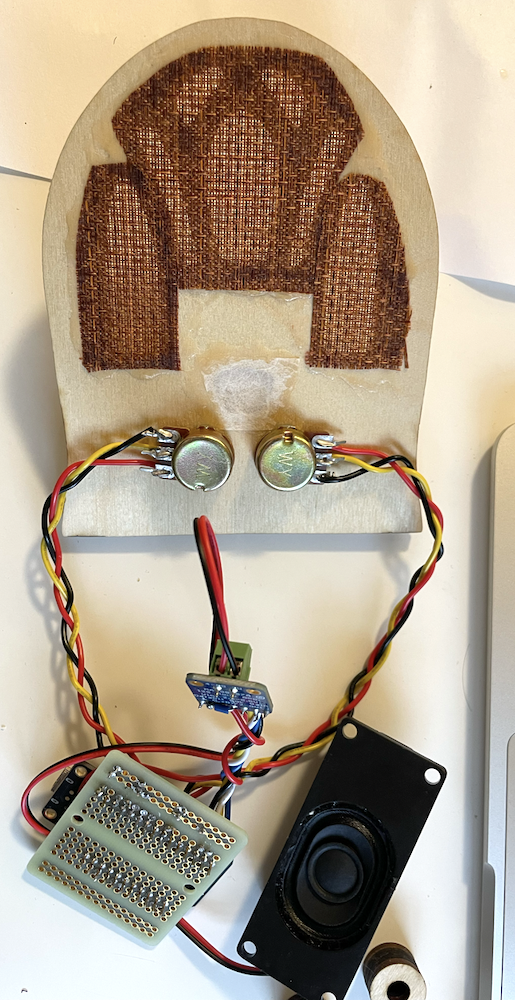

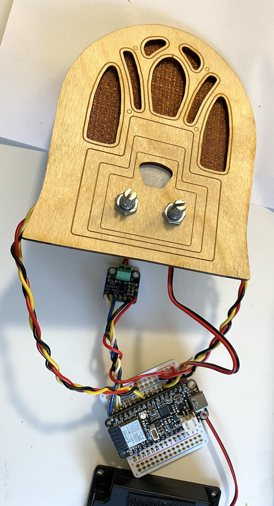

#### Enclosure

I modeled the speaker's wooden housing on a [Crosley 179 "Dual Four" Cathedral radio from 1934](https://radioattic.com/item.htm?radio=0960197): in parametric CAD program [cuttle.xyz](https://cuttle.xyz) I traced the main outline and cutouts from a photo of the Crosley, then rearranged the knob positions and added simplified decoration to the faceplate.

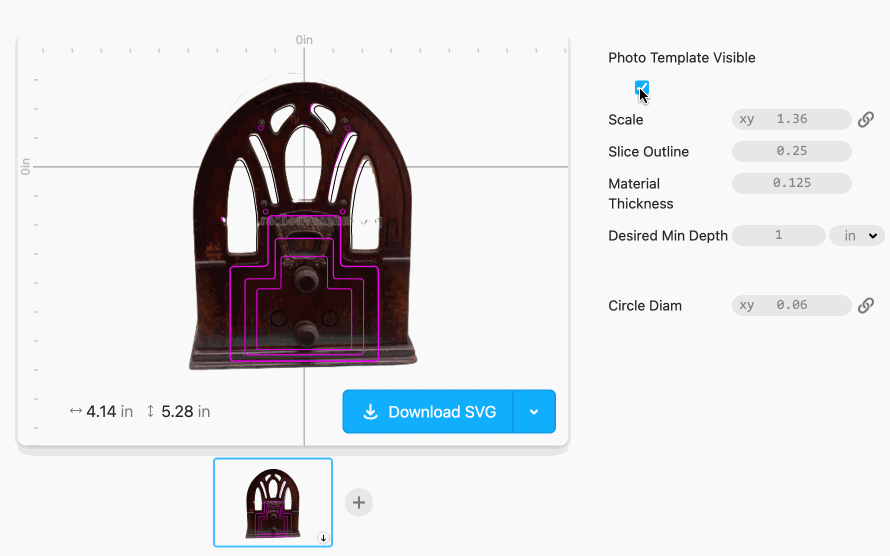

I scaled it to just big enough to fit the electronics.

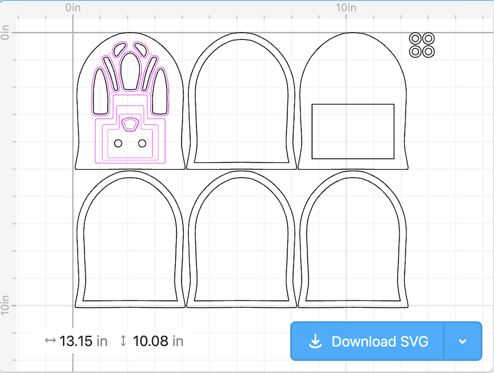

My Cuttle design is [here](https://cuttle.xyz/@hannahilea/Bluetooth-cathedral-speaker-Bmqlp4mlXIro), if you want to cut your own.

I cut the pieces from 1/8" plywood using the laser cutter at my public library's maker space.[^thanks] I finished the wood with a basic stain.

[^thanks]: Thanks, staff at the Cambridge Public Library's [Hive](https://www.cambridgema.gov/departments/cambridgepubliclibrary/locations/mainlibrary/thehive)! Thanks, taxpayers of the greater Camberville area!

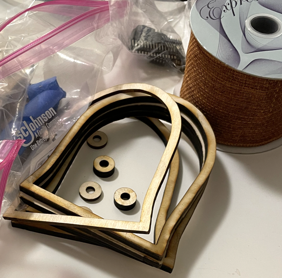

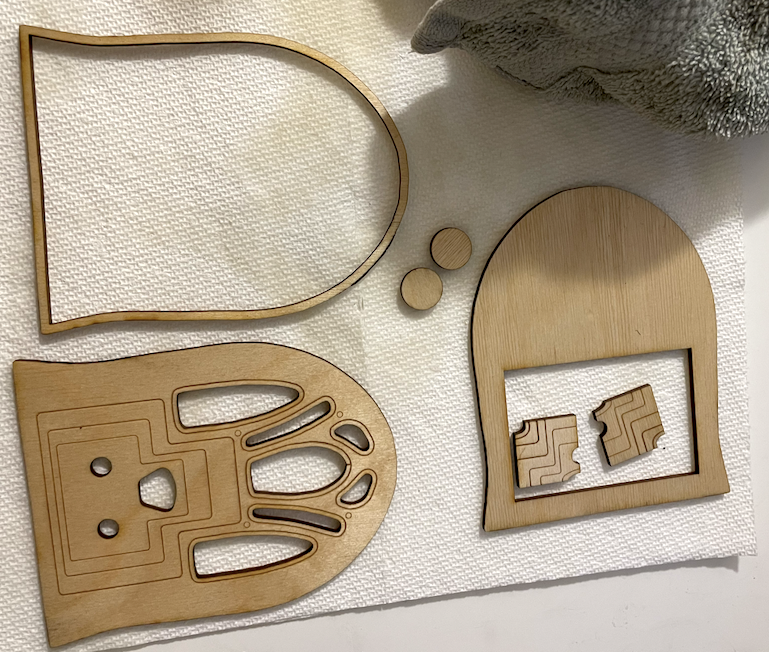

The speaker fabric was roughly four inches of a perfect ribbon I found at my local [second-hand art supply](https://makeandmendshop.com/) store. Seriously, they could not have had a more perfect option. I glued it on, along with a small piece of mulberry paper over the dial hole.

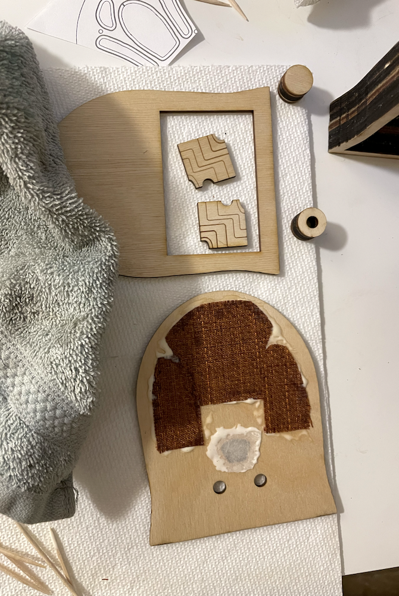

A small piece of velcro helped hold the speaker component in place:

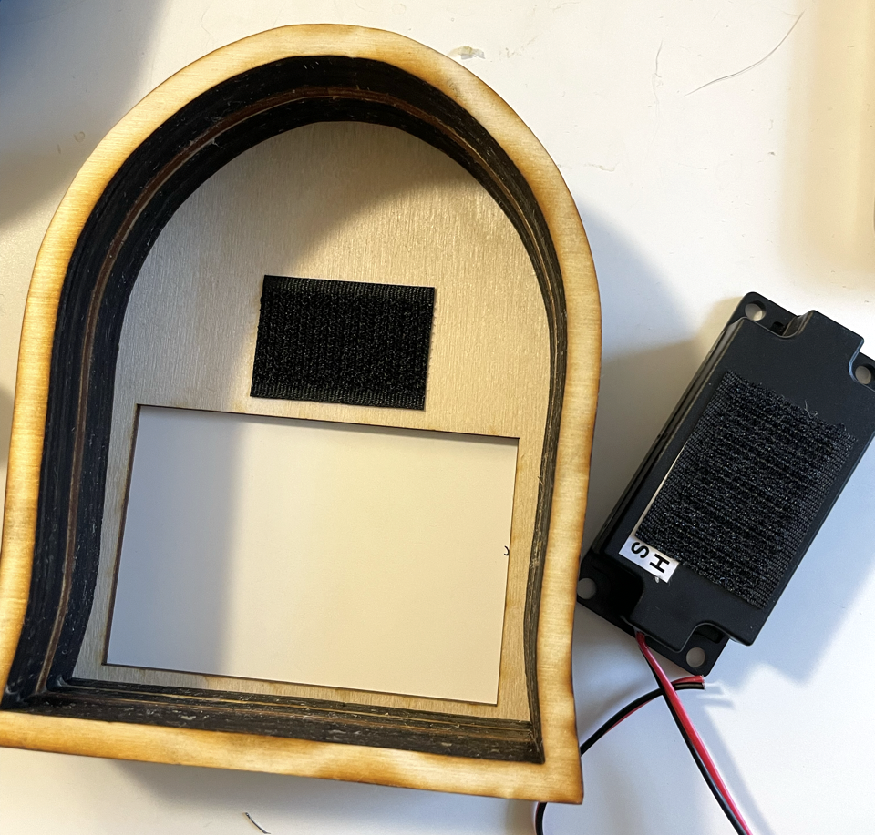

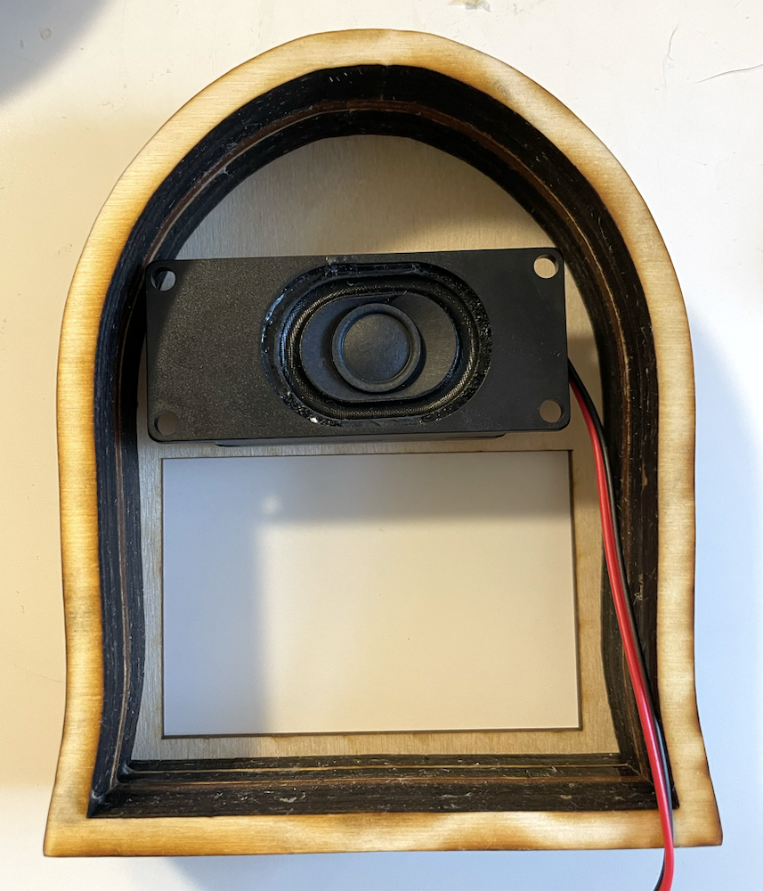

Once I confirmed everything fit together, I glued the wood layers together. The wood knobs were glued directly onto their respective potentiometers.

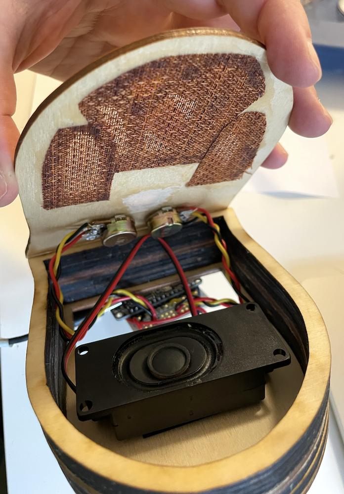

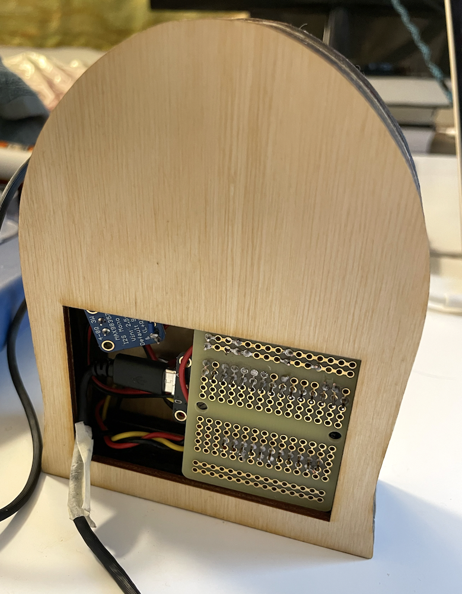

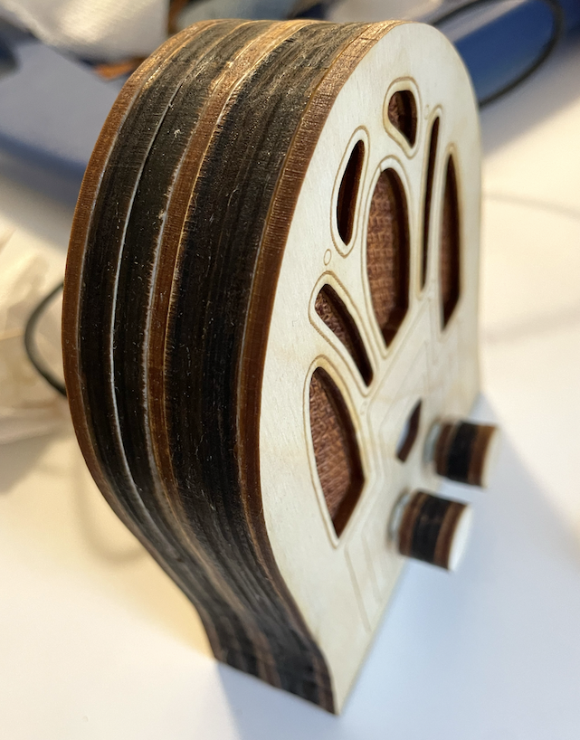

Complete, with external battery pack and mug for scale:

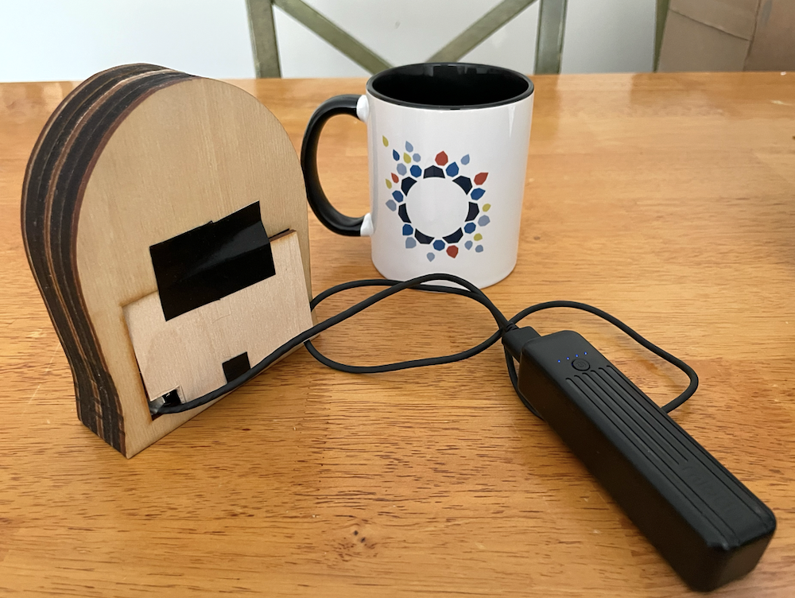

#### Software

The speaker is programmed in C++, using the Arduino [Audio Tools](https://github.com/pschatzmann/arduino-audio-tools) and [ESP32-A2DP](https://github.com/pschatzmann/ESP32-A2DP/tree/2e0f47dec2735924d58bfb5c67c44e32ae72218a) (audio over Bluetooth) libraries written by [Phil Schatzmann](https://github.com/pschatzmann).

Processing chain:

- Audio input is via Bluetooth, which is paired to a device (phone, computer) as for commercial headphones or speakers
    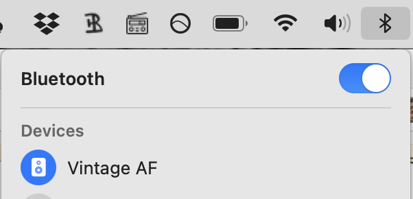

- A 2 kHz low pass filter is applied; white noise is added

- This processed stream is mixed into the original dry stream, with a ratio determined by the "vintage" knob: when set to 0, the output signal is entirely dry; when set to max, the output signal is equivalent to the wet signal

- The result is amplified based on the value of the "volume" potentiometer knob

- Output is played through the speaker component

My code is [here](https://github.com/hannahilea/baseball-radio).
The implementation ended up being slightly convoluted (read: hacky), due to my lack of familiarity with the processing library and the tricky conditions under which I was working.[^train] I ran out of time to add the notch filter I wanted, and also the high pass filter. Oh well.[^code]

[^code]: If you use this code you have to promise to squint at it instead of read it head-on, as my rush to meet the gifting deadline lead to a quality that I don't *really* stand behind. The speaker sounds like I wanted it to sound, which is I think at least a little coincidental, and I'm not convinced that the filter is actually doing anything. But also, after I handed it over, I did *not* then go back to verify or clean it up to be what I'd envisioned, as I thought I might! A true [houseplant program](../houseplant-programming/).

[^train]: Read: on a moving train, with the giftee sitting next to me such that I couldn't try out my code changes live without giving up the surprise, on the day the gift was due! After this project, I'm declaring a temporary moratorium on builds with any holiday gifting deadlines. The wow factor is not worth the stress of impending deadlines.

    "But Hannah," you may be saying to yourself, or to me if you're feeling rude(!), "why didn't you [:just-flag:](../just-flag) complete this project sooner?"

    Luckily for us both, this is a question I am far too genteel to dignify with a response.

## Next steps

For me, for now? None! I thought that I might continue to futz with it to get the processing how I wanted, but after I gifted it I realized I was *done*. It works, it works _mostly_ as designed, and it is usable without my intervention. Good enough for giftable work!

If I wanted to improve on the speaker or build something similar in the future, I'd definitely figure out what was going on in my code and make it nicer. I might also switch over to a different board and programming ecosystem---after the fact, a friend recommended using a [Teensy](https://www.pjrc.com/teensy/), which apparently has a whole GUI system for easily setting up exactly the processing chain I'd wanted.

**If you want to make one, go for it!** Typical caveat applies: I have not spent time turning my steps into a nice tutorial.

- The Cuttle.xyz CAD design for constructing the enclosure is [HERE](https://cuttle.xyz/@hannahilea/Bluetooth-cathedral-speaker-Bmqlp4mlXIro)

- The repo where I documented my hardware set-up and put my resultant script is [HERE](https://github.com/hannahilea/baseball-radio)

If you make one, let me know!

***Thanks to the Ruiz Brothers and Liz Clark for [their Adafruit tutorial](https://learn.adafruit.com/bluetooth-speaker), and to Phil Schatzmann for the Arduino libraries.***
