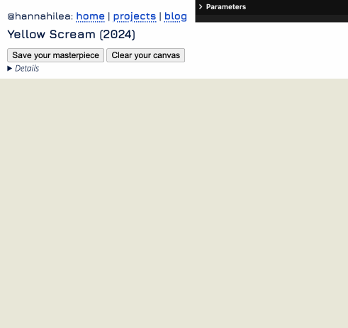
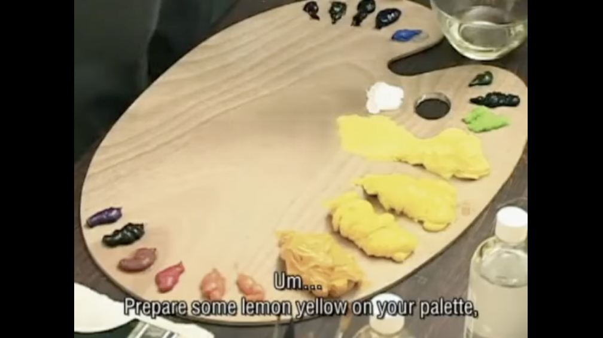
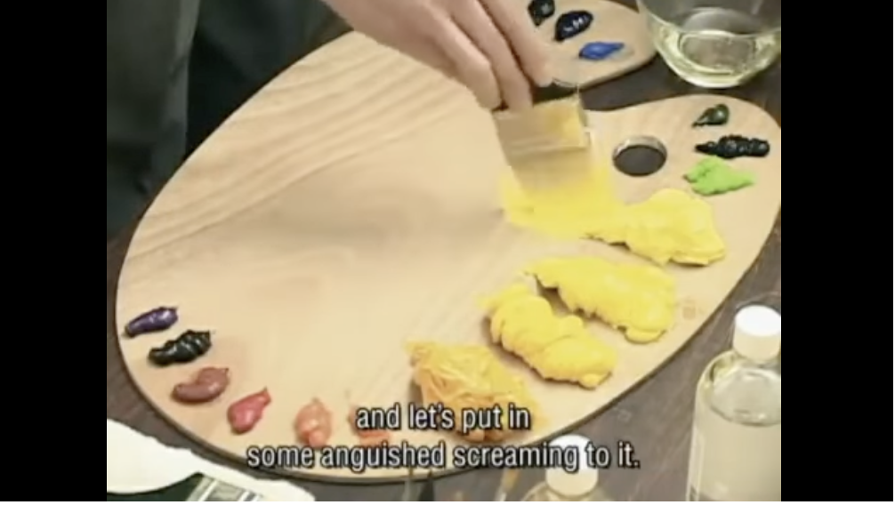

At some point in grad school, I encountered what is now one of my favorite works of art in the whole world: [Kim Beom](https://en.wikipedia.org/wiki/Kim_Beom)'s *Yellow Scream (2012)*. I'll let the piece speak for itself---if you don't watch the whole thing, at least jump to ~5:45 for a few seconds, and then skip around the rest of the recording:

<iframe width="560" height="315" src="https://www.youtube.com/embed/xesGkxslveo?si=b5BC9ABXSTms5J4S" title="YouTube video player" frameborder="0" allow="accelerometer; autoplay; clipboard-write; encrypted-media; gyroscope; picture-in-picture; web-share" referrerpolicy="strict-origin-when-cross-origin" allowfullscreen></iframe>

*Yellow Scream* became one of my go-to frustration regulators: if I was feeling off, I'd watch the video and invariably feel better.[^greg] 

Earlier this year[^rc] I watched the video and then wanted to do some of my OWN yellow screaming, so I made a little site for yell-painting a digital canvas:

<a href="../../projects/yellow-scream/">Yellow Scream (2024)</a>

***

Today feels like an apt day to share both the original performance piece and my interactive homage to it.
Are you also feeling off? Why not [give yelling a try]("../../projects/yellow-scream/")! To quote Kim Beom, 

> *Prepare some lemon yellow on your palette, and let's put in some anguished screaming to it.*

[^greg]: A labmate friend shared this yellow-as-stress-relief journey with me; I remember one day in particular when I went over to his desk to instigate a Timmies run, and found that his intense concentration wasn't focussed on programming, he was watching *Yellow Scream*....

[^rc]: I happened to be attending the [Recurse Center](http://www.recurse.com/) at the time, and the Thursday presentation where I shared it was one of the highlights of my batch. I just looked through my screenshots of the hype/enthusiasm/joy in that Zoom chat and am now [re-]filled with warm fuzzies.

***

When you've gotten some of the yelling out of your system, read the excellent Art Review article [Kim Beom: Do Not Think at All](https://artreview.com/kim-beom-do-not-think-at-all/) and [Online Screening: Kim Beom's *Yellow Scream* (2012)](https://walkerart.org/magazine/now-streaming-kim-beoms-yellow-scream-2012/).

***Thanks to Kim Beom for the years-long joy this piece has brought me.***
